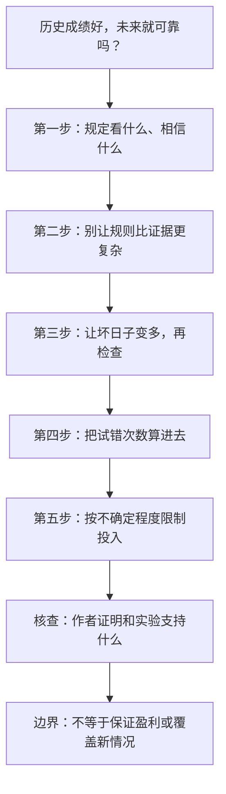

# 从历史成绩到谨慎决策

_本篇完整方法关系图 · arXiv:2608.23416v2_

---

五个步骤组成同一篇论文的完整研究主线，不是分成五天的课程。[^1]
[详细讲解中的关系图](notes.html#overview)已支持直接渲染与缩放；这里保留可编辑文本。

这是教学整理图，不是论文原图。
修改时请同步独立的 [Mermaid 源码](map.mmd) 和笔记中的图。

[^1]: Jiayu Li. (2026). The Axiomatic Trader, v2. 五阶段及其适用条件见 https://arxiv.org/html/2608.23416v2#S10 ，证据与局限见附录 B 和第 13 节。
