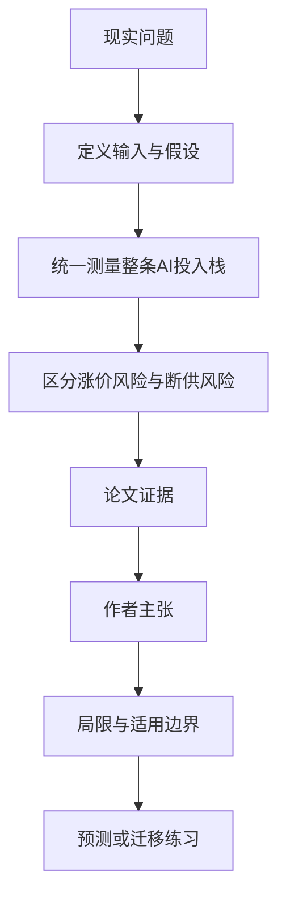

# AI 产业真正卡在哪里：从模型一路追到光刻、封装、电力和矿产

英文原题：Artificial Intelligence: Supply-Chain Chokepoints and the Reach of Industrial Policy

arXiv：2607.29572v1；方向：科技与产业；发布日期：2026-07-31

一句话问题：AI 模型供应商看起来很多，为什么一台设备、一种封装或一个国家控制的精炼材料仍能卡住整个产业？

## 先从一个普通人会遇到的问题开始

竞争讨论常盯着最下游的模型公司；论文把模型、云、芯片、电力和矿产放到同一浓度尺上，显示真正难替代的环节集中在更上游。

今天读完《AI 产业真正卡在哪里：从模型一路追到光刻、封装、电力和矿产》，目标不是记住论文名，而是能用自己的话回答：AI 模型供应商看起来很多，为什么一台设备、一种封装或一个国家控制的精炼材料仍能卡住整个产业？还要能指出作者的证据支持到哪一步、哪一步仍不能下结论。

## 整体关系图



## 先补两块必要基础

HHI 把每个参与者的市场份额平方后相加并乘 10,000；完全垄断是 10,000，参与者越多且越均衡就越低。美国机构把 1,800 以上视为高度集中，但高 HHI 不自动等于可随意涨价。

chokepoint 是短期缺少替代品的必需投入。若这种投入只占成品成本很小一部分，价格翻倍未必明显推高成品价；真正威胁可能是拿不到任何数量，导致整条生产停下。

## 论文接收什么，输出什么

输入是模型使用、云收入、芯片设计与制造环节、电力、矿产生产和精炼的公开份额数据；作者给每项数据标记 measured、derived、modeled 或 proxy 可信层级。

输出是各层 HHI、等效参与者数量和从下游到上游的浓度梯度；再用储量—开采—精炼对比，判断集中来自地质禀赋还是后来建设的加工能力。

## 第一步：把不同产业环节换算到同一 HHI 尺度

模型使用和云服务原本用流量或收入，封装、光刻、存储和矿产又用产量或国家份额；统一平方份额后，才能看出浓度不是消失了，而是沿供应链上移。

作者对未拆分的剩余份额不计平方项，使数值偏向低估，并保留数据来源层级，避免把平台快照和官方产量统计伪装成同等精确。

## 第二步：用成本份额判断风险走价格还是断供通道

单位成本对某投入价格的弹性等于该投入的成本份额。镓在芯片成本中很小，即使涨价很大，芯片成本传导也有限。

但如果无法取得最低所需数量，芯片不能生产。再比较矿产储量与精炼集中度，若地下分布广而加工集中，说明瓶颈是可由长期产能和产业政策改变的工业结构。

## 跟着一个小例子看中间状态

教学例中四家模型商份额 30%、25%、25%、20%，HHI 为 2,550；一家光刻设备商占 100%，HHI 为 10,000。即使模型层可替换，所有模型需要的先进芯片仍可能卡在同一设备上。

一种材料只占芯片成本 0.1%，价格翻倍只给成本增加约 0.1%；若材料完全断供，产量却可能直接归零。低成本份额不能当作低供应风险。

## 作者拿什么证据支持主张

论文的公开数据管线测得模型使用 HHI 约 1,149、云约 1,410、高带宽内存 4,174、先进封装 8,100、镓生产约 9,804、领先光刻达到 10,000，显示集中度明显向物理上游上升。

对有储量数据的矿产，储量 HHI 低于生产、生产又低于精炼；这支持许多瓶颈由加工产能形成而非地下资源必然决定。论文的政策结论是测量后的推断，不是产业政策效果的因果实验。

## 哪些结论不能顺手扩大

不同层的市场边界和数据质量不同：模型使用来自单一路由平台，云收入代理算力容量，部分芯片份额来自分析机构；国家生产集中也不等于企业市场势力。

HHI 是静态份额摘要，不包含库存、替代速度、贸易联盟、扩产周期和质量门槛。高浓度提示应深入分析，不能单凭一张梯度图决定出口管制或补贴。

## 把整条因果链重新接起来

研究问题“AI 模型供应商看起来很多，为什么一台设备、一种封装或一个国家控制的精炼材料仍能卡住整个产业？”先被拆成可观察输入，再经过“第一步：把不同产业环节换算到同一 HHI 尺度”与“第二步：用成本份额判断风险走价格还是断供通道”，最后由论文实验或数据核对。

排错时依次检查：输入是否代表真实问题、中间状态是否按定义计算、比较组是否公平、指标是否回答原问题、结论是否越过样本和假设边界。

## 最小实践：把核心机制跑一遍

需求：用一组明确标为教学设定的小数据演示“比较分散的模型市场与单一设备瓶颈，并区分涨价和断供”。脚本打印输入、中间状态、正常例和失效边界，便于逐步核对。

验收标准：输出能解释机制方向，并明确它没有复现论文数据、模型或效果数字。

实际运行输出：

```text
教学输入：
- 模型商份额：['30%', '25%', '25%', '20%']
- 光刻设备份额：['100%']
- 关键材料成本份额：0.1%
中间状态：
1. 平方份额计算两层HHI
2. 比较1,800阈值
3. 估算材料翻倍的成本传导
4. 再检查完全断供是否可替代
正常例：下游选择多并不能消除共同上游的单点依赖。
边界：份额为教学例，不是重新计算论文数据，也不构成产业或投资建议。
```

## 自测题

1. 为什么镓价格对芯片成本影响小，仍可能是严重瓶颈？
2. 储量分散但精炼集中的事实支持什么判断？
3. HHI 高是否自动证明某家公司有能力涨价？

## 原文与阅读范围

已读统一测量框架、HHI 与成本份额公式、全栈浓度、矿产生产/精炼/储量对比、政策讨论、限制和结论；核对图 1—9 与表 1—6。

教学中的日常类比、演示数据和运行结果由本学习包构造；作者主张与论文证据已在正文中单独标出，二者不混用。

本次保存并解析的正文格式为 arxiv_html，提取到 4 个相关章节、15 条图表说明，正文约 104,808 个字符。

原文：https://arxiv.org/html/2607.29572v1
