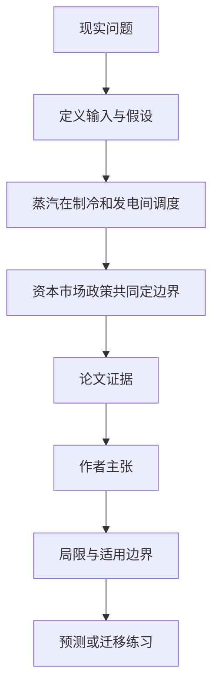

# 小型核反应堆给数据中心供电制冷，什么条件下才算得过账

英文原题：Techno-Economic Boundary Analysis of Small Modular Reactor Cogeneration for Hyperscale Data Center IT and Cooling Loads

arXiv：2608.10999v1；方向：科技与产业；发布日期：2026-08-11

一句话问题：核反应堆既发电又抽蒸汽驱动吸收式制冷，看似把废热利用起来，为什么在很多价格和资本成本下仍比直接买电贵？

## 先从一个普通人会遇到的问题开始

“核电稳定低碳、余热免费”是直觉，不是完整经济账；论文逐小时计算反应堆资本、融资、弃发电量、税收抵免、冷机效率和电网买卖，找出竞争边界。

今天读完《小型核反应堆给数据中心供电制冷，什么条件下才算得过账》，目标不是记住论文名，而是能用自己的话回答：核反应堆既发电又抽蒸汽驱动吸收式制冷，看似把废热利用起来，为什么在很多价格和资本成本下仍比直接买电贵？还要能指出作者的证据支持到哪一步、哪一步仍不能下结论。

## 整体关系图



## 先补两块必要基础

PUE 是数据中心总用电与 IT 用电之比，越接近 1 越省辅助电；吸收式冷机用热驱动，电压缩冷机用电驱动。抽蒸汽制冷会少让一部分蒸汽经过低压涡轮，因此热不是零机会成本。

CAPEX 是建设资本，WACC 是融资成本。核电燃料便宜但初始投资巨大，年度成本多数在开工时已经锁定；电网购电则更像随用随付，所以两者的胜负高度依赖资本和市场年份。

## 论文接收什么，输出什么

输入是休斯敦 200 MWe 数据中心逐小时 IT 与冷却负荷、ERCOT 2022—2024 电价、天气、300 MWe BWRX-300 机组、蒸汽与两类冷机、资本/融资、税收抵免和碳价格。

四种输出方案是电网+电制冷、核电+电制冷、核电+蒸汽吸收制冷、孤网燃气；混合整数优化给出 8,760 小时调度、总年化成本、碳排和 109 组边界敏感性。

## 第一步：每小时比较抽蒸汽制冷与继续发电的机会成本

吸收冷机节省电制冷用电，但抽出的蒸汽损失低压涡轮发电，还会失去按发电量支付的 45Y 抵免；湿球温度过高或反应堆检修时，电冷机必须接管。

所以优化器只在电价高、天气和设备允许且节电价值超过蒸汽机会成本时运行吸收冷机，而不是把所谓废热全年免费使用。

## 第二步：把运行收益放回资本、市场和政策边界

每个方案的设备资本按寿命和 WACC 年化，再加燃料、运维、电网进出口、碳价并减抵免；同一技术要在不同 ERCOT 年份和反应堆成本下重新求解。

敏感性把“是否划算”改写成条件句：反应堆造价降到何处、融资多便宜、碳价多高、电冷机多低效，核电或热电联供才跨过电网成本。

## 跟着一个小例子看中间状态

教学例中一小时抽蒸汽可省 100 元电费，却少发 70 元电并少拿 20 元发电补贴；毛收益只有 10 元，还未支付吸收冷机资本和维护。把蒸汽记成免费会把 90 元成本漏掉。

市场电价很低时，固定年金高的核电更难竞争；即使同一低造价机组在 2023 年有优势，换到论文的 2024 低价市场也可能回到持平或更贵。

## 作者拿什么证据支持主张

在 2023 中位反应堆资本和 45Y 抵免下，两种核电方案仍比电网贵 49% 与 62%；约 5,000 美元/kWe 附近才进入持平区。NOAK 低资本在 2023 年便宜 77%—89%，到 2024 年则介于近乎持平和贵 34%。

吸收制冷提供约 38% 年冷量，但基准下相对纯核电方案每年多 920 万美元；需将其安装成本降到约 60 美元/kWc 才在基准效率下持平，老旧低效园区的门槛约 570 美元/kWc。中位资本下碳价约 53/64 美元每吨分别使两种核方案与电网持平。

## 哪些结论不能顺手扩大

阈值依赖单一休斯敦负荷形状、ERCOT 市场年、平均排放归因、出口抵免与 45Y 规则；撤掉核电出口的减排信用会把碳价交叉点推到已求解区间之外。

可靠性没有在四方案间统一建模，强制停机、燃料供应、需求费和辅助服务收入被省略；论文的数字是边界分析，不是具体项目报价、建设许可或投资建议。

## 把整条因果链重新接起来

研究问题“核反应堆既发电又抽蒸汽驱动吸收式制冷，看似把废热利用起来，为什么在很多价格和资本成本下仍比直接买电贵？”先被拆成可观察输入，再经过“第一步：每小时比较抽蒸汽制冷与继续发电的机会成本”与“第二步：把运行收益放回资本、市场和政策边界”，最后由论文实验或数据核对。

排错时依次检查：输入是否代表真实问题、中间状态是否按定义计算、比较组是否公平、指标是否回答原问题、结论是否越过样本和假设边界。

## 最小实践：把核心机制跑一遍

需求：用一组明确标为教学设定的小数据演示“把抽蒸汽制冷的节电收益、少发电和少拿补贴放进同一小时账”。脚本打印输入、中间状态、正常例和失效边界，便于逐步核对。

验收标准：输出能解释机制方向，并明确它没有复现论文数据、模型或效果数字。

实际运行输出：

```text
教学输入：
- 节省电费：100元
- 少发电损失：70元
- 少拿发电补贴：20元
- 冷机资本维护：尚未计入
中间状态：
1. 记录100元节电收益
2. 减去70元发电机会成本
3. 再减20元补贴损失
4. 剩10元再与冷机固定成本比较
正常例：余热并不免费，运行毛收益很小且未必覆盖设备年金。
边界：数字为教学算例，没有运行论文8,760小时优化，也不构成核电或数据中心投资建议。
```

## 自测题

1. 为什么反应堆抽出的蒸汽不能直接视为免费余热？
2. 论文中哪一个成本轴最主导核电是否与电网持平？
3. 53—64 美元/吨的碳价阈值为什么不能直接搬到其他地区？

## 原文与阅读范围

已读四方案、逐小时热电与冷却模型、资本和政策核算、基准结果、109 组敏感性、吸收冷机机会成本、讨论与限制；核对图 1—6、表 1—3 和补充结果。

教学中的日常类比、演示数据和运行结果由本学习包构造；作者主张与论文证据已在正文中单独标出，二者不混用。

本次保存并解析的正文格式为 arxiv_html，提取到 6 个相关章节、19 条图表说明，正文约 134,294 个字符。

原文：https://arxiv.org/html/2608.10999v1
