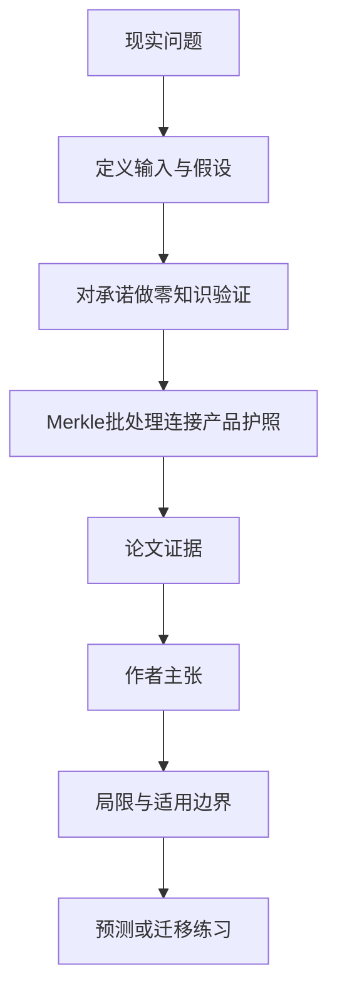

# 不公开供应商也能证明矿产来源吗：OreProof 的零知识溯源

英文原题：OreProof: Verifiable Provenance with Limited Disclosure for Critical-Minerals Supply Chains Using Zero-Knowledge Proofs

arXiv：2609.00340v1；方向：科技与产业；发布日期：2026-08-31

一句话问题：矿企不愿公开供应商、品位、产率和价格时，买家或监管者怎样验证“来自获批地区且达到纯度门槛”？

## 先从一个普通人会遇到的问题开始

传统透明账本要求把商业秘密摊开，封闭账本又让外部人只能相信运营者；论文用承诺和零知识证明，让验证者检查一个具体条件，而不直接看到原始值。

今天读完《不公开供应商也能证明矿产来源吗：OreProof 的零知识溯源》，目标不是记住论文名，而是能用自己的话回答：矿企不愿公开供应商、品位、产率和价格时，买家或监管者怎样验证“来自获批地区且达到纯度门槛”？还要能指出作者的证据支持到哪一步、哪一步仍不能下结论。

## 整体关系图



## 先补两块必要基础

密码学承诺像把数据锁进带指纹的信封：现在不能偷换，别人也看不到内容。零知识证明则让持有人证明“信封里的地区在批准名单”或“纯度高于门槛”，不揭示具体地区或数值。

Merkle tree 把很多事件压成一个根哈希；单个事件以后可用一条短证明核对是否属于该批。它降低上链次数，但每个事件要等整批根上链后才获得最终锚定。

## 论文接收什么，输出什么

输入是金矿登记、托管转移、精炼和检测事件，以及供应商身份、品位、产率和价格等敏感字段。敏感数据留在链下，链上只放承诺、Merkle 根、元数据和验证引用。

输出是针对获批来源集合与最低品位/纯度的 Groth16 证明、UNTP 对齐的可验证凭证、批次锚定结果，以及在定义攻击者下的直接信息泄漏率。

## 第一步：先承诺原始数据，再只证明需要的条件

矿企在记录批次属性时提交承诺，之后根据买方角色生成一个特定谓词的证明；验证者把证明与链上承诺配对，知道条件为真，却不读取原值。

不同角色只获得完成职责所需的最小视图。对于混合矿物，系统只凭证能够验证的来源，并明确标记未知输入，避免把比例推算包装成确定来源。

## 第二步：批量锚定事件，再输出标准化凭证

链下服务把许多生命周期事件规范化并组成 Merkle tree，只用一个根锚定整批；这把每事件一笔链上交易变成很多事件共享少数交易。

上层把出处与符合性写成 UNTP/W3C 可验证凭证，并映射到欧盟数字产品护照；区块链在这里是可替换的验证层，不是公开存放全部商业状态的数据库。

## 跟着一个小例子看中间状态

教学例中真实纯度是 99.95%，门槛为 99.9%。链上只保存承诺，验证者收到“承诺值不少于 99.9%”的有效证明；他知道合格，却不能从证明读出 99.95%。

若最初输入是假检测报告，零知识证明只会忠实证明假输入满足某条件。密码学保证数据未被偷换和谓词计算正确，不替代现场取样、身份治理或检测机构可信度。

## 作者拿什么证据支持主张

在 Polygon zkEVM Amoy 测试网原型中，透明基线的四类敏感属性有三类可直接推断，泄漏率 75%；混合架构在论文定义的公开数据攻击模型下为 0%。作者明确说明这不是绝对隐私。

原型把 2,000 个私有事件以四个、每批 500 个的 Merkle 根锚定，总耗时 14.368 秒，即 139.2 个已提交业务事件/秒；透明基线约 0.665 个事件/秒。吞吐收益来自批处理，不是零知识证明本身。

## 哪些结论不能顺手扩大

攻击模型不含时序关联、批大小推断、弱盐猜测、外部知识和链下数据库泄露；系统也不能保证原始声明真实，生产密钥管理、治理和正式 LBMA 认可仍未验证。

原型运行在测试网，所用链存在迁移需求；设计原则来自单一黄金案例，UNTP 对批量混合、矿业事件和多评估方仍有标准缺口。

## 把整条因果链重新接起来

研究问题“矿企不愿公开供应商、品位、产率和价格时，买家或监管者怎样验证“来自获批地区且达到纯度门槛”？”先被拆成可观察输入，再经过“第一步：先承诺原始数据，再只证明需要的条件”与“第二步：批量锚定事件，再输出标准化凭证”，最后由论文实验或数据核对。

排错时依次检查：输入是否代表真实问题、中间状态是否按定义计算、比较组是否公平、指标是否回答原问题、结论是否越过样本和假设边界。

## 最小实践：把核心机制跑一遍

需求：用一组明确标为教学设定的小数据演示“演示只公开门槛判断而隐藏具体矿产品位”。脚本打印输入、中间状态、正常例和失效边界，便于逐步核对。

验收标准：输出能解释机制方向，并明确它没有复现论文数据、模型或效果数字。

实际运行输出：

```text
教学输入：
- 真实纯度：99.95%（教学秘密）
- 合格门槛：99.9%
- 公开内容：承诺与是否合格
中间状态：
1. 对真实纯度生成承诺
2. 计算纯度是否达到门槛
3. 只公开有效证明
4. 验证者得到合格但看不到具体值
正常例：验证具体条件不要求把供应商的完整原始字段公开。
边界：这是逻辑类比，没有实现承诺、Groth16、区块链或身份认证。
```

## 自测题

1. 零知识证明为什么不能证明矿企最初录入的数据是真的？
2. 论文中吞吐量提升主要来自什么？
3. 0% 泄漏为什么不能理解为绝对隐私？

## 原文与阅读范围

已读可验证性—披露矛盾、系统设计、承诺与 Groth16、Merkle 批处理、UNTP 映射、吞吐与泄漏评估、设计原则和限制；核对图 1—4 与表 1。

教学中的日常类比、演示数据和运行结果由本学习包构造；作者主张与论文证据已在正文中单独标出，二者不混用。

本次保存并解析的正文格式为 pdf_text，提取到 9 个相关章节、0 条图表说明，正文约 40,628 个字符。

原文：https://arxiv.org/pdf/2609.00340
