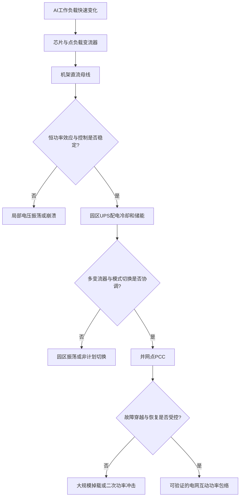

# 从电网到芯片：AI 数据中心为什么不能只看总耗电量

英文原题：From Grid to Chip: Power Architecture, Stability, and Flexibility of AI Data Centers

arXiv：2609.11649v1；方向：科技与产业；发布日期：2026-09-10

一句话问题：即使一年电量和峰值容量都够，为什么 AI 数据中心仍可能在几十毫秒到几十秒的扰动中电压振荡、整场掉载，甚至反过来冲击电网？

## 有电可用，不等于每一瞬间都送得稳

一座数据中心可能签到了足够的年发电量，但训练任务同时切换会让功率快速跳变；服务器为了维持计算功率，在电压下降时反而多吸电流；多个电源控制器又可能互相“抢着纠正”。能量账面平衡，动态系统仍可能不稳定。

这篇技术综述把并网排队、供电架构、计算灵活性和动态稳定统一为 grid-to-chip 视角。读完后你应能沿机架、园区、电网三层定位问题，并选择工作负载、变流器、储能或并网控制中的合适干预点。

## 整体关系图



## 先懂功率链和“恒功率负载”

电网的中高压交流电要经过整流器、UPS、配电单元、服务器电源和芯片电压调节器，电压逐级下降、电流逐级上升。每一级都有控制回路、储能元件和响应速度，前后级的动态并非自动兼容。

GPU 在短时间内常近似 constant-power load：它想维持功率 P，电流 I=P/V。母线电压 V 稍降时，它会多取电流，线路压降又变大，形成与普通电阻相反的负增量阻抗效应。控制和储能若来不及补偿，电压扰动可能被放大。

## 综述把哪些原本分开的对象接起来

一端是并网容量、接入排队、变压器和电缆交期、故障穿越与爬坡限制；另一端是 GPU 工作负载、冷却、UPS、电池、AC/DC 与 DC/DC 变流器以及芯片供电。论文不是优化一个具体园区，而是整理技术地图和分析边界。

全球在运数据中心 2024 年耗电约 416 TWh，综述引用的 IEA 基准情景为 2030 年 946 TWh、2035 年 1193 TWh。典型数据中心建设只需 18—36 个月，而电网接入可能需 5—10 年，这解释了为什么电力基础设施成为部署节奏的约束。

## 第一层：机架内部可能越补电越不稳

机架层把上游当相对稳定电源，重点看 48V 等直流母线、服务器电源、点负载变流器与 IT 负载。恒功率行为、快速算力切换和源负载阻抗耦合都可能造成小信号振荡或大扰动后的电压崩溃。

应对手段包括芯片功率限制、工作负载错峰、就近电容或电池缓冲、主动阻尼和针对负增量阻抗的非线性控制。每种手段只覆盖部分时间尺度：调任务适合可延迟变化，不能替代微秒级电力电子控制。

## 第二、三层：园区控制与电网恢复会相互影响

园区层保留多机架、UPS、冷却、内部线路和模式切换，关注多个变流器的阻抗相互作用、负载不平衡以及正常、旁路、后备模式切换。单台设备稳定，不保证并联后稳定。

系统层看并网点 PCC：故障时园区是继续取电、由储能接管，还是突然断开；故障后又以多快速度恢复。曾有 1500 MW 数据中心负荷下降抬升外部系统频率和电压，所以“保护本园区”也必须考虑电网看见的功率轨迹。

## 三个分析层不是三栋设备，而是三种问题边界

机架层保存直流电压、电流、负载功率和局部控制状态；园区层保存各变流器阻抗、储能荷电状态、冷却负载与运行模式；系统层保存并网功率、电压、频率、故障穿越和恢复斜率。边界按要解释的现象选择。

新型直流园区会让机架与园区边界变模糊，但不意味着可以省略某层。共同直流母线反而会让更多机架直接耦合，模型仍须包含分布阻抗、多机架和上游变流器。

## 综述用事件和容量约束说明问题规模

文献汇总了约 11 Hz、14.7 Hz、23 Hz 等园区振荡事件，也列出爱尔兰 387 MW 负荷下降后频率升至 50.341 Hz、RoCoF 约 +0.26 Hz/s 的事件。这些案例支持跨层动态风险真实存在，但来源设备和条件各不相同。

另一项被引分析称，只要可在全年峰值的 0.25% 时段削减需求，美国电网可能多接入 76 GW 负荷。它说明可验证灵活性可能释放容量，不表示每个地区或项目都能按同一比例获准并网。

## 这是技术综述和框架，不是一套已统一验证的设计

耗电预测、接入政策和事件数字来自多种外部来源，时间与地区条件不同。三层框架帮助选模型和找机制，却没有在同一真实数据中心端到端验证全部控制方案。

详细电磁暂态模型能看高频开关却难扩展到大电网，降阶相量模型能扩大规模却必须对照详细模型校验；黑箱测量模型又依赖采样到的运行条件。教学 demo 只演示恒功率负载的方向性。

## 从算力变化到电网影响的完整链

训练或推理任务改变芯片功率；局部控制器与储能把变化传到机架母线；多个电源和内部线路塑造园区功率；UPS 与保护决定故障时是否切换或断开；并网点的突然功率变化最终进入电网频率和电压。

因此扩建 AI 基础设施不能只配更多发电。应共同设计工作负载调度、冷却、供电拓扑、储能位置、控制参数、故障穿越与分阶段恢复，并向电网承诺可验证的功率包络。

## 最小实践：电压越低，恒功率负载为何反而要更多电流

需求：比较同一标称点附近的普通电阻与恒功率负载，在电压下降时的电流和线路压降。正常例展示相反反馈方向，边界说明静态算例不能判断真实系统稳定性。

实际运行输出：

```text
电压  恒功率电流  电阻负载电流  恒功率线路压降  电阻线路压降
  52V      230.8A        270.8A           3.46V         4.06V
  48V      250.0A        250.0A           3.75V         3.75V
  44V      272.7A        229.2A           4.09V         3.44V
  40V      300.0A        208.3A           4.50V         3.12V
边界：这是静态 I=P/V 对比；真实稳定性还取决于控制器、阻抗、储能、保护和扰动时间尺度。
```

## 自测题

1. 为什么母线电压下降时，恒功率 GPU 负载可能让问题加重？
2. 既然能用工作负载错峰，为什么还需要电池和快速变流器控制？
3. 数据中心在电网故障时立即全断开，为何不一定是全系统最安全选择？

## 原文与阅读范围

已读取并网瓶颈与规则、grid-to-chip 硬件路径、三层稳定框架、模型与评估方法、缓解策略和未来方向；核对表 I—VII及图 2—5、10—15。

论文是跨文献技术综述。恒功率算例为教学类比，不代表具体 GPU、UPS 或电网的稳定裕度，也没有复现事件。

本次保存并解析的正文格式为 arxiv_html，提取到 4 个相关章节、24 条图表说明，正文约 186,626 个字符。

原文：https://arxiv.org/html/2609.11649v1
