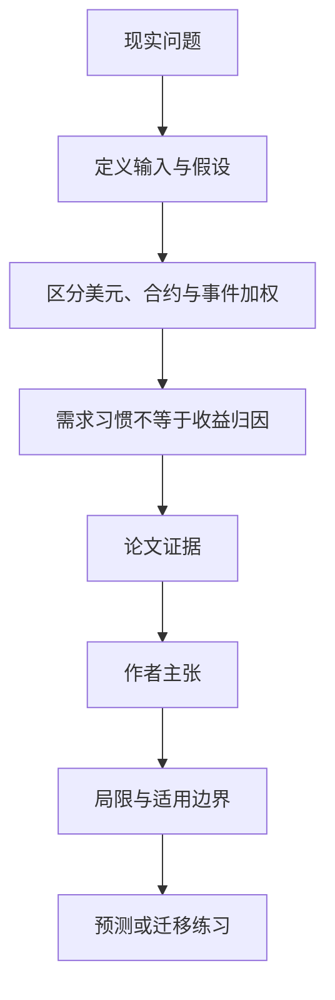

# 预测市场的热门—冷门偏差：结论为何随统计单位改变

英文原题：The Favorite-Longshot Bias in Prediction Markets: Evidence from Polymarket

arXiv：2609.12878v1；方向：金融；发布日期：2026-09-11

一句话问题：低于 10 美分的“小概率合约”整体看起来亏钱，为什么换成按大事件分组后，结论可能反过来？

## 先从一个普通人会遇到的问题开始

一个总统选举事件可拆出许多候选人子合约；若每张合约、每个大事件和每一美元投资分别等权，回答的是不同问题。论文用 5.88 亿笔交易展示聚合口径本身就是经济结论的一部分。

今天读完《预测市场的热门—冷门偏差：结论为何随统计单位改变》，目标不是记住论文名，而是能用自己的话回答：低于 10 美分的“小概率合约”整体看起来亏钱，为什么换成按大事件分组后，结论可能反过来？还要能指出作者的证据支持到哪一步、哪一步仍不能下结论。

## 整体关系图



## 先补两块必要基础

预测合约到期通常支付 0 或 1 美元。以 0.08 美元买入的小概率合约若成真赚很多，若失败损失 0.08；favorite-longshot bias 指冷门价格相对结果概率偏高、热门相对更划算的系统性模式。

child market 是具体子合约，parent event 是把相关子合约归为同一事件。一个大事件若列出很多冷门候选，会在“每合约等权”统计中占更大份量。

## 论文接收什么，输出什么

输入是 Polymarket 5.88 亿笔交易、248 万个账户、成交价格、最终结果、子市场—父事件映射和账户历史。输出是不同价格尾部的每美元回报与概率误差。

论文分别按资金流、每个子合约等权、先按父事件分组等口径计算，并按 Crypto、Politics、Sports 及账户历史需求拆分。

## 第一步：先定义“平均”到底平均谁

把所有购买混在一起，资金投得多的事件权重最大；每个子合约等权时，子合约多的父事件权重更大；父事件等权则每个大问题只算一次。

三种口径都可以正确，却描述“平均投资美元”“平均挂牌合约”“平均大事件”三个不同对象。报告偏差必须同时给分母。

## 第二步：区分持续偏好与最终谁亏钱

账户过去常买冷门，确实能预测下月继续买冷门；但这不强力预测它会比其他冷门买家亏得更多。

因此“有一群稳定的非理性新手承担全部损失”并未被证据支持。聚合偏差、覆盖多少事件、谁承担损失是三个问题。

## 跟着一个小例子看中间状态

事件 A 有 100 个候选人子合约且多数冷门亏，事件 B 只有 2 个子合约且冷门赚。每合约等权会让 A 获得约 50 倍权重；父事件等权则 A、B 各一半。

所以论文中低价购买按每个子合约等权亏 6.3 美分/美元，按父事件先聚合却赚 4.1 美分；资金流加权的观测购买亏 19.3 美分。

## 作者拿什么证据支持主张

低于 10 美分的实际购买按资金流聚合亏 19.3 美分/美元；每子合约等权亏 6.3 美分；父事件聚合后赚 4.1 美分。90 美分以上购买赚 0.83 美分。

偏差在 Crypto 和 Politics 呈双边模式，在 Sports 中没有；过去最偏好冷门的账户前 10% 占下月低价购买 26.6%，但收益与其他冷门买家相近。

## 哪些结论不能顺手扩大

数据来自一个平台和已解析的链上/平台结构，无法唯一识别偏差由偏好、信念、限制还是市场设计造成；不同类别也不一致。

历史收益不是未来回报保证，论文不是下注建议。账户不等于真实个人，聚合口径变化也不表示某一种一定更“正确”。

## 把整条因果链重新接起来

研究问题“低于 10 美分的“小概率合约”整体看起来亏钱，为什么换成按大事件分组后，结论可能反过来？”先被拆成可观察输入，再经过“第一步：先定义“平均”到底平均谁”与“第二步：区分持续偏好与最终谁亏钱”，最后由论文实验或数据核对。

排错时依次检查：输入是否代表真实问题、中间状态是否按定义计算、比较组是否公平、指标是否回答原问题、结论是否越过样本和假设边界。

## 最小实践：把核心机制跑一遍

需求：用一组明确标为教学设定的小数据演示“演示每子合约等权与每父事件等权如何给出相反平均回报”。脚本打印输入、中间状态、正常例和失效边界，便于逐步核对。

验收标准：输出能解释机制方向，并明确它没有复现论文数据、模型或效果数字。

实际运行输出：

```text
教学输入：
- 事件A子合约数：100
- 事件A平均回报：-0.06
- 事件B子合约数：2
- 事件B平均回报：0.1
中间状态：
1. 按 102 个子合约加权
2. A 因子合约多占绝大权重
3. 再让 A、B 两事件各占一半
4. 比较两个平均值的符号
正常例：同一底层结果可在两种合理统计单位下出现不同总体结论。
边界：教学数字不是 Polymarket 原始交易重算，也不构成下注或投资建议。
```

## 自测题

1. 为什么“按每张合约平均”和“按每个事件平均”回答不同问题？
2. 过去爱买冷门能否推出该账户未来一定亏得更多？
3. Sports 没有相同模式说明了什么？

## 原文与阅读范围

已读数据与测量、价格尾部回报、父子市场聚合、账户持续需求、类别与稳健性、结论；核对表 1—26 与图 1、3、5—7 的关键结果。

教学中的日常类比、演示数据和运行结果由本学习包构造；作者主张与论文证据已在正文中单独标出，二者不混用。

本次保存并解析的正文格式为 arxiv_html，提取到 3 个相关章节、35 条图表说明，正文约 144,195 个字符。

原文：https://arxiv.org/html/2609.12878v1
