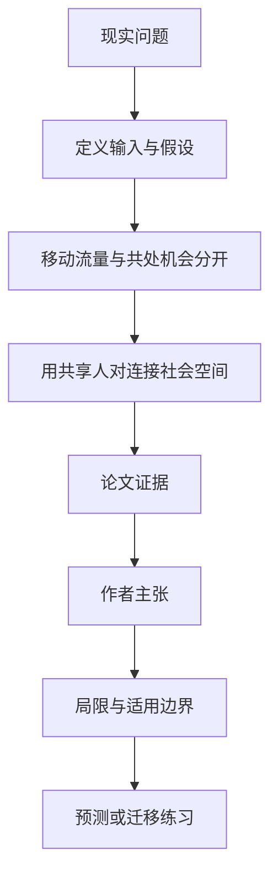

# 人流中心不等于相遇中心：13 座巴西城市的社会重叠网络

英文原题：The hierarchical organization of urban social overlap: How shared social spaces diverge from physical mobility

arXiv：2609.12888v1；方向：社会研究；发布日期：2026-09-11

一句话问题：一个地铁站人流很大，是否就代表那里形成最多重复相遇，而且与其他地点共享同一批人？

## 先从一个普通人会遇到的问题开始

移动记录告诉我们人从哪到哪，却不直接告诉谁与谁反复同处、不同地点是否服务同一社会群体；论文把流动、同处和跨地点社会重叠分成三层。

今天读完《人流中心不等于相遇中心：13 座巴西城市的社会重叠网络》，目标不是记住论文名，而是能用自己的话回答：一个地铁站人流很大，是否就代表那里形成最多重复相遇，而且与其他地点共享同一批人？还要能指出作者的证据支持到哪一步、哪一步仍不能下结论。

## 整体关系图



## 先补两块必要基础

colocation 衡量一个地点在时间窗口内发生多少共处机会；co-connectedness 衡量两个地点共享多少相同的共处人对，不是两地之间的行程数。

centricity 描述活动集中在一个还是多个中心；hierarchy 描述高低活动层级的地点更倾向与哪些层级共享重复人对。

## 论文接收什么，输出什么

输入是 13 座人口超百万的巴西城市通话详单位置数据；作者分别构建移动流网络与共处重叠网络。输出是社会中心、共连接分布、层级和中心集水效率。

中间状态包括天线位置的共处量、核密度平滑后的连续中心、地点对共享人对，以及与随机空模型比较后的层级。

## 第一步：把“经过这里”与“在这里共同出现”分开

高移动流量地点可能只是换乘通道，不一定产生长期共处；共处量高的地点才是潜在社会相遇中心。

作者对离散天线活动做 KDE 平滑后识别功能中心，避免把市中心密集天线误切成许多小中心。

## 第二步：再问两个地点是否反复承载相同的人群关系

两个地点不是因为有人直接从 A 去 B 才连接，而是因为相同的共处人对在两地都出现；这刻画城市社会环境的重叠。

地点更常与相近活动层级的地点共享人对，形成非随机层级，但其强度比移动层级弱且跨城市差异更大。

## 跟着一个小例子看中间状态

教学例中，车站每天 10 万人快速换乘，社区广场只有 5 千人但同一批家庭反复共处；前者移动中心更强，后者可能是社会相遇中心。

广场和学校若共享许多相同家长—儿童人对，就有高 co-connectedness，即使两地直接行程并不多。

## 作者拿什么证据支持主张

13 城中，共处量近似 log-normal；地点对共连接的弱关系为 log-normal 主体，强关系呈指数约 2.47 的重尾。结果对 15、30、45 分钟时间窗保持。

社会中心与移动中心在数量或位置上经常不同，例如 São Paulo 移动识别 2 个中心、社会共处识别 5 个；社会重叠层级系统性弱于且比移动层级更随城市变化。

## 哪些结论不能顺手扩大

通话详单只覆盖运营商用户和天线级时空分辨率，共处只是潜在接触，不证明交流、关系或感染传播。

13 城观察关系不能识别城市设计原因；KDE、时间窗和中心阈值虽做敏感性检查，仍会影响结构。

## 把整条因果链重新接起来

研究问题“一个地铁站人流很大，是否就代表那里形成最多重复相遇，而且与其他地点共享同一批人？”先被拆成可观察输入，再经过“第一步：把“经过这里”与“在这里共同出现”分开”与“第二步：再问两个地点是否反复承载相同的人群关系”，最后由论文实验或数据核对。

排错时依次检查：输入是否代表真实问题、中间状态是否按定义计算、比较组是否公平、指标是否回答原问题、结论是否越过样本和假设边界。

## 最小实践：把核心机制跑一遍

需求：用一组明确标为教学设定的小数据演示“区分移动流量、地点共处和跨地点共享人对”。脚本打印输入、中间状态、正常例和失效边界，便于逐步核对。

验收标准：输出能解释机制方向，并明确它没有复现论文数据、模型或效果数字。

实际运行输出：

```text
教学输入：
- 车站：10万人快速换乘
- 广场：5000人反复共处
- 学校：与广场共享许多家庭人对
中间状态：
1. 用流量找移动中心
2. 用同处找社会中心
3. 用共享人对连广场与学校
4. 比较三种城市结构
正常例：流量最大、共处最多和社会重叠最强可以落在不同地点。
边界：没有处理真实 CDR，也不推断个人身份、关系或城市规划效果。
```

## 自测题

1. co-connectedness 为什么不是 A 到 B 的出行量？
2. 天线密集为何要先做空间平滑？
3. 共处能否证明两个人发生了社会互动？

## 原文与阅读范围

已读共处与共连接定义、数据、KDE 中心识别、13 城分布与层级、移动对照、集水效率、空模型和讨论；核对表 1 及主图。

教学中的日常类比、演示数据和运行结果由本学习包构造；作者主张与论文证据已在正文中单独标出，二者不混用。

本次保存并解析的正文格式为 arxiv_html，提取到 6 个相关章节、17 条图表说明，正文约 88,383 个字符。

原文：https://arxiv.org/html/2609.12888v1
