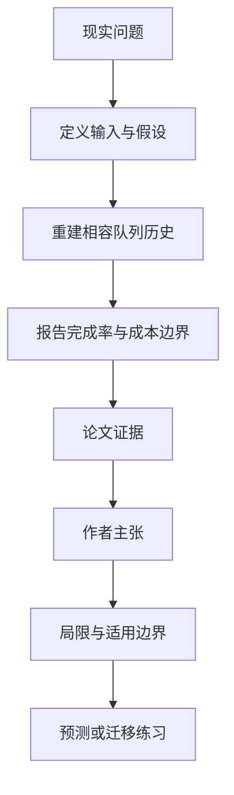

# 同一张订单簿，可能成交得完全不同：L2 数据的部分识别

英文原题：Same Book, Different Fills: Partial Identification of FIFO Execution from Aggregate Order Books

arXiv：2609.13597v2；方向：金融；发布日期：2026-09-11

一句话问题：只看到每个价位的总挂单量，为什么无法准确回测一张排队限价单会不会成交？

## 先从一个普通人会遇到的问题开始

L2 行情告诉你队伍总长度，却不告诉每张订单的先后位置；中间有人撤单时，撤的是你前面还是后面，会让同一公开订单簿路径对应不同成交结果。

今天读完《同一张订单簿，可能成交得完全不同：L2 数据的部分识别》，目标不是记住论文名，而是能用自己的话回答：只看到每个价位的总挂单量，为什么无法准确回测一张排队限价单会不会成交？还要能指出作者的证据支持到哪一步、哪一步仍不能下结论。

## 整体关系图



## 先补两块必要基础

FIFO/price-time priority 表示同价先到先成交。L2 只显示价位聚合数量，market-by-order 才能看到队列中每张订单的身份与顺序。

partial identification（部分识别）承认数据不能给唯一答案，转而计算所有与观测相容的隐含历史下，结果可能落在哪个区间。

## 论文接收什么，输出什么

输入是同步的东京交易所 L1/L2 快照、成交导致的移除和两只证券的观测路径。研究固定所有公开价格、数量和成交，只改变不可见的队列内撤单分配规则。

输出是被动订单完成率、implementation shortfall 与策略选择在前端撤单、后端撤单等相容重建下的范围；主动立即成交基准不受队列位置影响。

## 第一步：固定可见订单簿，枚举不可见撤单位置

当某价位总量减少且不是成交，L2 只知道有人取消。若取消发生在你的订单前方，你更快排到；若发生在后方，你的位置不变。

作者构造多种潜在分配和三个取消规则，要求它们都复现同一聚合路径，再运行完全相同的影子订单。

## 第二步：用结果区间而非单点回测

不同相容历史下的完成率和成本形成识别区间。若策略在所有重建中都相同，结论较稳；若最佳策略改变，就暴露对不可见队列假设的敏感性。

主动成交不用排 FIFO，所以作为不变基准可检查差异是否真的来自被动队列。

## 跟着一个小例子看中间状态

某价位你前面显示 100 股，随后聚合量少了 40 股。若这 40 股都从前方撤掉，你只剩 60 股在前；若都从后方撤掉，你仍排在原位置。屏幕轨迹完全一样。

回测若默认“按比例撤单”会产出一个精确成交时间，但这个精确值来自假设，不是 L2 数据本身。

## 作者拿什么证据支持主张

对 1301.T，从后端移除切换为前端移除使被动完成率提高 8.01 个百分点、implementation shortfall 降低 1.010 bp。

7911.T 复制得到同方向结果：完成率差 7.39 个百分点、成本差 0.384 bp；两只证券的主动基准保持不变。

## 哪些结论不能顺手扩大

样本仅两只证券、七个月，留出证据来自相同 18 个日期；取消规则仍是模型选择，前/后端只是条件端点，不是全部真实可能性。

影子策略假定零延迟、无费用/返佣、无自身市场冲击，末端库存按复制订单簿平仓；绝对成本差不可直接解释成流动性因果。

## 把整条因果链重新接起来

研究问题“只看到每个价位的总挂单量，为什么无法准确回测一张排队限价单会不会成交？”先被拆成可观察输入，再经过“第一步：固定可见订单簿，枚举不可见撤单位置”与“第二步：用结果区间而非单点回测”，最后由论文实验或数据核对。

排错时依次检查：输入是否代表真实问题、中间状态是否按定义计算、比较组是否公平、指标是否回答原问题、结论是否越过样本和假设边界。

## 最小实践：把核心机制跑一遍

需求：用一组明确标为教学设定的小数据演示“演示同一 L2 数量减少如何产生两个不同 FIFO 排位”。脚本打印输入、中间状态、正常例和失效边界，便于逐步核对。

验收标准：输出能解释机制方向，并明确它没有复现论文数据、模型或效果数字。

实际运行输出：

```text
教学输入：
- 你前方初始数量：100
- 观测撤单：40
- 前端撤单后前方：60
- 后端撤单后前方：100
中间状态：
1. 观察价位总量减少 40
2. 构造撤在你前方的相容历史
3. 构造撤在你后方的相容历史
4. 比较后续成交所需市场单量
正常例：同一聚合轨迹不能唯一决定你的成交，因此应报告区间或敏感性。
边界：没有真实交易、费用、延迟或市场冲击，不是执行建议。
```

## 自测题

1. 为什么 L2 数量下降不能告诉你排位改善了多少？
2. 主动成交基准为什么不受这个不确定性影响？
3. 回测最佳策略随取消规则变化说明什么？

## 原文与阅读范围

已读相容历史构造、取消分配、影子执行、两证券复制、限制与结论；核对完成率、成本和策略敏感性结果。

教学中的日常类比、演示数据和运行结果由本学习包构造；作者主张与论文证据已在正文中单独标出，二者不混用。

本次保存并解析的正文格式为 arxiv_html，提取到 8 个相关章节、3 条图表说明，正文约 56,130 个字符。

原文：https://arxiv.org/html/2609.13597v2
