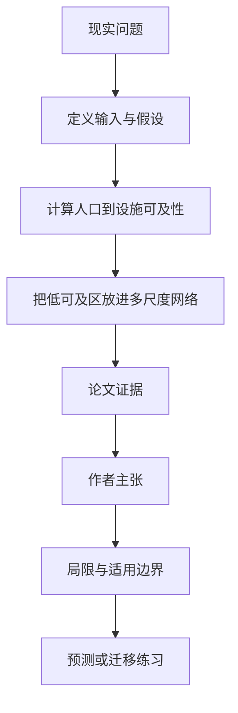

# 离医院远只是第一层：加纳医疗可及性为何要沿道路网络逐级看

英文原题：Unveiling healthcare-access inequality in Ghana using a multiscale approach

arXiv：2609.14510v1；方向：社会研究；发布日期：2026-09-13

一句话问题：两个村庄都离最近诊所 8 公里，为什么一个只是局部缺口，另一个却可能嵌在整片与城市服务断开的区域里？

## 先从一个普通人会遇到的问题开始

最近距离告诉我们哪里服务差，却不能判断贫困点是孤立小洞还是更大断裂的一部分；论文把街道级可及性放到道路网络的多尺度层级中。

今天读完《离医院远只是第一层：加纳医疗可及性为何要沿道路网络逐级看》，目标不是记住论文名，而是能用自己的话回答：两个村庄都离最近诊所 8 公里，为什么一个只是局部缺口，另一个却可能嵌在整片与城市服务断开的区域里？还要能指出作者的证据支持到哪一步、哪一步仍不能下结论。

## 整体关系图



## 先补两块必要基础

accessibility 不只是直线距离，还受道路连接和可达设施影响。局部差可能通过更大尺度网络继续限制教育、市场和转诊资源。

percolation divergence tree 随连接阈值变化追踪道路子系统何时合并或分裂，把局部社区放进镇、城市和区域层级。

## 论文接收什么，输出什么

输入是加纳人口分布、医疗设施位置和道路网络；输出是到最近设施的可及性，以及贫乏可及区在不同网络尺度上的嵌套结构。

作者先画街道级距离，再沿连接层级比较较连通单中心地区与较不连通多中心地区的贫乏可及模式。

## 第一步：先找离服务远的人口，而不是只数设施

设施数量相同不代表覆盖相同；人口密度、道路绕行和设施位置决定居民实际接近程度。

论文发现约四分之一人口距最近医疗设施超过 5 公里，建立不平等的第一张地图。

## 第二步：沿道路层级判断贫乏区域是局部还是系统性断裂

在较连通的单中心地区，差区可能集中在都市边缘，周围大系统仍连接良好，适合局部补点。

在较不连通的多中心地区，局部差区嵌在更大的低服务子系统中，只加一个小诊所可能解决不了转诊和区域连接。

## 跟着一个小例子看中间状态

村 A 距诊所 8 公里，但 2 公里外接入城市主干网；村 B 同样 8 公里，却位于多层级断裂的支路末端。最近距离相同，多尺度脆弱性不同。

A 可能通过一处基层设施改善，B 还需道路、转诊和跨区域服务协调；这只是从结构推导的政策诊断，不是论文直接测试的干预效果。

## 作者拿什么证据支持主张

论文结合街道级可及性和扩展的 percolation divergence tree，报告约四分之一加纳人口距最近医疗设施超过 5 公里。

跨地区比较发现，较连通单中心区常在都市边缘出现局部低可及口袋；较不连通多中心区的差区跨更大子系统并呈层层嵌套。

## 哪些结论不能顺手扩大

距离和道路结构不等于实际就医，未完整包含设施质量、床位、费用、交通工具、营业时间、文化接受度与季节道路条件。

数据精度和阈值会改变层级；结构诊断能指导调查，但不能直接证明建路或建诊所的因果收益。

## 把整条因果链重新接起来

研究问题“两个村庄都离最近诊所 8 公里，为什么一个只是局部缺口，另一个却可能嵌在整片与城市服务断开的区域里？”先被拆成可观察输入，再经过“第一步：先找离服务远的人口，而不是只数设施”与“第二步：沿道路层级判断贫乏区域是局部还是系统性断裂”，最后由论文实验或数据核对。

排错时依次检查：输入是否代表真实问题、中间状态是否按定义计算、比较组是否公平、指标是否回答原问题、结论是否越过样本和假设边界。

## 最小实践：把核心机制跑一遍

需求：用一组明确标为教学设定的小数据演示“比较最近距离相同但上层道路连接不同的两个村庄”。脚本打印输入、中间状态、正常例和失效边界，便于逐步核对。

验收标准：输出能解释机制方向，并明确它没有复现论文数据、模型或效果数字。

实际运行输出：

```text
教学输入：
- 村A到诊所：8公里
- 村B到诊所：8公里
- 村A：近主干网
- 村B：多层支路断裂
中间状态：
1. 确认局部距离都差
2. 检查接入镇级道路
3. 检查接入区域服务
4. 区分局部缺口与系统断裂
正常例：同样 8 公里可对应完全不同的干预范围。
边界：没有真实路线、设施容量或医疗结果，不能据此安排具体资源。
```

## 自测题

1. 为什么设施最近距离不能完整代表医疗可及性？
2. 多尺度分析比单张低可及地图多回答什么？
3. 结构性断裂能否证明建路一定改善健康？

## 原文与阅读范围

已读可及性定义、数据与道路网络、多尺度树扩展、全国结果、地区类型比较、政策含义与局限；核对 5 公里人口结果和空间图。

教学中的日常类比、演示数据和运行结果由本学习包构造；作者主张与论文证据已在正文中单独标出，二者不混用。

本次保存并解析的正文格式为 arxiv_html，提取到 5 个相关章节、9 条图表说明，正文约 68,826 个字符。

原文：https://arxiv.org/html/2609.14510v1
