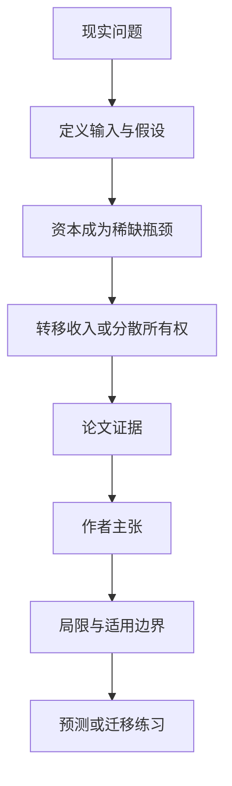

# 如果 AI 让资本成为收入主体，再分配该盯工资还是资本所有权

英文原题：Redistributive Policies for the Times of Transformative AI

arXiv：2609.14750v1；方向：经济；发布日期：2026-09-13

一句话问题：若变革性 AI 让劳动份额持续下降、算力和机器人等资本拿走大部分收入，UBI、全民资本、算力税或 token 税哪类工具更直接？

## 先从一个普通人会遇到的问题开始

今天很多再分配围绕工资设计；论文先假设一个高度自动化的未来，再比较政策究竟改变资本所有权、资本租金还是只对丰富的 AI 软件收费。

今天读完《如果 AI 让资本成为收入主体，再分配该盯工资还是资本所有权》，目标不是记住论文名，而是能用自己的话回答：若变革性 AI 让劳动份额持续下降、算力和机器人等资本拿走大部分收入，UBI、全民资本、算力税或 token 税哪类工具更直接？还要能指出作者的证据支持到哪一步、哪一步仍不能下结论。

## 整体关系图



## 先补两块必要基础

labor share 是总收入中付给劳动的比例，capital share 是资本租金和利润比例。模型假设高度自动化后，稀缺瓶颈是与 AI 软件互补的物理资本，如算力和机器人。

UBI 给每人收入转移；UBC（universal basic capital）直接让所有人持有资本；两者都可能减小收入差距，但只有 UBC 直接改变资产禀赋分布。

## 论文接收什么，输出什么

输入是不同能力和资本禀赋的人、AI/劳动/物理资本的生产互补、技术增长路径及税收转移规则。输出是长期资本份额、收入和财富不平等的方向。

论文把 UBI、UBC、资本/算力/机器人许可，以及资本、算力、机器人、token、土地、能源、消费和财富税放入统一理论框架比较。

## 第一步：先找高度自动化世界里最稀缺的生产瓶颈

若人类对齐的 AI 软件快速复制，软件本身相对丰富；扩产还受数据中心、芯片、能源和机器等物理资本限制，其收入份额在模型中趋近于高位。

因此只向每次 token 使用收费，税基落在相对丰富、份额趋降的要素上，长期再分配力度可能弱。

## 第二步：区分分资本收益和分资本本身

资本税资助并随资本收入指数化的 UBI，可把租金转给没有资本的人；计算/机器人许可也能把稀缺租金公共化。

UBC 直接把资本持有分散到人群，因此不仅转移当期收入，还改变财富和资本收益的初始分布。

## 跟着一个小例子看中间状态

教学例中，总收入 100 里劳动 60、资本 40；高度自动化后变成劳动 10、资本 90。只在工资端补贴能触达的税基缩小，而分享资本收益或所有权可直接覆盖 90。

若现实并未进入这种结构、AI 软件仍稀缺且劳动互补性强，上述排序可能改变；政策选择必须与实际瓶颈相匹配。

## 作者拿什么证据支持主张

论文是理论综述加统一模型，表 1 比较各种政策在部分自动化与完全自动化极限下对资本份额、财富不平等和收入不平等的方向。

作者主张 UBC 或资本税资助、与资本收入挂钩的 UBI 最可能持久降不平等，token 税最弱。论文没有对 TAI 到达时间、税率或量化福利给出经验预测。

## 哪些结论不能顺手扩大

结论建立在人类对齐 TAI、广泛自动化、可积累物理资本为慢瓶颈等强假设上；政治执行、避税、创新激励、跨国资本和偏好没有完整建模。

方向比较不是具体政策建议，不能据此推出今天应采用何税率；现实还需考察增长、行政能力、产权和代际分配。

## 把整条因果链重新接起来

研究问题“若变革性 AI 让劳动份额持续下降、算力和机器人等资本拿走大部分收入，UBI、全民资本、算力税或 token 税哪类工具更直接？”先被拆成可观察输入，再经过“第一步：先找高度自动化世界里最稀缺的生产瓶颈”与“第二步：区分分资本收益和分资本本身”，最后由论文实验或数据核对。

排错时依次检查：输入是否代表真实问题、中间状态是否按定义计算、比较组是否公平、指标是否回答原问题、结论是否越过样本和假设边界。

## 最小实践：把核心机制跑一遍

需求：用一组明确标为教学设定的小数据演示“比较劳动份额下降后，工资端与资本端政策覆盖的收入基础”。脚本打印输入、中间状态、正常例和失效边界，便于逐步核对。

验收标准：输出能解释机制方向，并明确它没有复现论文数据、模型或效果数字。

实际运行输出：

```text
教学输入：
- 自动化前劳动收入：60
- 自动化前资本收入：40
- 自动化后劳动收入：10
- 自动化后资本收入：90
中间状态：
1. 比较两期要素份额
2. 识别自动化后的稀缺收益来源
3. 工资端税基缩小
4. 资本收益或所有权工具直接触达主要份额
正常例：政策工具的着力点应跟随收入来源，而不是沿用旧结构。
边界：这不是未来预测或福利模型，只演示论文假设下的分配直觉。
```

## 自测题

1. 为什么论文认为 token 税长期可能较弱？
2. UBC 与资本税资助 UBI 的核心区别是什么？
3. 资本份额趋近很高是已观测事实吗？

## 原文与阅读范围

已读引言、统一生产与分配框架、各类政策比较、表 1、局限和结论；区分理论极限、作者主张与现实待验证假设。

教学中的日常类比、演示数据和运行结果由本学习包构造；作者主张与论文证据已在正文中单独标出，二者不混用。

本次保存并解析的正文格式为 arxiv_html，提取到 3 个相关章节、1 条图表说明，正文约 83,769 个字符。

原文：https://arxiv.org/html/2609.14750v1
