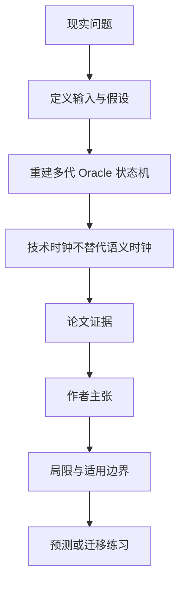

# 预测市场“裁决”不是一个时间戳：Polymarket 的 Oracle 状态机

英文原题：Resolution Is Not Settlement, Part I: Oracle Adjudication and Semantic Governance on Polymarket

arXiv：2609.15368v1；方向：金融；发布日期：2026-09-14

一句话问题：一个市场问题从创建到最终判定，中间为什么要区分请求、提议、争议、重置、Oracle 最终与 adapter 终止？

## 先从一个普通人会遇到的问题开始

只存“最终结果 + 时间”会把规则澄清、争议与后继请求抹掉；论文以 request generation 为关键单位，重建 50 多万条 Oracle 生命周期事件，说明技术时钟不能冒充事实已足够判断的语义时钟。

今天读完《预测市场“裁决”不是一个时间戳：Polymarket 的 Oracle 状态机》，目标不是记住论文名，而是能用自己的话回答：一个市场问题从创建到最终判定，中间为什么要区分请求、提议、争议、重置、Oracle 最终与 adapter 终止？还要能指出作者的证据支持到哪一步、哪一步仍不能下结论。

## 整体关系图



## 先补两块必要基础

Oracle 把链外事实交给合约。一个经济问题可能经历多个 request generation：提议被争议或标为过早后，adapter 重置并创建后继请求。

技术请求时间只表示机制开始，并不保证官方数据已发布或合约已可判定；rule clarification 也可能在请求后、首次提议前发生。

## 论文接收什么，输出什么

输入是固定区块前的 adapter 日志、三类 Optimistic Oracle 的 RequestPrice、ProposePrice、DisputePrice、Settle 事件、ABI、规则版本和精确请求身份。

输出是每个问题/请求代的状态路径、事件时间区间、争议与重置、规则更新及证据等级；未观察到终点的案例保留右删失。

## 第一步：以“请求代”而不是问题名重建路径

同一问题可重置出新请求。只按 question ID 合并会把上一代争议与下一代提议串错；论文用合约地址、事件主题和请求身份精确关联。

每代依次记录创建、提议、争议、普通 liveness、settle 和 adapter 消费；缺少 DVM 精确结果时只给上界或区间。

## 第二步：把规则澄清和外部事实时钟留在独立层

链上规则版本与创作者澄清能确定“合同怎么解释”，但外部来源何时发布且证据何时充分在全体样本中不可测。

因此请求到提议很久可能只是请求过早，不等于 Oracle 低效；风险控制应看当前状态，而非一个从初始化开始的倒计时。

## 跟着一个小例子看中间状态

问题创建后先发请求，但官方统计尚未发布；创作者随后澄清口径，第一次提议被争议并重置，第二代请求几分钟后获得新提议。一个“解决耗时”无法表达这条路径。

对杠杆风险来说，“已请求但不可判定”“有未争议提议”“争议后重置”“Oracle 最终”具有不同剩余风险，不能同样计费或清算。

## 作者拿什么证据支持主张

截止区块内有 350,703 条成功解码 adapter 日志和 185,550 个初始化问题；Oracle 层有 504,332 条生命周期事件：184,148 请求、159,447 提议、1,604 争议、159,133 settle。

版本账本含 1,570 次规则更新，其中 1,549 次创作者权威更新有精确时间；1,711 个澄清—请求代关系中，1,426 个发生在请求创建后、首次提议前。

## 哪些结论不能顺手扩大

全量外部来源发布日期与合同可判定时钟仍不可测；DVM 的精确结果时间/值和部分历史访问控制不可见。地址集中不等于受益所有权。

结果针对冻结的 Polymarket adapter 范围，不能直接外推 Kalshi；链上事件显示动作但不显示动机、私下沟通或因果。

## 把整条因果链重新接起来

研究问题“一个市场问题从创建到最终判定，中间为什么要区分请求、提议、争议、重置、Oracle 最终与 adapter 终止？”先被拆成可观察输入，再经过“第一步：以“请求代”而不是问题名重建路径”与“第二步：把规则澄清和外部事实时钟留在独立层”，最后由论文实验或数据核对。

排错时依次检查：输入是否代表真实问题、中间状态是否按定义计算、比较组是否公平、指标是否回答原问题、结论是否越过样本和假设边界。

## 最小实践：把核心机制跑一遍

需求：用一组明确标为教学设定的小数据演示“把一个问题拆成两代请求和不同风险状态”。脚本打印输入、中间状态、正常例和失效边界，便于逐步核对。

验收标准：输出能解释机制方向，并明确它没有复现论文数据、模型或效果数字。

实际运行输出：

```text
教学输入：
- 第一代：请求→提议→争议→重置
- 第二代：请求→提议→Oracle最终
- 规则澄清：两代之间
中间状态：
1. 按 request generation 分组
2. 保留第一代争议
3. 把澄清绑定到时间位置
4. 第二代最终不覆盖第一代历史
正常例：同一个问题具有多段状态路径，不能压成单一解决时间。
边界：没有读取链上账户或判断任何争议动机，也不是杠杆产品设计建议。
```

## 自测题

1. 为什么 request age 很长不必然说明 Oracle 处理慢？
2. 重置后为什么要新建 request generation 单位？
3. 链上澄清早于提议能否证明它因果影响了提议？

## 原文与阅读范围

已读问题/请求形式化、数据构造、状态路径、规则澄清、讨论、限制与结论；核对图 1—2、表 1—7、10。

教学中的日常类比、演示数据和运行结果由本学习包构造；作者主张与论文证据已在正文中单独标出，二者不混用。

本次保存并解析的正文格式为 arxiv_html，提取到 10 个相关章节、18 条图表说明，正文约 132,922 个字符。

原文：https://arxiv.org/html/2609.15368v1
