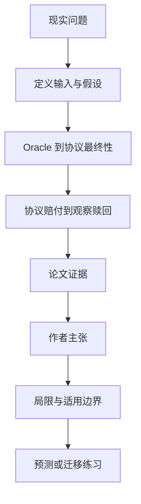

# 结果已公布不等于钱已到账：Polymarket 的协议结算与赎回链

英文原题：Resolution Is Not Settlement, Part II: Protocol Finality and Observed Redemption on Polymarket

arXiv：2609.15373v1；方向：金融；发布日期：2026-09-14

一句话问题：预测市场结果已经被 Oracle 判定后，为什么持有人仍可能尚未拿到抵押品？

## 先从一个普通人会遇到的问题开始

“答案确定”“协议写入赔付”“头寸可赎回”“持有人实际赎回”是不同事件；论文用链上事件逐层重建，防止把一个时间戳误当整条结算完成。

今天读完《结果已公布不等于钱已到账：Polymarket 的协议结算与赎回链》，目标不是记住论文名，而是能用自己的话回答：预测市场结果已经被 Oracle 判定后，为什么持有人仍可能尚未拿到抵押品？还要能指出作者的证据支持到哪一步、哪一步仍不能下结论。

## 整体关系图



## 先补两块必要基础

Oracle 负责把外部事件映射成结果；adapter 把结果送入市场合约；Conditional Tokens 协议记录 payout vector；持有人随后主动 redemption，把中奖头寸换回抵押品。

right censoring（右删失）指观察截止时还没看到事件，不等于它永远不会发生。Kaplan–Meier 可在保留风险集的情况下估计等待时间分布。

## 论文接收什么，输出什么

输入是固定 Polygon 区块快照、ConditionPreparation、ConditionResolution、PayoutRedemption 三类事件及与市场问题的精确映射。输出是条件状态、赔付向量、赎回事件与各层可识别时间。

论文把合约全体 universe 与精确链接的 Polymarket cohort 分开，且每个统计量明确分母；缺少跨合约精确顺序键时报告区间或不可评估。

## 第一步：把最终性拆成多个状态和时钟

Oracle finality 只是上游裁决，adapter terminality 和协议 ConditionResolution 是下游不同状态。相同区块时间也不能自动证明合约内部同时发生。

精确桥接需要合约身份、事件索引和版本关系，不能只按问题文字或近似时间拼接。

## 第二步：把可赎回与实际经济实现分开

协议记录 payout vector 后，中奖头寸具备技术赎回条件；持有人何时调用 redemption 是另一个行为过程。

即使完整观察赎回事件，没有每个地址应得的中奖头寸余额分母，也不能计算“总权益已有多少比例兑现”。

## 跟着一个小例子看中间状态

一场比赛结果已由 Oracle 给出；adapter 随后终止，协议写入 (1,0) 赔付；用户的钱包过几分钟才赎回。四个时刻都真实，却回答不同问题。

若某条件在截止时未见赎回，只能记为右删失：用户可能不急于赎回、通过托管或 wrapper 实现，也可能后来再操作。

## 作者拿什么证据支持主张

精确桥包含 108,638 个条件，其中 99,283 个在快照前观察到协议 resolution；在这组已解析条件中，92,158 个有任意赎回，91,817 个有正赔付赎回。

从首次协议 resolution 算起，条件层 Kaplan–Meier 中位数分别为任意赎回 182 秒、正赔付赎回 200 秒。赔付向量中有 53,847 个 (0,1)、45,024 个 (1,0)、410 个 50/50。

## 哪些结论不能顺手扩大

这些时间以“已观察到协议解析”为条件，不是最终权益完成率；地址不等于受益所有人，wrapper、托管、桥和链下净额会改变观察路径。

缺少完整中奖余额分母，论文明确不估算总未赎回价值；跨合约通用的同交易顺序也因证据键不足而不作断言。

## 把整条因果链重新接起来

研究问题“预测市场结果已经被 Oracle 判定后，为什么持有人仍可能尚未拿到抵押品？”先被拆成可观察输入，再经过“第一步：把最终性拆成多个状态和时钟”与“第二步：把可赎回与实际经济实现分开”，最后由论文实验或数据核对。

排错时依次检查：输入是否代表真实问题、中间状态是否按定义计算、比较组是否公平、指标是否回答原问题、结论是否越过样本和假设边界。

## 最小实践：把核心机制跑一遍

需求：用一组明确标为教学设定的小数据演示“沿一笔预测合约区分四个结算状态”。脚本打印输入、中间状态、正常例和失效边界，便于逐步核对。

验收标准：输出能解释机制方向，并明确它没有复现论文数据、模型或效果数字。

实际运行输出：

```text
教学输入：
- Oracle最终：12:00
- 协议解析：12:02
- 可赎回：12:02
- 观察赎回：12:05
中间状态：
1. 记录上游 Oracle 结果
2. adapter/协议写入赔付
3. 中奖头寸变为可赎回
4. 持有人实际调用赎回
正常例：从协议解析到观察赎回是 3 分钟，但不代表所有权益都在 3 分钟兑现。
边界：不是链上数据重建，也没有推断任何用户资金或平台可靠性。
```

## 自测题

1. 为什么看到 ConditionResolution 不能说用户钱已到账？
2. 截止时没赎回为什么不是“结算失败”？
3. 要算总权益兑现比例，还缺什么核心分母？

## 原文与阅读范围

已读形式化状态、数据桥接、分母与删失、实证结果、限制与结论；核对图 3、表 6、表 9 和主要人数/时间结果。

教学中的日常类比、演示数据和运行结果由本学习包构造；作者主张与论文证据已在正文中单独标出，二者不混用。

本次保存并解析的正文格式为 arxiv_html，提取到 9 个相关章节、20 条图表说明，正文约 134,328 个字符。

原文：https://arxiv.org/html/2609.15373v1
