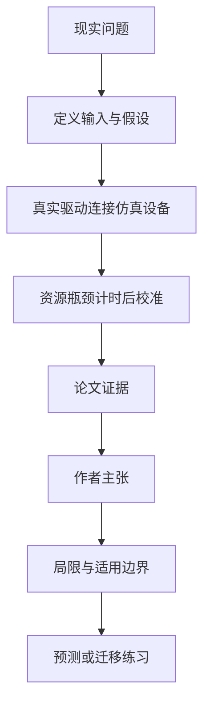

# 没有昂贵整机也能开发 AI 机架软件吗：Cnuas 的功能仿真边界

英文原题：Cnuas: A Software-Defined AI/HPC Rack-scale Emulation Platform and Hyperscale Data Center Facility Twin

arXiv：2609.15889v1；方向：科技与产业；发布日期：2026-09-14

一句话问题：学校或开发团队买不起完整 AI/HPC 机架时，怎样让驱动、RDMA、管理固件和设施界面在普通主机上先跑通，又不假装速度等于真机？

## 先从一个普通人会遇到的问题开始

硬件仿真最容易把“接口能工作”和“性能像真机”混为一谈；论文建立一条明确的 emulation seam，并把功能测试、虚拟时间估计和物理校准分开。

今天读完《没有昂贵整机也能开发 AI 机架软件吗：Cnuas 的功能仿真边界》，目标不是记住论文名，而是能用自己的话回答：学校或开发团队买不起完整 AI/HPC 机架时，怎样让驱动、RDMA、管理固件和设施界面在普通主机上先跑通，又不假装速度等于真机？还要能指出作者的证据支持到哪一步、哪一步仍不能下结论。

## 整体关系图



## 先补两块必要基础

functional emulation 复现设备寄存器、驱动、协议和管理接口，使真实软件能交互；performance simulation 还要预测每次传输和计算花多久。前者通过不代表后者准确。

RDMA 允许一台机器直接读写另一台机器内存，减少 CPU 参与；RoCEv2 和 InfiniBand 是不同传输路径。机架还有 BMC、电源 PSU、备用电池 BBU 等独立管理面。

## 论文接收什么，输出什么

输入是按 Open Rack v3 组织的虚拟机、CnuasNIC、混合软件交换机、独立 GPU peer fabric、OpenBMC 管理与 RS-485 电源固件；探索性扩展把遥测送入 OpenUSD 设施场景。

输出是 guest 可见的设备和协议行为、可重复的离散事件轨迹、测试清单与跳过原因。若提供真实目标测量，还可拟合时间缩放与偏置并在留出数据上报告误差。

## 第一步：在设备边界下仿真，边界上保留真实软件接口

应用、运行库和内核驱动照常运行，跨过 seam 后由 CnuasNIC、CnuasSwitch、CnuasGPU 与管理固件响应；开发者能观察一项工作怎样穿过服务器、网络和管理组件。

RoCEv2、原生 InfiniBand 与加速器 peer traffic 被分成可修改的网络，正常 OpenBMC 服务读取仿真 PSU/BBU 传感器，便于做接口和控制流程实验。

## 第二步：给虚拟时间明确的假设，再用真机数据校准

模型为指令、周期、字节、包和操作设置速率；可重叠资源取最慢项，可串行资源相加，稳定事件队列让相同输入产生相同轨迹。

目标机器若有训练测量，可用线性缩放和偏置校准，再在留出样本报告 MAE、RMSE 等误差。论文随附参数尚未绑定某台物理目标，因此只能叫分析估计。

## 跟着一个小例子看中间状态

教学例中一个操作同时需要 2 ms 计算和 5 ms 网络，若两者并行，服务时间取 5 ms；下一步还要串行写管理日志 1 ms，总计 6 ms。若误把所有项相加，会高估并行路径。

主机墙钟受 QEMU 翻译、宿主调度和其他负载影响，不能直接当真机延迟。确定性虚拟时间解决可重复性，只有真机校准才能讨论预测准确度。

## 作者拿什么证据支持主张

记录的单工作站测试中，Python 套件 375 例通过 350、因缺少设备或环境跳过 25；BMC 三套固件测试分别通过 177、45 和 98 例。作者明确没有把跳过算通过。

虚拟时间有 46 个自动化用例，覆盖资源重叠、排队、确定性重放和校准计算；但没有提供物理校准数据，也未完成 16 个 blade 同时执行或该次主机上的完整双节点 RDMA。

## 哪些结论不能顺手扩大

加速器栈尚早期，设施模型只是探索性原型；参考拓扑定义两机架 16 blade，记录的主机测量只启动一个 blade，生产可靠性和完整机架规模未证明。

测试通过只证明被测配置下的功能行为。未校准的虚拟时间不能作为真实吞吐或延迟预测，仿真设施也不能替代工程设计认证。

## 把整条因果链重新接起来

研究问题“学校或开发团队买不起完整 AI/HPC 机架时，怎样让驱动、RDMA、管理固件和设施界面在普通主机上先跑通，又不假装速度等于真机？”先被拆成可观察输入，再经过“第一步：在设备边界下仿真，边界上保留真实软件接口”与“第二步：给虚拟时间明确的假设，再用真机数据校准”，最后由论文实验或数据核对。

排错时依次检查：输入是否代表真实问题、中间状态是否按定义计算、比较组是否公平、指标是否回答原问题、结论是否越过样本和假设边界。

## 最小实践：把核心机制跑一遍

需求：用一组明确标为教学设定的小数据演示“区分可重叠资源的瓶颈时间、串行时间和未经校准的物理预测”。脚本打印输入、中间状态、正常例和失效边界，便于逐步核对。

验收标准：输出能解释机制方向，并明确它没有复现论文数据、模型或效果数字。

实际运行输出：

```text
教学输入：
- 计算：2ms
- 网络：5ms（与计算重叠）
- 管理日志：1ms（串行）
中间状态：
1. 重叠阶段取max(2,5)=5ms
2. 串行加1ms得到6ms
3. 同输入重复得到同轨迹
4. 没有真机测量就不声称6ms是真实延迟
正常例：功能与虚拟时间可重复，但物理准确度仍需目标机器校准。
边界：没有启动 Cnuas、QEMU、RDMA 或物理机架，只演示计时公式。
```

## 自测题

1. 为什么 host wall-clock time 不能直接代表仿真设备的真实延迟？
2. 46 个虚拟时间测试通过证明了什么、没有证明什么？
3. 测试被跳过为什么不能记作通过？

## 原文与阅读范围

已读系统边界、NIC/交换与加速器网络、OpenBMC 和设施扩展、虚拟时间与校准、测试矩阵、局限和结论；核对图 1—5 与表 1—4。

教学中的日常类比、演示数据和运行结果由本学习包构造；作者主张与论文证据已在正文中单独标出，二者不混用。

本次保存并解析的正文格式为 arxiv_html，提取到 7 个相关章节、9 条图表说明，正文约 62,566 个字符。

原文：https://arxiv.org/html/2609.15889v1
