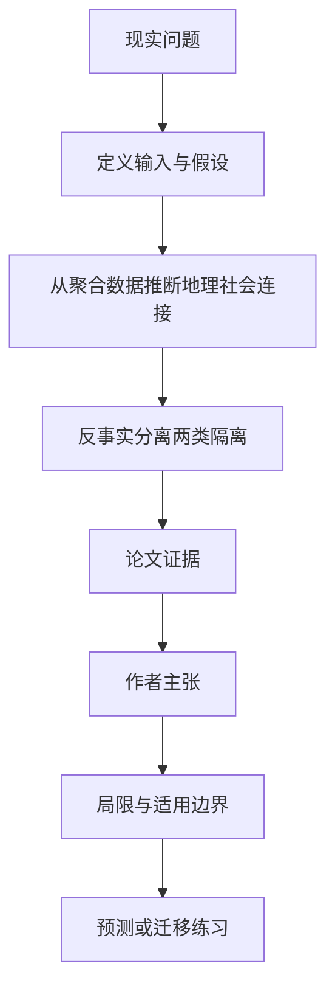

# 住得分开与交往分开不是一回事：把地理隔离和社会隔离拆开测

英文原题：Unified framework for measuring segregation resolves how social and geographical space jointly shape connections

arXiv：2609.16469v1；方向：社会研究；发布日期：2026-09-15

一句话问题：两个群体朋友少，究竟因为他们住在不同地方没有机会见面，还是住得近也更偏好同群体交往？

## 先从一个普通人会遇到的问题开始

只看居住分布会把机会结构当成社交偏好，只看朋友网络又会把距离影响算成同类偏好；论文用反事实网络分别关闭地理和群体通道。

今天读完《住得分开与交往分开不是一回事：把地理隔离和社会隔离拆开测》，目标不是记住论文名，而是能用自己的话回答：两个群体朋友少，究竟因为他们住在不同地方没有机会见面，还是住得近也更偏好同群体交往？还要能指出作者的证据支持到哪一步、哪一步仍不能下结论。

## 整体关系图



## 先补两块必要基础

geographical segregation 是群体在空间上的分布差异；social segregation 是在控制地理机会后，连接仍偏向同群体；total segregation 是实际网络相对随机混合的总体偏离。

null model 是一个有意简化的参照世界。这里保留每个节点的连接度，再随机混合；与它的距离越大，说明实际连接越偏离随机。

## 论文接收什么，输出什么

输入是美国 Facebook Social Connectedness Index 的地区聚合连接、人口普查和 Pew 群体构成；个人级网络不可见。输出是地区—群体单元间推断连接及四类隔离指数。

作者用联合地理—社会 intervening-opportunities 模型推断聚合关系，再构造“各地区群体占比相同”和“连接不看群体”两个反事实。

## 第一步：先建立能同时看距离与群体的连接模型

地区总连接不告诉我们具体哪个群体与哪个群体连接；作者利用各地区人口构成差异，估计地区—群体单元之间的连接概率。

联合 intervening opportunities 不只看公里数，还看地理与社会空间中间有多少可替代机会；拟合优于把两种空间简单相加的模型。

## 第二步：用两个反事实分别关掉地理或群体通道

把每个地区的群体构成调成相同，保留群体连接偏好，得到社会隔离；让连接只由地理、不由群体决定，得到地理隔离。

统一的 f-divergence 框架还能在特例下恢复 Theil、dissimilarity 和网络 modularity，说明旧指标在新框架中的位置。

## 跟着一个小例子看中间状态

教学例有红蓝两群，住区分布完全相同。世界 A 人人按距离交友，世界 B 即使住得近也偏向同色；传统居住隔离相同，社会隔离却不同。

另一个世界让两群住得很分开但见面后不挑群体，总网络仍可能同群连接多；若不做反事实，会误把空间机会全算成社交偏好。

## 作者拿什么证据支持主张

联合模型在 Facebook 聚合连接数据上的拟合优于纯距离和分离式混合模型；论文推断美国种族、教育和收入维度的连接，并报告后验不确定性。

作者发现社会隔离在三类维度上高于由实际网络诱导的地理隔离，White–Black、大学—非大学和高收入—中低收入分离突出；图 6 中社会隔离约为传统地理隔离的两到三倍。

## 哪些结论不能顺手扩大

地区聚合数据不能还原真实个人网络，推断依赖模型、Facebook 使用人群代表性及群体计数准确；“社会隔离”也不是对个人歧视动机的直接测量。

反事实会改变一个社会属性而冻结其他结构，现实中居住和交友共同演化；观察关系不能确定政策该改变地点、机会还是偏好。

## 把整条因果链重新接起来

研究问题“两个群体朋友少，究竟因为他们住在不同地方没有机会见面，还是住得近也更偏好同群体交往？”先被拆成可观察输入，再经过“第一步：先建立能同时看距离与群体的连接模型”与“第二步：用两个反事实分别关掉地理或群体通道”，最后由论文实验或数据核对。

排错时依次检查：输入是否代表真实问题、中间状态是否按定义计算、比较组是否公平、指标是否回答原问题、结论是否越过样本和假设边界。

## 最小实践：把核心机制跑一遍

需求：用一组明确标为教学设定的小数据演示“区分相同居住分布下的随机交往和同群体偏好”。脚本打印输入、中间状态、正常例和失效边界，便于逐步核对。

验收标准：输出能解释机制方向，并明确它没有复现论文数据、模型或效果数字。

实际运行输出：

```text
教学输入：
- 红群住区：东西各半
- 蓝群住区：东西各半
- 世界A：只按距离交友
- 世界B：距离相同但偏好同色
中间状态：
1. 确认居住构成相同
2. 建立随机混合参照
3. 比较实际同群连接
4. 把额外偏离归入社会通道
正常例：传统地理隔离相同，社会隔离可以完全不同。
边界：两群玩具网络没有拟合 Facebook 数据，也不能识别真实人的偏好或歧视。
```

## 自测题

1. 朋友网络同群连接多为什么不必然代表强社会偏好？
2. 论文为何需要人口普查群体构成？
3. 模型中的社会隔离能否直接解释为个人歧视？

## 原文与阅读范围

已读统一指标、反事实模型、聚合关系推断、美国种族教育收入结果、距离交互、方法和讨论；核对图 1—7 及指标特例证明。

教学中的日常类比、演示数据和运行结果由本学习包构造；作者主张与论文证据已在正文中单独标出，二者不混用。

本次保存并解析的正文格式为 arxiv_html，提取到 8 个相关章节、17 条图表说明，正文约 375,091 个字符。

原文：https://arxiv.org/html/2609.16469v1
