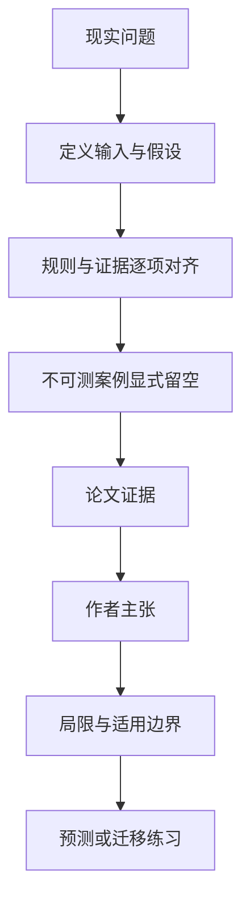

# 公开证据何时足够结算：Kalshi 的首次与稳定可判定时间

英文原题：From Public Evidence to Contractual Outcome: First and Stable Decidability on Kalshi

arXiv：2609.16642v1；方向：金融；发布日期：2026-09-15

一句话问题：官方数据已经发布时，怎样判断它是否真的满足某份预测合约的精确规则，而且之后不会被修订推翻？

## 先从一个普通人会遇到的问题开始

“新闻出来了”不是合约证据。规则版本、指定来源、发布对象、修订历史和所有未完成条件都要同时满足；论文提出首次可判定与稳定可判定两个时钟，并坦诚当前历史资料不足以完成全量估计。

今天读完《公开证据何时足够结算：Kalshi 的首次与稳定可判定时间》，目标不是记住论文名，而是能用自己的话回答：官方数据已经发布时，怎样判断它是否真的满足某份预测合约的精确规则，而且之后不会被修订推翻？还要能指出作者的证据支持到哪一步、哪一步仍不能下结论。

## 整体关系图



## 先补两块必要基础

first decidability 是当时第一次出现唯一合约结果的最早时刻；stable decidability 是回头看，从某时刻以后结果再未因修订或新条件改变。后者是事后概念，不能冒充交易者实时知识。

contractual outcome 由规则—证据映射决定，不等于现实世界的宽泛“真相”。同一经济问题换了规则版本或数据来源，最早可判定时刻可能不同。

## 论文接收什么，输出什么

理想输入包括准确规则版本、官方发布对象、来源优先级、修订历史和未完成条件。输出是 YES/NO/其他结果的唯一集合，或区间、冲突、不可测。

论文先建立分层抽样与盲审流程，再检查历史 Kalshi 数据是否保存足够的规则和发布对象；并开展前瞻性 shakedown 验证未来可捕获来源。

## 第一步：按规则版本把公开证据映射成候选结果

审阅者不能只看最终平台判定，而要在不被结果诱导的情况下读取当时有效规则、指定来源和原始发布，逐项排除尚未满足的条件。

当映射结果第一次只剩一个值时记 first decidability；若发布后来修订，旧时间不能继续算稳定边界。

## 第二步：保留不可测，不用技术时间戳填空

历史普通数据虽能看到平台侧状态，却无法稳定给出绑定版本的规则对象与官方发布对象，不能用 determination timestamp 替代证据充分时刻。

论文把未测、冲突、区间和支持不足作为正式输出。这种负面识别比制造一个虚假精确延迟更可靠。

## 跟着一个小例子看中间状态

合约问“官方年报中的全年值是否超过 5%”。新闻稿先给初值 5.2%，一周后官方修订为 4.9%。首次可判定可能在初值发布时，稳定可判定只能在修订后回溯确定。

若历史档案只保留当前网页，没有当时规则版本和初始发布，研究者应标为不可测，而不是拿平台最终时间减新闻时间。

## 作者拿什么证据支持主张

论文完成历史可行性检查，发现普通历史框架不能提供注册设计要求的版本绑定规则与官方发布对象，因此没有报告最终人工 adjudication、延迟估计或价格研究。

前瞻性 shakedown 证明来源观察与主动登记可运行；最终样本仍取决于预注册的支持阈值。该论文此阶段最重要的结果是识别哪些时钟不可由现有数据替代。

## 哪些结论不能顺手扩大

公共页面可能覆盖旧版本，场所可能使用研究者看不到的证据；人工判断即使盲审仍带主观性，抽样结果不能自动外推全平台。

stable decidability 是事后时钟；所谓较长公共证据残差不是场所低效的因果估计。当前版本没有给出最终时延数字。

## 把整条因果链重新接起来

研究问题“官方数据已经发布时，怎样判断它是否真的满足某份预测合约的精确规则，而且之后不会被修订推翻？”先被拆成可观察输入，再经过“第一步：按规则版本把公开证据映射成候选结果”与“第二步：保留不可测，不用技术时间戳填空”，最后由论文实验或数据核对。

排错时依次检查：输入是否代表真实问题、中间状态是否按定义计算、比较组是否公平、指标是否回答原问题、结论是否越过样本和假设边界。

## 最小实践：把核心机制跑一遍

需求：用一组明确标为教学设定的小数据演示“区分初次唯一结果与修订后稳定结果”。脚本打印输入、中间状态、正常例和失效边界，便于逐步核对。

验收标准：输出能解释机制方向，并明确它没有复现论文数据、模型或效果数字。

实际运行输出：

```text
教学输入：
- 规则：官方全年值>5%则YES
- 初值：5.2%
- 修订值：4.9%
- 历史规则版本：缺失
中间状态：
1. 按当时规则读取初值
2. 首次映射为 YES
3. 官方修订后映射为 NO
4. 历史版本缺失时标记不可测
正常例：first 和 stable decidability 可以不同，且历史证据不足时两者都不能伪造。
边界：示例未对应真实 Kalshi 合约，也没有测量市场价格或延迟。
```

## 自测题

1. 为什么平台首次 determination 时间不能替代 first decidability？
2. stable decidability 能否描述交易者当时知道什么？
3. 论文没有最终延迟估计是否等于研究失败？

## 原文与阅读范围

已读规则—证据形式化、历史可行性、抽样与盲审设计、限制和结论；确认论文没有把未执行的人类判定与价格分析包装成结果。

教学中的日常类比、演示数据和运行结果由本学习包构造；作者主张与论文证据已在正文中单独标出，二者不混用。

本次保存并解析的正文格式为 arxiv_html，提取到 7 个相关章节、3 条图表说明，正文约 31,109 个字符。

原文：https://arxiv.org/html/2609.16642v1
