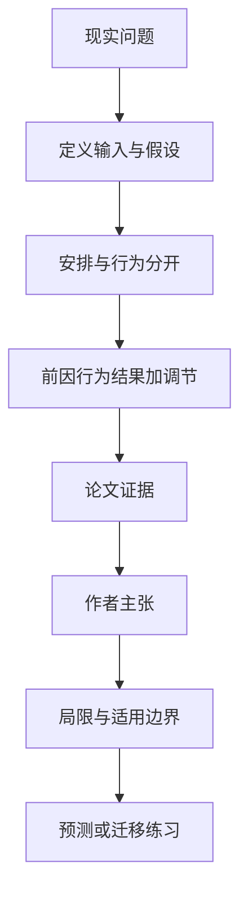

# 远程办公不能只问“在不在办公室”：六类行为怎样连接条件与结果

英文原题：An Integrative Multidimensional Conceptualization of Telework Behavior: A Systematic Review and Grounded Theory Approach

arXiv：2609.17409v1；方向：社会研究；发布日期：2026-09-15

一句话问题：两个人每周都远程三天，为什么一个更高效、一个更孤立，研究时应该观察他们具体做了什么？

## 先从一个普通人会遇到的问题开始

远程办公天数只是安排，不是行为；论文把工作表现、沟通、环境、任务、政策和身心健康六类可观察行为放进同一框架，帮助避免把所有结果都归因于“远程”两个字。

今天读完《远程办公不能只问“在不在办公室”：六类行为怎样连接条件与结果》，目标不是记住论文名，而是能用自己的话回答：两个人每周都远程三天，为什么一个更高效、一个更孤立，研究时应该观察他们具体做了什么？还要能指出作者的证据支持到哪一步、哪一步仍不能下结论。

## 整体关系图



## 先补两块必要基础

telework arrangement 是组织规定的地点、频率和条件；telework behavior 是员工实际怎样安排任务、沟通、管理边界和照顾健康。安排相同，行为可以不同。

antecedent 是行为之前的条件，outcome 是之后观察的结果，moderator 会改变两者关系强弱。三者分开，才不会把相关性随意讲成原因。

## 论文接收什么，输出什么

输入是按 PRISMA 流程筛出的 114 篇综述文章；作者用建构主义扎根理论编码，输出六类行为、五类前因、六类结果、三类情境调节和 14 条命题。

框架的中间层是行为：个人、工作、组织、技术和家庭环境先影响行为，行为再可能连接满意度、生产率、离职、健康、工作生活平衡和孤立。

## 第一步：把“远程办公”拆成六类实际行动

表现行为包括自我监控和主动性，沟通行为包括媒介选择和回应，环境行为包括布置工作空间，另有任务、政策遵从与健康边界行为。

拆开后才可能解释：不是远程天数本身，而是某类安排通过哪项行为连接到哪种结果。

## 第二步：把情境写进关系，而不是寻找一个万能结论

同一种沟通做法在自愿混合办公和被迫全远程中可能产生不同效果，文化与国家制度也会改变边界管理和组织规范。

作者把远程模式、个人偏好与文化国家背景作为调节条件，让未来研究能够提出可检验的“对谁、在何时有效”。

## 跟着一个小例子看中间状态

教学例中，两人都远程三天。甲主动写异步进度、下班关闭通知；乙持续待命却很少同步任务。相同安排通过不同沟通和健康行为，可能连接到不同生产率与压力。

若只在问卷中记录“每周远程三天”，这些中间状态全被压扁，最后只能得到难解释的平均相关。

## 作者拿什么证据支持主张

作者系统回顾 114 篇综述，并用迭代编码形成六个行为维度、五类前因、六类结果和三个调节因素；论文展示检索筛选流程、编码架构和内容域。

14 条关系被作者明确称为 propositions：它们来自综述证据的理论整合，尚未在同一样本中对中介结构和六因子测量做实证检验。

## 哪些结论不能顺手扩大

这是“综述的综述”，会继承原研究的自报偏差、定义差异和发表偏差；建构主义编码也不是从数据中发现唯一客观分类。

六维框架覆盖广却牺牲每个维度的细度，心理状态也可能是另一条机制。不能据此直接规定员工政策或断言某行为必然提高绩效。

## 把整条因果链重新接起来

研究问题“两个人每周都远程三天，为什么一个更高效、一个更孤立，研究时应该观察他们具体做了什么？”先被拆成可观察输入，再经过“第一步：把“远程办公”拆成六类实际行动”与“第二步：把情境写进关系，而不是寻找一个万能结论”，最后由论文实验或数据核对。

排错时依次检查：输入是否代表真实问题、中间状态是否按定义计算、比较组是否公平、指标是否回答原问题、结论是否越过样本和假设边界。

## 最小实践：把核心机制跑一遍

需求：用一组明确标为教学设定的小数据演示“把相同远程安排拆成不同中间行为和可能结果”。脚本打印输入、中间状态、正常例和失效边界，便于逐步核对。

验收标准：输出能解释机制方向，并明确它没有复现论文数据、模型或效果数字。

实际运行输出：

```text
教学输入：
- 共同安排：每周远程3天
- 员工甲：异步更新+关闭通知
- 员工乙：持续待命+少同步
中间状态：
1. 先记录安排
2. 再编码沟通与健康行为
3. 连接可能结果
4. 加入偏好和文化情境
正常例：相同远程天数不能替代行为测量。
边界：这是概念分类练习，没有测量真实员工、估计因果效应或给出管理规定。
```

## 自测题

1. 为什么“每周远程几天”不能代表远程办公行为？
2. 14 条命题是否等于 14 个已验证因果关系？
3. 举出一个可能改变沟通行为效果的调节因素。

## 原文与阅读范围

已读 PRISMA 检索、扎根理论编码、六维内容、前因—行为—结果框架、14 条命题、讨论与测量局限；核对作者对“待检验命题”的明确声明。

教学中的日常类比、演示数据和运行结果由本学习包构造；作者主张与论文证据已在正文中单独标出，二者不混用。

本次保存并解析的正文格式为 pdf_text，提取到 47 个相关章节、0 条图表说明，正文约 143,951 个字符。

原文：https://arxiv.org/pdf/2609.17409
