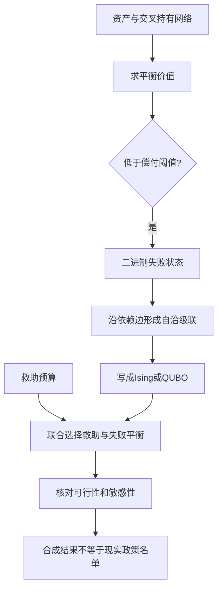

# 把金融传染网络写成可退火求解的 Ising 系统：级联、救助优化与易感性

英文原题：Financial Contagion Networks as Annealing-Ready Ising Systems Cascades, Bailout Optimization, and Susceptibility

arXiv：2609.17415v1；方向：金融；发布日期：2026-07-09

一句话问题：当机构通过持股和债务相连时，怎样寻找最坏失败集，并在有限预算下选择能阻断最多传染的救助对象？

## 救一家，可能间接保住很多家

三家公司互相持有资产。A 受损后低于偿付门槛，给持有 A 的 B 带来损失；B 再失败又拖累 C。最终失败集合必须“自洽”：集合中的每家在传播后的价值都低于门槛，而不是随意把最差公司列出来。

论文把失败/存活写成二进制变量，并转成 Ising/QUBO 能量最小化问题，再同时优化失败平衡和救助选择。读完你应能解释网络反馈、预算约束与 bailout susceptibility；但合成网络上的优化不是现实救助名单。

## 整体关系图



## 先把 Ising 和 QUBO 翻成普通话

Ising 模型用每个节点的两种状态表示，例如存活 -1、失败 +1，相邻节点通过耦合相互影响。QUBO 是二次无约束二进制优化：目标只含 0/1 变量的一次项和两两乘积，约束可通过惩罚项写进同一个能量函数。

退火算法从高“温度”开始允许偶尔接受更差状态，以跳出局部低谷，随后降温寻找低能量配置。它是求近似优化解的方法；写成 QUBO 并不表示必须使用量子计算，也不保证找到了全球最优。

## 金融网络怎样进入二进制系统

输入包括机构对基础资产的持有、机构间交叉持有或依赖矩阵、初始价值、偿付阈值、外生冲击和救助预算。价值先通过网络关系形成固定点；低于阈值会触发非线性失败成本，并继续传播。

输出可以是平衡价值与失败集合、某个种子冲击能引发的最大自洽级联、预算内救助集合及干预后的状态。易感性则描述给一个节点小干预时，整个系统状态响应多强。

## 把“最坏级联”变成能量最低

每个失败变量为 1 时获得“希望多找失败”的目标收益，但若它没有足够失败邻居支持，或违反种子与传播逻辑，就加惩罚。惩罚必须足够大，才能让低能量解同时满足级联自洽，而非为了多计失败而作弊。

论文把 Maximum Cascade Failure Problem 转成 QUBO，并用模拟量子退火寻找配置。这个形式适合经典退火、量子启发式算法或未来硬件；真正计算可信度仍需独立重复、可行性检查和与小规模精确解比较。

## 把救助与失败平衡放进同一个问题

救助会改变节点局部场并重新塑造传播路径，所以不能先固定失败集合再随意选最大机构。联合 QUBO 同时决定哪些机构救、救后哪些失败，并用预算惩罚限制干预成本。

bailout susceptibility 来自平衡状态的协方差响应，可理解为“轻推这个节点，网络有多大连锁反应”。高易感节点不一定资产最大，而可能处于能阻断多条传播路径的位置。

## 三节点教学级联

设 A 已失败；B 有两个依赖来源，其中一个来自 A，阈值为一个失败邻居；于是 B 失败。C 依赖 B，也随之失败。若预算只能救一个，救 A 可能不允许（种子固定失败），救 B 可让 C 免于传播；只救末端 C 则 B 仍失败。

每轮中间状态是当前失败集合、新增失败和是否收敛。真实估值还能相互反馈而非简单阈值，论文用固定点和更完整的耦合表达；教学布尔传播只保留“网络位置决定间接效果”。

## 合成实验展示了哪些能力

20 个机构的估值例中，一个机构低于阈值，总平衡损失约 9.69，即初始价值的 12.5%。1,000 节点合成网络中，模拟量子退火找到包含 561 家的自洽最坏级联，独立的并行回火版本得到相同规模和近似能量。

100 节点救助实验中，初始有 92 家失败；直接救助 40 家后，另有 47 家间接受保护，只剩 9 家失败，外生种子保持失败。它展示网络阻断可能产生乘数效果，但数字来自作者设定的合成层级网络。

## 漂亮网络图不等于现实压力测试

模型需要已知且稳定的暴露矩阵、阈值和失败传播规则；现实衍生品、流动性、恢复率、政策预期和时间动态更复杂。合成网络参数可能决定级联形状，不能把 561/1000 外推到真实系统。

退火找到低能量不证明全球最优或量子优势，惩罚权重不当还会得到不可行解。教学 demo 枚举一个四节点布尔模型，可精确核对，但没有估值、成本异质性或现实机构数据，也不构成救助建议。

## 从持有关系到干预结果

资产和交叉持有产生平衡价值；门槛把连续价值变成失败状态；失败通过依赖边传播；二进制变量与惩罚构成 QUBO；优化寻找最坏级联或预算内救助；再用固定点核对可行性，并以易感性解释哪些节点有系统影响。

排错顺序是：暴露方向是否正确、失败阈值是否有经济含义、迭代是否收敛、QUBO 解是否满足原约束、结果是否对参数和随机种子稳健。只看最低能量数值无法替代这些检查。

## 最小实践：枚举救哪一个节点

需求：在 A→B、B→C、B→D 的四节点网络中固定 A 失败，模拟阈值传播，并枚举预算为 1 时救 B、C 或 D 的最终失败数。正常例显示救 B 的间接保护；边界说明这不是金融估值或 QUBO 性能测试。

实际运行输出：

```text
不救助：A、B、C、D
救 B：失败 A
救 C：失败 A、B、D
救 D：失败 A、B、C
最小失败方案：救 B，同时间接保护 C、D。
边界：这是确定性布尔传播的精确枚举，不含估值、成本差异、概率、QUBO惩罚或真实金融机构。
```

## 自测题

1. 为什么按机构资产规模从大到小救，不一定是网络中的最优方案？
2. 两个退火器找到同样级联规模，是否证明全球最优？
3. QUBO 解能量很低但违反预算，应先怀疑什么？

## 原文与阅读范围

已读取模型、失败固定点、MCFP 与救助 QUBO、易感性、数值结果和结论；核对图 1—6及主要能量与失败数字。

论文结果来自合成网络；教学枚举只解释传播与网络干预，不使用真实银行数据、量子硬件或投资信息。

本次保存并解析的正文格式为 arxiv_html，提取到 3 个相关章节、10 条图表说明，正文约 74,590 个字符。

原文：https://arxiv.org/html/2609.17415v1
