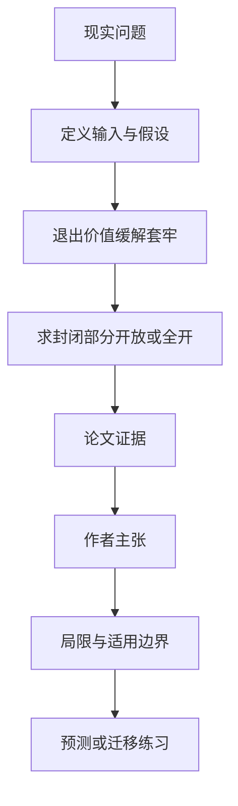

# AI 智能体平台该开放多少：可迁移性如何改变开发者投资

英文原题：Developer Investment in Agentic Platforms: Capability Spillovers, Hold-Up, and Portability

arXiv：2609.17558v1；方向：经济；发布日期：2026-07-21

一句话问题：开发者担心工作流、工具连接和任务记录被平台锁住时，允许带走多少能力才能鼓励投资，又不会造成过度泄漏和安全成本？

## 先从一个普通人会遇到的问题开始

平台事后可以改费率或路由，开发者会预见到被“套牢”而少投资；可迁移权提供退出价值，但完全开放也可能复制敏感资产、碎片化生态。

今天读完《AI 智能体平台该开放多少：可迁移性如何改变开发者投资》，目标不是记住论文名，而是能用自己的话回答：开发者担心工作流、工具连接和任务记录被平台锁住时，允许带走多少能力才能鼓励投资，又不会造成过度泄漏和安全成本？还要能指出作者的证据支持到哪一步、哪一步仍不能下结论。

## 整体关系图



## 先补两块必要基础

hold-up（攫取/套牢）是投资先发生、条款后重谈时，投资者拿不到自己创造的足够回报，于是事前少投入。

portability 不是把所有数据原样导出，而是目的平台在可验证规则下承认多少工作流、记录、授权记忆或能力。论文用 0 到 1 表示保护强度。

## 论文接收什么，输出什么

输入是开发者投资成本、直接能力收益、对其他智能体的溢出、原平台事后抽取能力、目的平台认可、验证质量和泄漏治理成本。输出是投资水平与最优开放程度。

中间状态包括开发者的可保护外部回报、平台因更多投资得到的价值、额外留给开发者的租金及迁移造成的真实或纯分配成本。

## 第一步：可迁移的退出选项提高事前可保护回报

平台无法完全承诺未来费率时，封闭关系让开发者预期成果会被抽取；可验证迁移提高离开后的回报，因此增加投资。

即便平台不能完全抽走事后剩余，结论仍成立；而能力对其他开发者的生产性溢出还会留下另一层投资不足。

## 第二步：平台比较投资增益、租金与治理泄漏

更开放扩大能力和收费基础，却也要给开发者更多回报，并承担验证、复制、竞争泄漏和安全成本。

验证既能降低危险迁移，又能让目的平台更愿意认可资产、抬高开发者外部租金，所以验证不必单调增加最优开放度。

## 跟着一个小例子看中间状态

开发者要花 100 单位构建工作流。完全封闭时预期平台改费后只能保留 30，于是放弃；若经验证可迁移使外部回报升到 80，投资更可能发生。

若迁移只是把利润从原平台转给目的平台，社会成本可能小；若会复制敏感授权、制造兼容碎片，真实成本会让完全开放过头。

## 作者拿什么证据支持主张

论文建立原平台、目的平台和开发者的理论模型，刻画封闭、部分与完全可迁移的边界条件，并给出投资、验证和工具组合的比较静态。

作者证明投资随可保护回报上升，但最优迁移取决于诱导投资收益是否超过租金、竞争泄漏和治理成本。没有平台级实证数据验证参数或福利大小。

## 哪些结论不能顺手扩大

单期抽象模型把复杂资产压成一个能力存量，现实还涉及用户同意、数据权属、动态创新、多平台接入和安全审计。

“竞争泄漏”若只是私人利润转移与若是真实重复成本，政策含义完全不同；必须先实证区分，不能先验认定越开放或越封闭越好。

## 把整条因果链重新接起来

研究问题“开发者担心工作流、工具连接和任务记录被平台锁住时，允许带走多少能力才能鼓励投资，又不会造成过度泄漏和安全成本？”先被拆成可观察输入，再经过“第一步：可迁移的退出选项提高事前可保护回报”与“第二步：平台比较投资增益、租金与治理泄漏”，最后由论文实验或数据核对。

排错时依次检查：输入是否代表真实问题、中间状态是否按定义计算、比较组是否公平、指标是否回答原问题、结论是否越过样本和假设边界。

## 最小实践：把核心机制跑一遍

需求：用一组明确标为教学设定的小数据演示“比较封闭和可验证迁移下开发者的预期可保护回报”。脚本打印输入、中间状态、正常例和失效边界，便于逐步核对。

验收标准：输出能解释机制方向，并明确它没有复现论文数据、模型或效果数字。

实际运行输出：

```text
教学输入：
- 投资成本：100
- 封闭时可保留：30
- 迁移时可保留：80
- 额外生态价值：40
中间状态：
1. 开发者比较私有回报与成本
2. 封闭时投资不足
3. 迁移提高退出价值
4. 平台再扣除验证与真实泄漏成本
正常例：可迁移可诱导更多投资，但是否应完全开放取决于治理成本。
边界：数字不来自平台数据，没有计算任何真实产品的最优权限或迁移方案。
```

## 自测题

1. 为什么平台自己也可能自愿给予一定迁移权？
2. 验证更强为什么不一定让最优开放度更高？
3. 若泄漏只是利润转移，社会福利判断会怎样变化？

## 原文与阅读范围

已读能力存量与溢出、套牢基准、可迁移投资结果、平台最优选择、验证与目的平台、费率承诺组合、福利与结论。

教学中的日常类比、演示数据和运行结果由本学习包构造；作者主张与论文证据已在正文中单独标出，二者不混用。

本次保存并解析的正文格式为 pdf_text，提取到 65 个相关章节、0 条图表说明，正文约 98,088 个字符。

原文：https://arxiv.org/pdf/2609.17558
