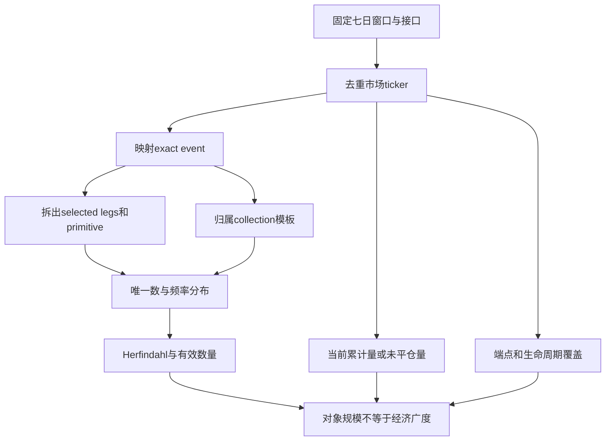

# Kalshi 按需组合事件市场：实例化、集中度与有效市场广度

英文原题：On-Demand Combinatorial Event Markets on Kalshi: Instantiation, Concentration, and Effective Market Breadth

arXiv：2609.17610v1；方向：金融；发布日期：2026-09-14

一句话问题：一个平台有数百万个市场 ticker，为什么不能直接说它拥有数百万种独立的预测问题？

## 761 万个菜单项，可能只是三套模板的排列组合

一家餐厅允许顾客任选五种配料，菜单编号会迅速膨胀；但这不代表出现了几百万种真正独立的食材或菜系。Kalshi 的 multivariate event（多变量事件）也能按用户选择的 legs 即时生成市场对象。

论文连续记录七天，研究从 collection、event、primitive 到 ticker 的层级，以及对象是否显示活动。读完后你应能解释原始对象数、唯一基础元素数、集中度和有效数量为何回答不同问题；这是一篇市场结构测量，不是下注建议。

## 整体关系图



## 先分清 ticker、leg、event 与 collection

ticker 是一个可被接口识别的市场对象编号。leg 是组合中的一个基础条件，例如“球队 A 获胜”或“某指标超过阈值”。exact event key 描述一组确切选择，collection 则是允许哪些组合规则的上层模板。

大量 ticker 可由少数 collection 和重复使用的 primitives 组合生成。经济广度应问基础问题、规则和交易兴趣是否多样，而不能把每个排列组合都当成一项新经济主题。

## 论文怎样建立可审计的人口清单

作者在登记的七日区间使用 190 个独立校验的时间分片，从 REST 接口收集 MVE 对象，并排除 5,777 个边界重叠观测，得到 7,611,594 个唯一 ticker。还记录 exact event key、collection key、primitive 及其出现次数。

REST 与 WebSocket 是不同观察面：创建通知 ticker 与最终 REST 人口只部分相交，因此不能拿一个接口的流量替代另一个接口的存量。对象的生命周期终态与规则端点可追溯程度也被单独统计。

## 从“很多”变成“集中度多大”

最大 collection 包含 7,217,085 个对象，占 94.82%；全样本只有三个 collection key。用 Herfindahl 集中度的倒数表示有效 collection 数，论文得到约 1.11，意思是分布的多样性更像一个占主导的模板，而非三个均衡模板。

primitive 有 83,701 种，却出现约 6,634 万次；按频率计算的有效 primitive 数约 720。有效数量把不均衡计入：若一个元素占绝大多数，简单去重计数会夸大可见广度。

## 对象存在、现在有活动、历史成交是三回事

检索时有 2,692,787 个对象的累计成交量或未平仓量为正，占 35.38%。这只能称为当前快照的 activity eligibility；24 小时成交量字段全为零且缺少交易次数，不能还原历史上什么时候或多少人交易。

同样，能够在公开端点确认对象存在，不等于能重建从创建到结算的完整生命周期。论文分别报告对象端点证据与 determination-to-endpoint 配对覆盖，避免把“现在查得到”写成“历史全过程已观测”。

## 用层级树读一个组合市场

一个 ticker 先归属 collection；其 exact event 由选定 legs 构成；每条 leg 又引用 primitive。两个 ticker 可能只差一条 leg，却都被原始计数当成独立对象。分析时要同时展示每层唯一数、出现频率和覆盖状态。

论文还用 exact structural signature 检查对象结构，761 万个签名无碰撞组。这说明签名在观察人口中能区分对象，不说明这些对象有同等交易深度或独立信息。

## 最有用的结果是“压缩比”

七天平均每天创建约 108.7 万个对象，但 94.82% 来自同一 collection，有效 collection 数约 1.11；83,701 个 primitive 的频率加权有效数约 720。数字共同说明对象层爆炸与基础经济广度不是一回事。

REST 人口 7,611,594，与 WebSocket 创建通知交集只有 276,177 个 exact ticker；该差异警告研究者先定义数据面。当前有累计量或未平仓量的比例 35.38%，也不能称为历史交易率。

## 七天快照不能回答所有市场活跃问题

窗口短、接口规则可能变化，三个 collection 的当前端点确认不能建立历史版本。缺少逐笔成交与完整生命周期时，不能测参与者数量、流动性质量、价格发现或长期存活率。

对象生成速度也可能由自动化需求或接口行为推动，并非用户兴趣。教学 demo 只计算几个份额的有效数量，不能复制 190 分片采集或验证 Kalshi 数据。

## 正确阅读“市场规模”的顺序

先固定观察窗口与接口；去重 ticker；映射 exact event、collection 和 primitive；按层计算唯一数与出现频率；用有效数量看集中度；把端点可见、当前有活动和生命周期覆盖分开；最后才讨论经济广度。

若有人只展示 ticker 总数，应追问：多少来自最大模板、基础 legs 是否反复复用、活动字段的时间含义是什么、不同接口是否覆盖同一人口。回答不了这些问题，就不能把技术对象数当市场多样性。

## 最小实践：四个类别为何只相当于 1.1 个

需求：给一个占 95% 的主 collection 和三个小 collection，计算 Herfindahl 指数及有效类别数；再与四类均衡分布比较。正常例展示集中压缩，边界说明有效数只描述频率，不描述交易质量。

实际运行输出：

```text
原始类别数：4
95%集中分布的有效类别数：1.11
四类均衡分布的有效类别数：4.00
含义：同样都是四个标签，频率高度集中时更像一个主导类别。
边界：有效数量只概括频率集中度，不测成交、流动性、独立信息或经济价值。
```

## 自测题

1. 若 ticker 数翻倍但全部来自同一 collection 和同一批 primitive，有效广度一定翻倍吗？
2. “35.38% 对象有累计量或未平仓量”为什么不能写成“35.38% 市场在本周交易过”？
3. REST 与 WebSocket 交集很小，研究者第一步应做什么？

## 原文与阅读范围

已读取数据采集、去重、层级结构、集中度、活动和端点覆盖部分；核对主要人口计数、collection/primitive 有效数和接口交集。

论文描述平台结构而非交易收益；教学份额为缩小示意，没有调用 Kalshi、创建市场或处理真实下注。

本次保存并解析的正文格式为 arxiv_html，提取到 6 个相关章节、9 条图表说明，正文约 33,992 个字符。

原文：https://arxiv.org/html/2609.17610v1
