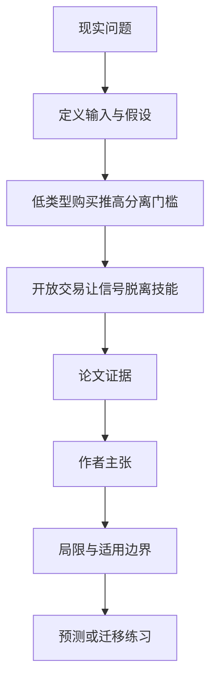

# AI 能代写产出后，学历和早期工作还在传递什么信号

英文原题：AI and the Market for Signals

arXiv：2609.17752v1；方向：经济；发布日期：2026-09-15

一句话问题：当求职者可以买到与本人作品难以区分的 AI 产出时，低能力者更容易包装自己，为何高能力者有时反而要更努力？

## 先从一个普通人会遇到的问题开始

作业和早期工作既创造真实技能，也向雇主传递能力；AI 降低了制造可见产出的成本，却不必立刻消灭筛选，可能先把“证明自己”的军备竞赛推高。

今天读完《AI 能代写产出后，学历和早期工作还在传递什么信号》，目标不是记住论文名，而是能用自己的话回答：当求职者可以买到与本人作品难以区分的 AI 产出时，低能力者更容易包装自己，为何高能力者有时反而要更努力？还要能指出作者的证据支持到哪一步、哪一步仍不能下结论。

## 整体关系图



## 先补两块必要基础

signaling model 中，雇主看不到能力，只看到可观察产出并据此付工资；separating equilibrium 是不同能力仍选择不同信号，市场因而能反推出类型。

论文把真实努力同时设为产出和长期技能投资；AI token 能生成表面相同产出，但购买 token 本身不积累同样技能。

## 论文接收什么，输出什么

输入是连续能力类型、努力成本与技能收益、产出价值、AI token 成本和能否把产出卖给别人。输出是各类型的努力、token 买卖、可见信号、工资和福利。

作者比较无 token、只能购买、可购买且可侧向出售三种制度，追踪信号斜率与真实努力的脱钩。

## 第一步：只能买 AI 产出时，低类型抬高信号门槛

低类型会买便宜 token 补产出，但分离均衡中市场仍可从总信号识别类型。高类型若想保持区别，就必须提交更高信号。

因此一部分买家减少真实努力，而顶端类型可能比没有 AI 时更努力；AI 和努力并非对每个人都简单替代。

## 第二步：开放侧向销售后，价格可能切断努力—信号关系

若劳动者还能出售自己或 AI 生成的产出，丰富且便宜的 token 会让可见信号由市场价格而非自身努力决定。

当努力不再提高工资信号时，各类型都会少投技能。税、工资税或水印的效果取决于是否有真实产出价值和侧向市场，不能一概而论。

## 跟着一个小例子看中间状态

教学例中，原来低能力者交 4 份、高能力者交 8 份作品。低能力者买 AI 把可见产出抬到 7，高能力者若仍想被识别，可能要把信号推到 10。

若大家能以统一价格买卖作品，雇主看到的数量越来越像交易结果而不是亲自努力，产出信号与技能积累开始断裂。

## 作者拿什么证据支持主张

论文在连续类型的职业信号模型中推导三种交易制度的分离与开放市场均衡，并用图 1—5 展示参数化例子的信号、努力、交易和收益。

主要发现包括：购买不必终止筛选；高类型努力可增加；侧向交易和充足 AI 下所有类型技能投资不足；教育产出无直接价值时，分离均衡中的劳动者都可能受损。这些是模型结果。

## 哪些结论不能顺手扩大

模型假设 AI 产出与本人产出无法区分、类型和技术结构特定、AI 供给按边际成本定价；现实检测会误判，企业还会看面试、过程和多维信号。

税或水印结论随产出价值、市场结构和能否侧卖改变，不能从模型直接推出单一教育或劳动政策。

## 把整条因果链重新接起来

研究问题“当求职者可以买到与本人作品难以区分的 AI 产出时，低能力者更容易包装自己，为何高能力者有时反而要更努力？”先被拆成可观察输入，再经过“第一步：只能买 AI 产出时，低类型抬高信号门槛”与“第二步：开放侧向销售后，价格可能切断努力—信号关系”，最后由论文实验或数据核对。

排错时依次检查：输入是否代表真实问题、中间状态是否按定义计算、比较组是否公平、指标是否回答原问题、结论是否越过样本和假设边界。

## 最小实践：把核心机制跑一遍

需求：用一组明确标为教学设定的小数据演示“演示低类型购买 AI 产出后，高类型为何可能提高信号”。脚本打印输入、中间状态、正常例和失效边界，便于逐步核对。

验收标准：输出能解释机制方向，并明确它没有复现论文数据、模型或效果数字。

实际运行输出：

```text
教学输入：
- 低类型原信号：4
- 高类型原信号：8
- 低类型AI后信号：7
- 高类型新信号：10
中间状态：
1. 雇主只看总信号
2. 低类型用AI接近原高类型
3. 原8不再充分区分
4. 高类型提高到10维持分离
正常例：AI 替代低类型部分努力，却可能把高类型的信号竞赛推高。
边界：数值是教学故事，没有求论文均衡，也不预测真实招聘市场。
```

## 自测题

1. AI token 可购买为什么不必马上让所有类型混在一起？
2. 高类型更努力是否代表社会福利一定提高？
3. 完美水印假设为什么重要？

## 原文与阅读范围

已读模型设定、无交易/只购买/开放交易均衡、福利与教育例、税和水印比较、扩展与结论；核对图 1—5。

教学中的日常类比、演示数据和运行结果由本学习包构造；作者主张与论文证据已在正文中单独标出，二者不混用。

本次保存并解析的正文格式为 arxiv_html，提取到 3 个相关章节、5 条图表说明，正文约 264,275 个字符。

原文：https://arxiv.org/html/2609.17752v1
