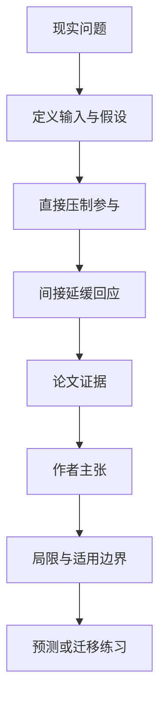

# 机构还能部分运转，为何罢工有时反而拖得更久

英文原题：Why Some Strikes Last Longer: The Resilience Paradox of Partially Functional Institutions

arXiv：2609.17761v1；方向：社会研究；发布日期：2026-09-15

一句话问题：未罢工部门维持一部分服务，本应削弱罢工，为什么它也可能降低机构解决冲突的紧迫感，让罢工更持久？

## 先从一个普通人会遇到的问题开始

“韧性总能稳定系统”忽略了反馈：残余运行直接压低参与，却也缓冲损失、减弱回应；论文用最小动力模型找出两条力量正好抵消的阈值。

今天读完《机构还能部分运转，为何罢工有时反而拖得更久》，目标不是记住论文名，而是能用自己的话回答：未罢工部门维持一部分服务，本应削弱罢工，为什么它也可能降低机构解决冲突的紧迫感，让罢工更持久？还要能指出作者的证据支持到哪一步、哪一步仍不能下结论。

## 整体关系图



## 先补两块必要基础

stationary participation 是模型长时间后的稳定罢工比例，不是一次现实罢工的预测时长。susceptibility 表示残余运行改变一点时，稳定参与率怎样变化。

residual activity 有两个通道：让员工觉得行动影响小而直接抑制参与，也让机构承受压力小而减少让步或解决速度。

## 论文接收什么，输出什么

输入是罢工参与、机构回应、总体功能、残余活动的直接压制强度和对机构压力的缓冲强度。输出是平衡参与率、稳定性及 compensation threshold。

作者解析求导，判断残余活动增加时稳定参与率下降、无变化还是反常上升，再用数值轨迹展示。

## 第一步：残余运行直接让罢工更难扩大

机构仍能提供服务时，罢工造成的可见中断较小，加入行动的社会或策略收益可能下降，直接通道压低参与。

若只看这一条，残余运行越多，罢工应越弱、越短，这是常规直觉。

## 第二步：残余运行也会削弱机构解决冲突的压力

服务没有完全停摆时，机构可承受更长时间，回应和让步压力降低；未解决的不满持续，反而托住参与。

当间接持续效应超过直接压制效应，就进入 resilience paradox；阈值处两者恰好抵消，平衡参与率对残余活动不敏感。

## 跟着一个小例子看中间状态

教学例中，残余服务从 20% 增到 40%，直接让参与意愿下降 5 点；但机构解决速度减慢造成参与增加 8 点，净效应反而 +3。

若机构承诺无论服务维持多少都在固定时间谈判，第二通道被削弱，反常区间可能消失。

## 作者拿什么证据支持主张

论文构造三变量最小动力系统，解析推导稳定状态、strike-response susceptibility 与精确补偿阈值。

数值结果验证在参数越过阈值时，增加残余活动可提高而非降低稳定参与。证据是理论与模拟，不是罢工事件面板的经验估计。

## 哪些结论不能顺手扩大

模型把工人和机构高度同质化，忽略工会组织、法律、工资谈判、舆论、替代工与多轮策略；参数并未从真实罢工识别。

平衡参与率不等于罢工持续天数，反常机制是可能性而非所有部分运行机构的普遍规律。

## 把整条因果链重新接起来

研究问题“未罢工部门维持一部分服务，本应削弱罢工，为什么它也可能降低机构解决冲突的紧迫感，让罢工更持久？”先被拆成可观察输入，再经过“第一步：残余运行直接让罢工更难扩大”与“第二步：残余运行也会削弱机构解决冲突的压力”，最后由论文实验或数据核对。

排错时依次检查：输入是否代表真实问题、中间状态是否按定义计算、比较组是否公平、指标是否回答原问题、结论是否越过样本和假设边界。

## 最小实践：把核心机制跑一遍

需求：用一组明确标为教学设定的小数据演示“把残余运行的直接抑制和间接拖延放在一张净效应账上”。脚本打印输入、中间状态、正常例和失效边界，便于逐步核对。

验收标准：输出能解释机制方向，并明确它没有复现论文数据、模型或效果数字。

实际运行输出：

```text
教学输入：
- 直接参与变化：-5
- 回应减弱导致变化：8
- 残余服务变化：20%到40%
中间状态：
1. 计算直接压制-5
2. 计算间接持续+8
3. 相加得到+3
4. 比较两通道大小决定所在区间
正常例：机构更能撑住时，稳定参与可能反而提高。
边界：数值不是现实罢工估计，也不预测持续时间或提供谈判策略。
```

## 自测题

1. 残余服务为何同时有两个相反作用？
2. 补偿阈值处会观察到什么局部现象？
3. 模型结果能否证明某次真实罢工拖长的原因？

## 原文与阅读范围

已读模型设定、平衡与稳定、响应敏感度、补偿阈值、数值结果和制度解释；区分数学可能性与经验事实。

教学中的日常类比、演示数据和运行结果由本学习包构造；作者主张与论文证据已在正文中单独标出，二者不混用。

本次保存并解析的正文格式为 arxiv_html，提取到 3 个相关章节、3 条图表说明，正文约 34,387 个字符。

原文：https://arxiv.org/html/2609.17761v1
