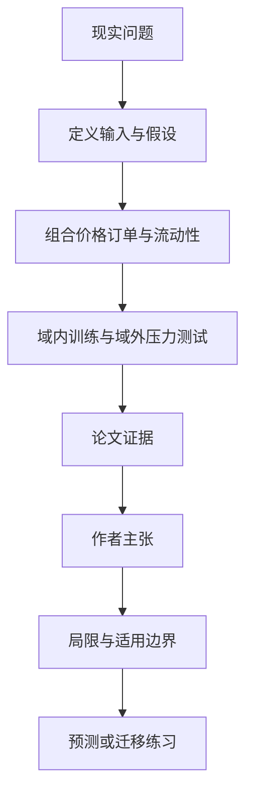

# SAiFE-gym：在集中流动性 AMM 中训练与压力测试做市策略

英文原题：SAiFE-gym: Model-based Environments for Automated Market Making with Concentrated Liquidity

arXiv：2609.17788v1；方向：金融；发布日期：2026-09-15

一句话问题：流动性提供者把资金放在多窄的价格区间，才能多赚手续费又不至于价格一变就失去作用？

## 先从一个普通人会遇到的问题开始

集中流动性像只在某一段路上开收费站：车流经过时资本效率高，价格跑出区间后就不再收费；论文搭建模块化仿真环境，让不同策略在可控市场条件下比较。

今天读完《SAiFE-gym：在集中流动性 AMM 中训练与压力测试做市策略》，目标不是记住论文名，而是能用自己的话回答：流动性提供者把资金放在多窄的价格区间，才能多赚手续费又不至于价格一变就失去作用？还要能指出作者的证据支持到哪一步、哪一步仍不能下结论。

## 整体关系图



## 先补两块必要基础

constant product market 常用 x·y=k 定价。集中流动性允许 LP 只在选定价格区间投入资金；区间越窄，在区间内份额越集中，但更容易被价格移出。

LP 收手续费，同时承担库存价值变化、重新布置费用和 adverse selection。强化学习把每次选区间看成序列决策，但训练效果高度依赖模拟环境。

## 论文接收什么，输出什么

输入是价格动态、订单到达、套利者、费用、流动性曲线和 LP 动作空间。输出是可向量化并行运行的 gym 环境、策略轨迹与收益指标。

模块化组件让研究者固定其他机制，只改变波动率、订单强度或代理策略；domain randomization 在一组市场参数上训练，以测试超出名义参数时是否更稳。

## 第一步：把 AMM 微观结构拆成可替换组件

环境分别暴露市场价格过程、订单流、套利、流动性分布和 LP 决策接口。这样同一策略可在不同机制下重跑，而不是把结果绑死在一个黑箱模拟器。

向量化让许多轨迹在 NumPy 中并行推进，减少强化学习采样成本，也让相同条件的随机重复更稳定。

## 第二步：用跨市场参数测试策略韧性

论文比较周期性居中重平衡、在一个名义市场训练的 PPO，以及在参数分布中随机训练的策略。

不能只看训练域内奖励；波动率或订单强度改变后，过度贴合单一环境的策略可能失效，域随机化意在换取更稳的跨情景表现。

## 跟着一个小例子看中间状态

价格为 100，LP 选 95—105 的窄区间。价格在区间内时资本集中、手续费份额高；涨到 110 后资金变成单边资产且停止提供有效流动性，需要决定是否付成本重置区间。

策略看到的中间状态应包含当前价格、区间位置、库存构成、累计费、重平衡成本与市场参数；只看最终利润无法解释它靠什么风险赚到。

## 作者拿什么证据支持主张

论文发布模块化 Python 环境，并用 NumPy 向量化展示运行加速与奖励估计稳定性；图 3—4比较向量化效果。

图 5—6比较周期性基线、名义 PPO 与域随机 PPO 在不同波动率和订单强度的域内、域外表现，用于展示环境的实验能力，而非宣布一种策略普遍最优。

## 哪些结论不能顺手扩大

市场过程主要由外生模型给定，多 LP 的战略竞争、动态费用和更丰富套利行为仍待扩展；模拟简化无法覆盖链上延迟、MEV、合约风险和费用。

gym 是研究基础设施，策略在模拟器获利不等于真实可交易收益。本学习包只解释机制，不提供个性化交易指令。

## 把整条因果链重新接起来

研究问题“流动性提供者把资金放在多窄的价格区间，才能多赚手续费又不至于价格一变就失去作用？”先被拆成可观察输入，再经过“第一步：把 AMM 微观结构拆成可替换组件”与“第二步：用跨市场参数测试策略韧性”，最后由论文实验或数据核对。

排错时依次检查：输入是否代表真实问题、中间状态是否按定义计算、比较组是否公平、指标是否回答原问题、结论是否越过样本和假设边界。

## 最小实践：把核心机制跑一遍

需求：用一组明确标为教学设定的小数据演示“比较窄区间的高效率与价格越界风险”。脚本打印输入、中间状态、正常例和失效边界，便于逐步核对。

验收标准：输出能解释机制方向，并明确它没有复现论文数据、模型或效果数字。

实际运行输出：

```text
教学输入：
- 初始价格：100
- 窄区间：95—105
- 宽区间：80—120
- 新价格：110
中间状态：
1. 窄区间内资本更集中
2. 价格升至 110
3. 窄区间已越界停止有效做市
4. 宽区间仍覆盖但单位资本费份额更低
正常例：窄区间不是免费增益，它用更高在区间效率交换更高越界与重平衡风险。
边界：未计算真实 AMM 头寸、无常损失、gas、滑点或任何投资回报。
```

## 自测题

1. 为什么把区间设得极窄不是必然更赚钱？
2. 域随机化想解决什么问题？
3. 模拟策略表现好还缺哪些真实验证？

## 原文与阅读范围

已读 AMM/集中流动性组件、RL wrapper、向量化、策略示例与未来研究；核对表 1、图 1—6。

教学中的日常类比、演示数据和运行结果由本学习包构造；作者主张与论文证据已在正文中单独标出，二者不混用。

本次保存并解析的正文格式为 arxiv_html，提取到 2 个相关章节、7 条图表说明，正文约 53,377 个字符。

原文：https://arxiv.org/html/2609.17788v1
