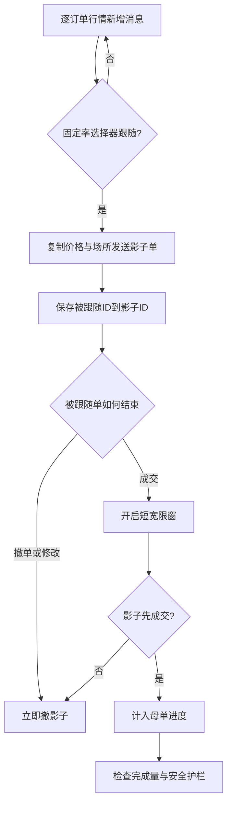

# 通过订单级影子跟随实现无模型被动执行

英文原题：Model-Free Passive Execution via Order-Level Shadowing

arXiv：2609.18019v1；方向：金融；发布日期：2026-09-16

一句话问题：如果不预测价格和成交概率，一个大订单还能怎样选择挂单价与撤单时机？

## 不猜下一步，只跟着刚刚真实挂出的钱

大额买卖若一次完成，可能把市场现有报价吃光并推高成本，所以通常拆成许多小单。被动挂单等待别人来成交，能少付价差，却面临“挂在哪里、何时撤”的问题。传统方案常预测成交概率和订单簿变化。

Shadow-PPOV 换一种做法：看见第三方在某价格、某场所新增订单时，按固定概率在同处挂自己的“影子单”，并记住对方的订单编号；对方撤走时立刻跟撤，对方被成交时短暂等待扫单是否继续。读完后你应能解释它为何“无模型但不无信息”，也知道它不是投资信号或个性化交易建议。

## 整体关系图



## 先懂限价单、队列和被动成交

限价买单规定最多愿意付多少，挂在订单簿里等待卖方；主动单则立刻跨过买卖价差成交。在先价后时的 FIFO 队列中，同价后到的影子排在被跟随订单后面：只有扫单先吃掉前面的量，才可能轮到影子。

POV 是按市场成交量维持参与比例的执行思路。Shadow-PPOV 名字相似，但控制的是“观察到的新增订单中跟随多少”，实际成交占市场量的比例是结果，不是可精确设定的输入。

## 一条市场消息如何变成一个动作

输入是逐订单市场消息：新增、撤单、成交、修改，并带交易所订单 ID、场所、方向、价格和数量。看到合格新增时，算法可按固定概率或每 N 条选择一次，在同一价格和场所发送显示限价单。

核心状态只是“被跟随 ID → 自己的影子 ID”的关联，加上剩余目标量和安全限制。它不保存对方的价格、排队位置或成交概率来做撤单判断；收到相同 ID 的生命周期结束消息时，依据类型撤单或开启短宽限窗。

## 为什么撤单和成交要区别处理

若对方主动撤单，原有流动性已消失，影子继续留下可能暴露于不利价格，因此立即撤。若对方被市场单成交，扫单可能仍在路上并即将轮到排在后面的影子；立刻撤会永远躲开本来可得到的成交，所以算法等待少量 burst 事件。

这种规则仍是 ID 驱动，不计算订单簿状态。实际参考实现还叠加完成量、过度对冲和价格漂移等安全护栏；应区分论文的极简核心与生产实现的安全超集。

## “无模型”不是“没有市场信息”

算法直接继承另一个参与者已经做出的价格和场所选择，相当于免费使用订单流里隐含的判断，却不推断价格方向。它适合作为被动挂单的简单基线：更复杂预测模型至少要在相同条件下超过它。

若多个场所中新增订单分布为 50:30:20，固定概率跟随会在期望上继承同样分布，但这不是费用、延迟或逆向选择意义上的最优路由。论文只在单一 CME 场所评估，跨场所继承只是分析性主张，未被实测。

## 跟踪一个 ID 的完整生命周期

看到新增单 A：买入、价格 5000、数量 3。选择器决定跟随，发送自己的买单 S 并记录 A→S。若 A 撤单，查表后撤 S；若 A 被成交，给 S 开短宽限窗，若扫单继续则 S 成交，否则窗口结束撤 S。

关键中间状态只有选择结果、ID 映射、宽限窗和自己已成交数量。若执行异常，要问消息是否延迟、ID 是否匹配、modify 如何定义、护栏是否抢先触发，而不是虚构一个算法根本没有的方向预测。

## 全年回放测到了什么

作者用 2025 年 CME ES 期货逐订单数据做确定性回放。近似匹配参与率时，被动 Shadow-PPOV 与主动 POV 相对滑点分别约 +0.0955 与 +0.0952 tick/合约，区间重叠；被动完成 100 张平均更慢，且约 99% 成交量来自挂单。

把订单、撤单和行情三条路径共同延迟 0—5 毫秒时，两种方法成本都单调上升；被动从约 0.097 到 0.150 tick，主动从约 0.087 到 0.296。30 秒是故意摧毁信息新鲜度的控制实验：被动成本升到约 0.3673，是无延迟的 3.9 倍。这支持订单流信息真实且易腐。

## 回放最重要的缺口是市场不会回应你

模拟器把影子单插入已记录行情，却不让市场因它的存在改变；自己的成交也不会挤掉别人或改变后续订单。这在约 4.5% 聚合参与率时或许较温和，但参与率更高时假设变紧，不能当成真实大规模执行结果。

回放是单产品、单场所、特定年份；隐藏流动性、多场所费用和真实排队反馈未覆盖。教学 demo 只执行几条消息，既无真实资金也无价格，不可用作交易策略评价或执行建议。

## 从新增消息到退出队列

市场新增单到达；固定率选择器决定是否跟；影子复制价格与场所并排在后面；ID 映射保存关联；撤单消息触发立即撤，成交消息触发短宽限；自己的成交计入母单进度；安全护栏负责完成或风险退出。

要评价它，至少同时看成本、完成速度、参与率、成交方式和延迟。只看“被动少付价差”会漏掉逆向选择，只看回放滑点又会漏掉自身市场冲击。

## 最小实践：用 ID 驱动一个影子单

需求：对新增、成交、时间推进和撤单消息跑一个小状态机，显示 A 的成交宽限与 B 的立即撤销。正常例让 A 的影子在宽限期成交；边界说明没有模拟价格、队列深度和自身冲击。

实际运行输出：

```text
A: 新增被选中 → 影子挂单，状态=resting
A: 被跟随单成交 → 开启宽限，状态=grace
A: 扫单继续 → 影子成交，状态=filled
B: 新增被选中 → 影子挂单，状态=resting
B: 被跟随单撤销 → 影子立即撤销，状态=cancelled
边界：消息顺序为手写示例；没有价格、队列深度、延迟、自身市场冲击或真实交易。
```

## 自测题

1. 为什么对方被成交时立刻撤影子，可能导致被动单几乎永远成交不了？
2. 30 秒延迟实验能否证明 Shadow-PPOV 比所有预测模型好？
3. 回放没有模拟自身市场冲击，会让高参与率结果产生什么解释风险？

## 原文与阅读范围

已读取机制、算法、实现护栏、全年回放、被动/主动对照、延迟实验与限制；核对算法 1、表 1、表 3—6和图 1—5。

论文评估的是执行基线，不提供方向预测；本学习包不构成交易指令。小状态机未模拟订单簿、价差、费用或真实成交。

本次保存并解析的正文格式为 arxiv_html，提取到 5 个相关章节、14 条图表说明，正文约 94,604 个字符。

原文：https://arxiv.org/html/2609.18019v1
