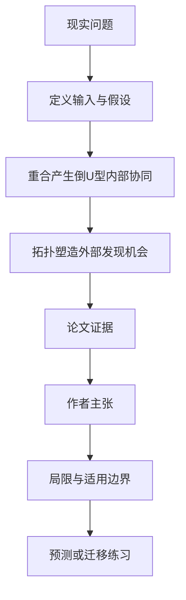

# 团队知识重合多少最好：共同语言与新信息之间的中间地带

英文原题：Overlap and topology shape synergy in collective knowledge integration

arXiv：2609.18140v1；方向：社会研究；发布日期：2026-09-16

一句话问题：团队成员知识完全相同没有新东西，完全不同又难以沟通，什么样的重合更容易把知识拼成新的连接？

## 先从一个普通人会遇到的问题开始

“多样性越高越好”和“共同背景越多越好”都过于简单；论文把个人知识画成同一知识网络中的连通子图，区分内部路径缩短和外部新概念两种协同。

今天读完《团队知识重合多少最好：共同语言与新信息之间的中间地带》，目标不是记住论文名，而是能用自己的话回答：团队成员知识完全相同没有新东西，完全不同又难以沟通，什么样的重合更容易把知识拼成新的连接？还要能指出作者的证据支持到哪一步、哪一步仍不能下结论。

## 整体关系图



## 先补两块必要基础

知识空间用网络表示：节点是概念，边是可理解的关系；每个人掌握其中一块连通区域。overlap 是成员共享区域，complementarity 是各自独有部分。

internal synergy 是合并后已知概念间路径变短；external synergy 是某个未知概念同时连接共享区和所有成员独有区，成为可发现的新桥梁。

## 论文接收什么，输出什么

输入是随机、无标度、模块化和小世界等背景知识网络，团队规模与成员子图重合程度。输出是内部协同和严格外部协同的数量或比例。

中间状态包括共享节点、个人独有节点、合并后的最短路径，以及未知节点是否同时贴近所有知识区域。

## 第一步：中等重合兼顾共同语言与互补信息

重合太低时，成员知识块缺少连接点，难把信息拼起来；重合太高时，大家几乎知道相同东西，没有足够互补边可缩短路径。

模型在多类背景网络中都观察到内部协同在中间重合附近达到峰值，但位置和团队规模效应受拓扑影响。

## 第二步：周围知识拓扑决定新桥梁是否集中在可达边界

小世界结构保留局部团簇又有少量远程边，可能让未知桥梁集中在团队已知区域的边界，较容易被发现。

重连可增加潜在协同节点总数，却也把它们分散到更多外部候选中；“机会更多”不必等于“更容易找到”。

## 跟着一个小例子看中间状态

甲懂 A-B-C，乙懂 B-C-D。共享 B-C 提供共同语言，合并后 A 到 D 通过短路径连接；若两人都只懂 A-B-C，没有新增 D；若甲乙完全无共同节点，也难集成。

一个未知 X 若同时连到共享 B 和甲独有 A、乙独有 D，符合严格外部协同；只连到其中两块则不满足论文的高阶标准。

## 作者拿什么证据支持主张

作者在随机、scale-free、modular 和 small-world 知识网络模拟中计算协同；内部协同普遍随重合呈中间峰值。

外部协同强烈依赖拓扑，小世界的局部边界结构更有利；中度重连有时增加结构机会却降低其边界集中度，团队规模效应也不普遍单调。

## 哪些结论不能顺手扩大

节点和边把知识、沟通和学习能力极度简化，模拟没有真实团队的权力、动机、语言质量和搜索策略。

协同指标是结构机会，不是创意质量或实际创新产出；中等重合的峰值不能直接变成人员招聘比例。

## 把整条因果链重新接起来

研究问题“团队成员知识完全相同没有新东西，完全不同又难以沟通，什么样的重合更容易把知识拼成新的连接？”先被拆成可观察输入，再经过“第一步：中等重合兼顾共同语言与互补信息”与“第二步：周围知识拓扑决定新桥梁是否集中在可达边界”，最后由论文实验或数据核对。

排错时依次检查：输入是否代表真实问题、中间状态是否按定义计算、比较组是否公平、指标是否回答原问题、结论是否越过样本和假设边界。

## 最小实践：把核心机制跑一遍

需求：用一组明确标为教学设定的小数据演示“用两个小知识集合比较零重合、中等重合和完全重合”。脚本打印输入、中间状态、正常例和失效边界，便于逐步核对。

验收标准：输出能解释机制方向，并明确它没有复现论文数据、模型或效果数字。

实际运行输出：

```text
教学输入：
- 甲：['A', 'B', 'C']
- 乙中等重合：['B', 'C', 'D']
- 乙完全重合：['A', 'B', 'C']
中间状态：
1. 找共享概念
2. 找各自独有概念
3. 检查合并后新路径
4. 比较共同语言和互补性
正常例：B、C 的共享让 A 与 D 可接通，同时仍保留互补知识。
边界：集合例没有网络权重、搜索行为或真实创新绩效。
```

## 自测题

1. 为什么知识零重合不一定带来最大协同？
2. 潜在外部节点更多为何可能更难发现？
3. 论文的结构协同能否直接等同团队创新？

## 原文与阅读范围

已读知识子图设定、内部与外部协同定义、四类拓扑模拟、重合/重连/团队规模结果及讨论。

教学中的日常类比、演示数据和运行结果由本学习包构造；作者主张与论文证据已在正文中单独标出，二者不混用。

本次保存并解析的正文格式为 arxiv_html，提取到 5 个相关章节、15 条图表说明，正文约 75,086 个字符。

原文：https://arxiv.org/html/2609.18140v1
