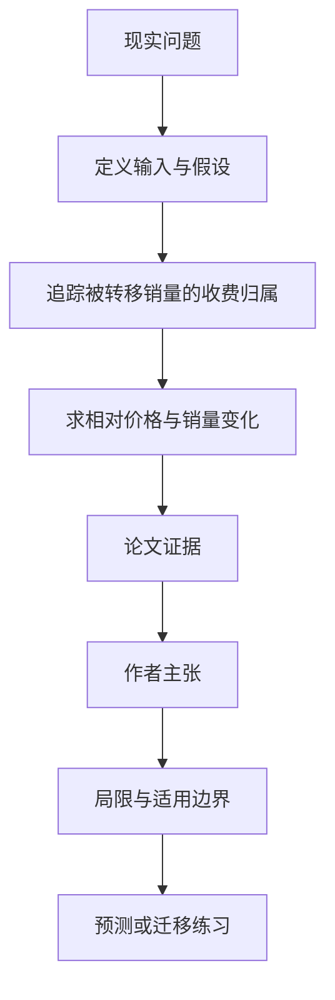

# 同样向所有手机收费，为何仍可能偏向自家芯片

英文原题：Why a Non-Discriminatory Royalty Surcharge Is Not Chip-Neutral: The Error in FTC v. Qualcomm

arXiv：2609.18161v1；方向：经济；发布日期：2026-09-16

一句话问题：一笔专利附加费对使用高通或竞争对手芯片的手机都同额收取，为什么“表面不歧视”仍不代表芯片选择不受扭曲？

## 先从一个普通人会遇到的问题开始

买家账单上两边都多同样一项，看似会抵消；关键是这笔钱不是交给第三方政府，而是由同时卖芯片的高通收取，因此两家调价后的收益变化不对称。

今天读完《同样向所有手机收费，为何仍可能偏向自家芯片》，目标不是记住论文名，而是能用自己的话回答：一笔专利附加费对使用高通或竞争对手芯片的手机都同额收取，为什么“表面不歧视”仍不代表芯片选择不受扭曲？还要能指出作者的证据支持到哪一步、哪一步仍不能下结论。

## 整体关系图



## 先补两块必要基础

all-in price 是芯片标价加上与选择相关的许可或附加成本。facial neutrality 只看收费规则文字相同；economic neutrality 要求两家相对价格和销量选择不被改变。

diversion ratio 是一家涨价失去的销量中有多少转给对手，通常小于 1，因为一部分买家会退出、延迟或转向其他方案。

## 论文接收什么，输出什么

输入是两家芯片企业的需求、交叉价格反应、成本、FRAND 基础许可费，以及每台或按手机收入比例收取的附加费。输出是均衡总价、利润和销量变化。

论文把同额政府税与高通收取的附加费作基准比较：对竞争对手二者相似，对收费并卖芯片的一方则不同。

## 第一步：沿着涨价后流失销量的钱流看激励

政府税由财政拿走；高通附加费即使在对手芯片手机上也归高通。高通提高自家芯片总价、把部分销量推给对手时，仍可从那些对手手机收附加费。

因为只有部分销量转给对手，高通在附加费制度下的最优调价激励与政府税不同，不能用“买家两边都付”直接判中立。

## 第二步：比较两家均衡总价和产量而非收费条文

模型表明，在原本可让政府税中立的条件下，附加费对竞争对手总价的提高严格更多；对称需求下，对手产量下降也更多。

按收入比例收费时问题更强：只要 FRAND 许可率为正，所谓非歧视税本身通常也不满足芯片中立。

## 跟着一个小例子看中间状态

教学例中，两种芯片手机都付 10 元附加费。若高通芯片涨价流失 100 台，只有 60 台转到对手，高通仍从这 60 台各收附加费；另外 40 台退出市场，钱流与政府税情形不同。

所以分析不能只从手机厂“无论选谁都付 10 元”出发，还要把收费归属带回两家芯片商的利润函数。

## 作者拿什么证据支持主张

论文建立价格竞争均衡模型，以一系列命题比较无附加费、政府税、非歧视附加费和歧视性附加费；核心结果来自一阶条件和比较静态。

作者把模型用于批评 FTC v. Qualcomm 上诉判决中的芯片中立论证，并讨论每台收费和从价收费。论文没有重新估计案件中的真实需求、转移率或损害金额。

## 哪些结论不能顺手扩大

结论依赖需求可微、均衡存在、局部比较及文中曲率和转移条件；现实还有多家对手、谈判、专利价值、长期研发和手机下游定价。

论文作者披露曾在高通相关案件中担任对高通不利的专家；模型能指出法律论证中的经济漏洞，不等同于对案件全部事实或法律责任的最终判决。

## 把整条因果链重新接起来

研究问题“一笔专利附加费对使用高通或竞争对手芯片的手机都同额收取，为什么“表面不歧视”仍不代表芯片选择不受扭曲？”先被拆成可观察输入，再经过“第一步：沿着涨价后流失销量的钱流看激励”与“第二步：比较两家均衡总价和产量而非收费条文”，最后由论文实验或数据核对。

排错时依次检查：输入是否代表真实问题、中间状态是否按定义计算、比较组是否公平、指标是否回答原问题、结论是否越过样本和假设边界。

## 最小实践：把核心机制跑一遍

需求：用一组明确标为教学设定的小数据演示“比较政府收税与兼营芯片者收附加费时流失销量的钱流”。脚本打印输入、中间状态、正常例和失效边界，便于逐步核对。

验收标准：输出能解释机制方向，并明确它没有复现论文数据、模型或效果数字。

实际运行输出：

```text
教学输入：
- 附加费：10
- 高通涨价流失销量：100
- 转向对手：60
- 退出市场：40
中间状态：
1. 政府税情形税款归第三方
2. 附加费情形对手手机仍向高通付费
3. 高通从转移的60台保留收费
4. 因此两制度的调价激励不同
正常例：收费文字相同不等于收款方的竞争激励相同。
边界：数字是钱流类比，没有求均衡、估计真实转移率或评价个案损害。
```

## 自测题

1. 为什么从买家账单看“同额”还不足以证明中立？
2. diversion ratio 小于 1 在机制中有什么作用？
3. 理论模型能否直接给出案件赔偿金额？

## 原文与阅读范围

已读案件背景、两企业模型、政府税基准、每台附加费核心命题、销量比较、从价扩展与结论；核对关键命题及作者利益背景。

教学中的日常类比、演示数据和运行结果由本学习包构造；作者主张与论文证据已在正文中单独标出，二者不混用。

本次保存并解析的正文格式为 pdf_text，提取到 40 个相关章节、0 条图表说明，正文约 101,078 个字符。

原文：https://arxiv.org/pdf/2609.18161
