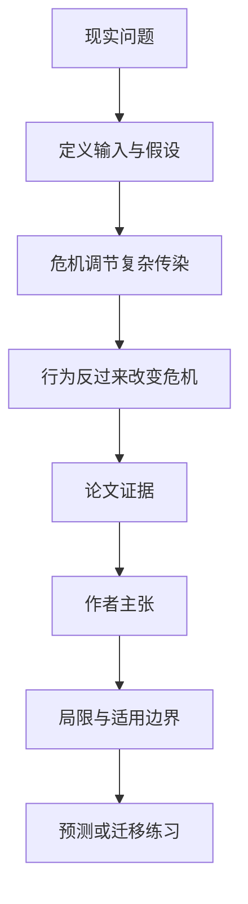

# 危机与舆论会互相推：复杂传染如何生成反复疫情波动

英文原题：Modelling opinion dynamics during crises as complex contagion with feedback

arXiv：2609.18684v1；方向：社会研究；发布日期：2026-09-16

一句话问题：为什么人们看到危机严重才集体采取保护行为，保护奏效后又放松，最终出现一轮轮反复？

## 先从一个普通人会遇到的问题开始

简单“接触一个人就模仿”的传播忽略了行为常需多人强化，也忽略行为会反过来改变危机；论文把两条反馈放入一个可分析的模型。

今天读完《危机与舆论会互相推：复杂传染如何生成反复疫情波动》，目标不是记住论文名，而是能用自己的话回答：为什么人们看到危机严重才集体采取保护行为，保护奏效后又放松，最终出现一轮轮反复？还要能指出作者的证据支持到哪一步、哪一步仍不能下结论。

## 整体关系图



## 先补两块必要基础

simple contagion 一次接触即可传播；complex contagion 要多个邻居或更强社会强化才转变。戴口罩、疏远或恐慌通常受到重复确认影响。

bidirectional feedback 指危机水平改变采用难度，群体行为又改变危机增长；这可能产生稳定点、滞后、突变或周期。

## 论文接收什么，输出什么

输入是两种竞争行为的人口比例、社会强化强度、采用复杂度、危机状态、宣传影响和行为对危机的保护效果。输出是行为与危机随时间的轨迹及平衡稳定性。

作者先在均匀混合人口中写随机切换率并分析平衡，再把机制接到按澳大利亚人口校准的 COVID-19 agent-based model。

## 第一步：危机水平改变跨过社会强化门槛的难度

感染上升或宣传加强时，保护行为所需的社会确认可降低；感染下降时，继续保持行为的动力又减弱。

竞争状态不是被一次接触线性传染，而是转变概率随群体支持和复杂度非线性变化。

## 第二步：群体行为改变危机，再反馈回行为

更多疏远降低传播，危机回落；回落又降低采用和维持疏远的压力，放松后感染再升，形成闭环。

论文求解平衡和稳定条件，并用少参数 CCF 与既有意见模型比较重现多波疫情的能力。

## 跟着一个小例子看中间状态

教学例从感染高、保护行为 30% 开始；危机信号使采用门槛下降，保护升到 70%，感染随后回落；人们感到安全后保护降到 40%，感染又反弹。

若保护行为对危机几乎无效，反馈环会断一半；若采用始终很难，即使危机高也不一定形成集体转变。

## 作者拿什么证据支持主张

论文给出均匀混合 CCF 方程、平衡点和稳定性条件，再与澳大利亚人口校准的 COVID-19 agent-based transmission 模型耦合。

案例中，CCF 用更少参数重现反复感染波的表现与一个已有 opinion dynamics 模型相当，说明机制具备拟合能力；这不证明现实人群确实按该方程转变。

## 哪些结论不能顺手扩大

均匀混合忽略真实社交网络、群体异质、媒体平台与政策执行；疫情数据中多种行为和变异株同时变化，参数可识别性有限。

能重现波形不等于模型机制被因果验证，其他机制也可能给出相似曲线；模型不应用来直接制定个人健康决策。

## 把整条因果链重新接起来

研究问题“为什么人们看到危机严重才集体采取保护行为，保护奏效后又放松，最终出现一轮轮反复？”先被拆成可观察输入，再经过“第一步：危机水平改变跨过社会强化门槛的难度”与“第二步：群体行为改变危机，再反馈回行为”，最后由论文实验或数据核对。

排错时依次检查：输入是否代表真实问题、中间状态是否按定义计算、比较组是否公平、指标是否回答原问题、结论是否越过样本和假设边界。

## 最小实践：把核心机制跑一遍

需求：用一组明确标为教学设定的小数据演示“沿四个时间点演示危机—保护行为负反馈造成的反复”。脚本打印输入、中间状态、正常例和失效边界，便于逐步核对。

验收标准：输出能解释机制方向，并明确它没有复现论文数据、模型或效果数字。

实际运行输出：

```text
教学输入：
- 初始危机：高
- 初始保护：30%
- 保护有效性：降低危机
- 放松条件：危机下降
中间状态：
1. 危机高降低采用门槛
2. 保护升至70%使危机下降
3. 危机低使保护降至40%
4. 保护下降后危机反弹
正常例：行为与危机互推可形成多轮变化，而非单向扩散到终点。
边界：百分比为教学轨迹，没有运行疫情模型、估计参数或预测感染。
```

## 自测题

1. 复杂传染与一次接触传播的关键区别是什么？
2. 为什么保护成功反而可能为下一轮反弹创造条件？
3. 拟合多波曲线是否证明了行为机制？

## 原文与阅读范围

已读 CCF 状态与转移率、双向反馈、平衡和稳定分析、澳大利亚 COVID-19 案例、模型比较和局限。

教学中的日常类比、演示数据和运行结果由本学习包构造；作者主张与论文证据已在正文中单独标出，二者不混用。

本次保存并解析的正文格式为 arxiv_html，提取到 6 个相关章节、13 条图表说明，正文约 87,279 个字符。

原文：https://arxiv.org/html/2609.18684v1
