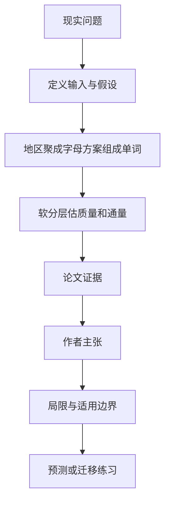

# 如何从海量选区方案中抽到罕见类型：先给方案造“字母”和“单词”

英文原题：Towards stratified sampling for redistricting plans

arXiv：2609.18741v1；方向：社会研究；发布日期：2026-09-16

一句话问题：选区方案数量巨大，普通采样几乎看不到罕见但重要的布局，怎样先把方案空间分层又不把边界切得过硬？

## 先从一个普通人会遇到的问题开始

论文没有宣称已经解决选区公平，而是完成分层抽样的前置工作：把相似选区聚成字母、整套方案写成单词，再检查各层是否覆盖且相互连通。

今天读完《如何从海量选区方案中抽到罕见类型：先给方案造“字母”和“单词”》，目标不是记住论文名，而是能用自己的话回答：选区方案数量巨大，普通采样几乎看不到罕见但重要的布局，怎样先把方案空间分层又不把边界切得过硬？还要能指出作者的证据支持到哪一步、哪一步仍不能下结论。

## 整体关系图



## 先补两块必要基础

redistricting plan 是把地理单元分成若干人口平衡、连通的选区；组合数量极大。ensemble 是算法生成的一批可行方案，用来判断现实方案是否异常。

stratified sampling 先把空间分层，再在各层取样；若层之间没有重叠或某些区域没覆盖，采样器可能被困住或漏掉重要方案。

## 论文接收什么，输出什么

输入是康涅狄格州真实国会选区方案样本和不同目标分布下的平衡图划分。输出是区级原型“字母”、方案级“单词”、软层权重、层质量和重叠通量矩阵。

作者先把跨方案出现的选区按相关结构层次聚类，再以各方案包含哪些代表选区描述整套计划。

## 第一步：从选区原型构建方案语法

许多方案中的某个选区覆盖相近地域，可聚为同一个代表字母；一套含多个选区的计划就写成这些字母组成的单词。

语法把高维地理边界压成可比较类别，但仍保留计划由哪些地区原型组合而成的信息。

## 第二步：用软归属检查层的质量与通路

一个方案可对多个相近单词有不同权重，partition of unity 让权重相加为一，避免硬边界造成突然跳变。

由样本估计每层质量和层间重叠通量，可诊断是否有未覆盖区域、孤立层或迁移瓶颈，为未来真正的分层采样器做准备。

## 跟着一个小例子看中间状态

教学例中，北部型选区记 A、沿海型记 B、中部型记 C；一套三选区计划可写成 ABC。边界略变的计划可能对 ABC 权重 0.7、ABB 权重 0.3。

若某罕见单词只有极小质量且与其他层几乎无重叠，普通链难以进入；分层方法未来可专门分配样本，但前提是先诊断这条通路。

## 作者拿什么证据支持主张

论文在康涅狄格国会选区数据上实现层次相关聚类、词构造、软分层、质量和通量估计，并比较一个目标分布学到的层在相关分布中的表现。

结果证明这套候选层构造与诊断管线可运行；作者明确没有实现完整 stratified sampler，也没有证明它提高有效样本量或降低估计方差。

## 哪些结论不能顺手扩大

字母和单词依赖初始样本、相似度、聚类阈值与标签排序；稀有但样本中从未出现的结构仍可能完全漏掉。

案例只覆盖一个州和特定目标分布。计算覆盖与重叠不等于评价选区公平、党派偏向或法律合规。

## 把整条因果链重新接起来

研究问题“选区方案数量巨大，普通采样几乎看不到罕见但重要的布局，怎样先把方案空间分层又不把边界切得过硬？”先被拆成可观察输入，再经过“第一步：从选区原型构建方案语法”与“第二步：用软归属检查层的质量与通路”，最后由论文实验或数据核对。

排错时依次检查：输入是否代表真实问题、中间状态是否按定义计算、比较组是否公平、指标是否回答原问题、结论是否越过样本和假设边界。

## 最小实践：把核心机制跑一遍

需求：用一组明确标为教学设定的小数据演示“用字母单词和软权重描述三个玩具选区方案”。脚本打印输入、中间状态、正常例和失效边界，便于逐步核对。

验收标准：输出能解释机制方向，并明确它没有复现论文数据、模型或效果数字。

实际运行输出：

```text
教学输入：
- 地区原型：['A北部', 'B沿海', 'C中部']
- 方案：ABC
- 相邻方案：ABB
中间状态：
1. 把相似选区聚成字母
2. 按整套计划组成单词
3. 对ABC赋0.7权重
4. 对ABB赋0.3并检查层间连接
正常例：软归属保留方案靠近多个层的事实。
边界：没有生成合法选区、计算人口平衡或证明分层采样的统计增益。
```

## 自测题

1. 为什么软分层可能比每个方案只归一个层更稳？
2. 通量矩阵接近零的两个层说明什么风险？
3. 论文是否已经证明选区估计方差下降？

## 原文与阅读范围

已读问题设定、选区字母聚类、计划单词与 partition of unity、质量/通量诊断、跨分布案例和结论；确认完整采样效率仍属未来工作。

教学中的日常类比、演示数据和运行结果由本学习包构造；作者主张与论文证据已在正文中单独标出，二者不混用。

本次保存并解析的正文格式为 arxiv_html，提取到 5 个相关章节、21 条图表说明，正文约 75,388 个字符。

原文：https://arxiv.org/html/2609.18741v1
