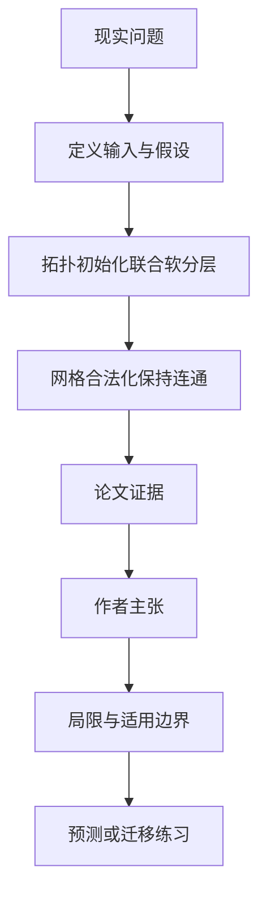

# 两层芯片怎样一起排版：先别过早决定每个模块放哪一层

英文原题：Rect3D: A Unified Analytical Framework for 3D-IC Rectilinear Floorplanning

arXiv：2609.18946v1；方向：科技与产业；发布日期：2026-07-14

一句话问题：3D 芯片若先把模块分到上下两层、再分别排版，为什么可能错过更短连线，怎样让层选择和几何位置一起优化？

## 先从一个普通人会遇到的问题开始

芯片模块谁和谁连接，会影响它们该靠多近，也会影响放在哪一层；论文把原本先分层后布局的两步，变成可连续搜索、最后再合法化的一条流程。

今天读完《两层芯片怎样一起排版：先别过早决定每个模块放哪一层》，目标不是记住论文名，而是能用自己的话回答：3D 芯片若先把模块分到上下两层、再分别排版，为什么可能错过更短连线，怎样让层选择和几何位置一起优化？还要能指出作者的证据支持到哪一步、哪一步仍不能下结论。

## 整体关系图



## 先补两块必要基础

floorplanning 决定每个功能模块的形状和位置；总连线越长，通常延迟、能耗和布线压力越大。rectilinear 模块可由多个直角区域组成，比矩形更灵活。

legal layout 必须让模块不重叠、面积足够、位于芯片边界内且每个模块连通。连续优化容易搜索，却可能产生重叠和模糊层号，所以最后还要 legalization。

## 论文接收什么，输出什么

输入是模块面积、网络连接权重和两层共享外框。输出是每个模块的上下层、平面位置、连通直角形状，以及 HPWL 近似线长和运行时间。

中间状态先是图拉普拉斯产生的三维连续坐标，再是 z∈[0,1] 的软层概率与平面中心，最后才收敛为 0/1 层号并映射到网格单元。

## 第一步：让连接图给出起点，并暂时保留层的模糊性

图拉普拉斯的低频特征向量把强连接模块放近，前两个方向作 x/y，第三个作软 z；它只是拓扑友好的起点，还不是无重叠的合法布局。

全局目标同时惩罚线长、重叠、越界和层面积失衡，并逐阶段加大 z 正则。模块可在早期改变倾向，不会被一次错误分层永久锁住。

## 第二步：把连续圆形近似变成连通的直角模块

层号确定后，每层外框离散为网格，先按最近中心分配，再让面积过多的模块把边界格转给面积不足的邻居。

每次转移前检查原模块仍连通，因此最终每格只归一个模块、面积接近目标、形状由直角网格组成，连续解才变成可用 floorplan。

## 跟着一个小例子看中间状态

教学例中 A 与 B 连接很强。若先固定 A 在上层、B 在下层，它们可能产生昂贵跨层连接；软层变量让 B 在看到 C、D 的位置后改回上层，整体线长才一起比较。

连续优化结束时模块仍像有半径的圆点；合法化才把每个点长成若干相邻方格。一个模块若被分成两座孤岛，即使总面积正确也不合法。

## 作者拿什么证据支持主张

在 GSRC n10—n300 基准上，相对六种代表性 3D 矩形基线，Rect3D 平均线长降低 46.8%—83.6%，运行快 2.69—15.98 倍；n300 在 42.1 秒完成。

与六种共享同一合法化器的“先分层再做 2D 直角布局”基线相比，Rect3D 每个实例线长最低，但这些基线单个运行通常更快。图拉普拉斯初始化相对网格起点平均再改善 HPWL 20.7%。

## 哪些结论不能顺手扩大

实验使用 GSRC soft-block 基准、统一硬件和作者实现；没有真实工业 netlist、布线拥塞、功耗、热、时序、TSV 可靠性和制造规则的流片验证。

HPWL 是线长代理，不等于最终详细布线品质。性能百分比只对所列基线、实现和超参数成立，未来仍需加入热感知与多层堆叠。

## 把整条因果链重新接起来

研究问题“3D 芯片若先把模块分到上下两层、再分别排版，为什么可能错过更短连线，怎样让层选择和几何位置一起优化？”先被拆成可观察输入，再经过“第一步：让连接图给出起点，并暂时保留层的模糊性”与“第二步：把连续圆形近似变成连通的直角模块”，最后由论文实验或数据核对。

排错时依次检查：输入是否代表真实问题、中间状态是否按定义计算、比较组是否公平、指标是否回答原问题、结论是否越过样本和假设边界。

## 最小实践：把核心机制跑一遍

需求：用一组明确标为教学设定的小数据演示“演示过早固定层号与保留软层选择的差别”。脚本打印输入、中间状态、正常例和失效边界，便于逐步核对。

验收标准：输出能解释机制方向，并明确它没有复现论文数据、模型或效果数字。

实际运行输出：

```text
教学输入：
- 强连接：A-B=10
- 弱连接：A-C=2, B-D=2
- 早期方案：A上/B下
- 软方案：B可在优化中换层
中间状态：
1. 从连接强度建立相近起点
2. 保留B的软层概率
3. 同时比较线长和同层重叠
4. 收敛后固定层号并合法化
正常例：软层搜索可以修正早期分层，而不是让后续2D布局背负不可逆决定。
边界：没有求解 HPWL、制造规则或论文基准，只展示联合决策逻辑。
```

## 自测题

1. 为什么先分层再布局会限制解空间？
2. 图拉普拉斯初始化为什么还不是合法 floorplan？
3. Rect3D 线长更短是否保证真实芯片性能一定更好？

## 原文与阅读范围

已读问题定义、图拉普拉斯初始化、软层联合优化、三阶段正则、网格合法化、GSRC 对比与消融、案例和结论；核对图 2—8、算法 1—2 和表 I—III。

教学中的日常类比、演示数据和运行结果由本学习包构造；作者主张与论文证据已在正文中单独标出，二者不混用。

本次保存并解析的正文格式为 arxiv_html，提取到 4 个相关章节、23 条图表说明，正文约 76,506 个字符。

原文：https://arxiv.org/html/2609.18946v1
