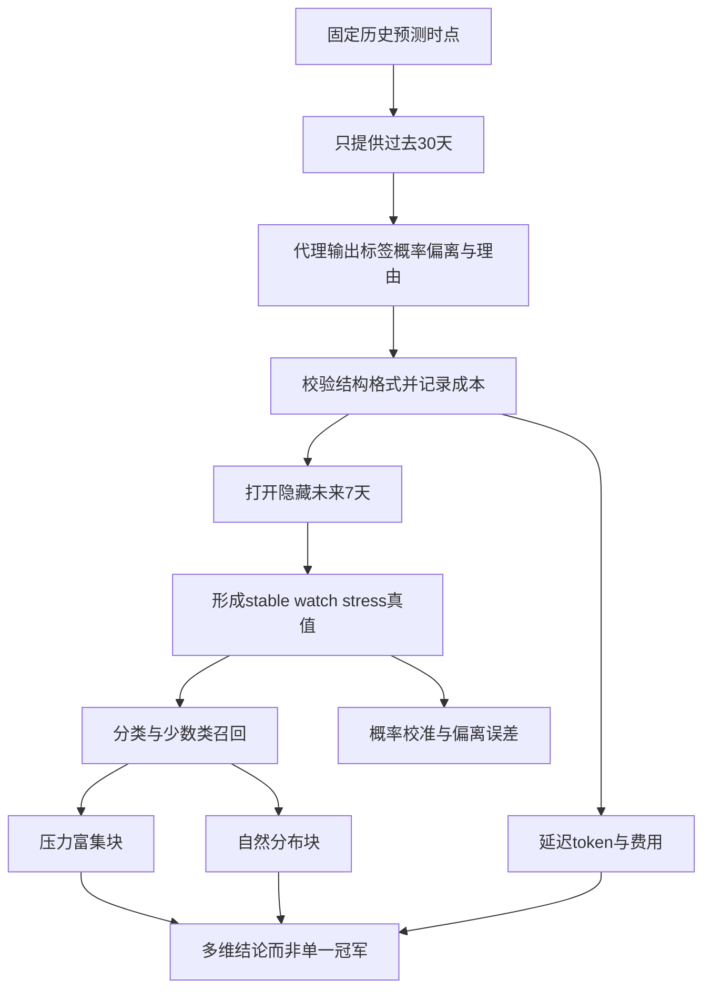

# StableEval Arena：兼顾成本的稳定币价格稳定性智能体基准

英文原题：StableEval Arena: A Cost-Aware Agentic Benchmark for Stablecoin Price Stability Prediction

arXiv：2609.18949v1；方向：金融；发布日期：2026-08-07

一句话问题：稳定币大多数时间都在一美元附近时，怎样避免一个总说“稳定”的系统靠高准确率赢得排行榜？

## 总猜“没事”也能很准，但危机来时没有用

假设 100 天里 96 天稳定、4 天出现严重脱锚。系统每天都说“稳定”，准确率是 96%，却漏掉全部真正需要预警的日子。稳定币风险是稀有但后果重的事件，单一 accuracy 会奖励这种无用策略。

StableEval Arena 用冻结的历史回放，让智能体看过去 30 天，预测隐藏的未来 7 天，并同时记录标签、概率、偏离幅度、格式、延迟、token 和估算费用。读完你应能设计不会被类别不平衡骗过的评测；这不是买卖稳定币建议。

## 整体关系图



## 先分清稳定、观察与压力

美元稳定币承诺价格靠近 1 美元。基准把未来窗口分成 stable、watch、stress，并要求预测脱锚概率、最大偏离、方向、信心和理由。严重压力召回问真正 stress 中抓到多少，误报则问正常期被吓成压力多少。

Macro-F1 先分别计算每类 F1 再平均，使少数 stress 类不被多数 stable 淹没。概率还要看 calibration：声称 20% 风险的一批事件，长期应约有 20% 发生。结构化输出有效率只是流程可靠性，不等于金融判断可靠。

## 怎样避免未来信息泄漏

每个案例只给预测时点之前冻结的 30 日价格—成交量与市场背景，未来七日作为隐藏标签。模型和工具不得看到窗口后的数据，提示、预算和输出 schema 统一，才能比较代理框架而不是比较谁偷看得更多。

作者设置两个互补块：120 个压力富集验证案例便于观察少数类，507 个自然分布案例反映真实类别比例。前者不能代表日常误报成本，后者又会让 raw accuracy 被稳定类主导，所以必须一起看。

## 预测质量要拆成一组指标

标签指标包括 Macro-F1、压力召回与漏掉持续脱锚；概率指标看 Brier 或校准误差；数值指标看最大偏离预测；运行指标看合法 JSON、延迟、token 和费用。一个系统可能格式从不出错，却风险判断很差。

成本也不能脱离质量单独排名。更贵的智能体若只多写长理由、没有增加压力召回，不值得；很便宜但漏掉全部严重事件也不能称为最佳。Pareto 视角更合适：寻找在质量、可靠性和成本上不被另一个方案全面压过的系统。

## 为什么需要两种分布

压力富集集人为增加困难案例，使差异更可见，也能较稳定地估计 stress recall；但它改变了先验概率，准确率和校准不能直接代表部署环境。自然集保留多数稳定状态，能暴露简单基线其实很强，以及误报的实际负担。

论文结果显示智能体能以适中成本稳定生成合法结构，但稀有严重压力和持续脱锚仍大量漏掉。校准后的代理在压力富集块 Macro-F1 有改善；到 507 案例自然分布中，简单基线仍具竞争力。程序守规矩与风险可靠是两个问题。

## 一个案例从截断到评分

预测日为 t：系统只能看到 t-29 到 t 的数据，生成 stable/watch/stress、风险概率和偏离预测；评估器在运行结束后打开 t+1 到 t+7，依据最大偏离等规则形成真实标签，再计算分类、校准和成本。

中间日志应包含输入版本、时间截点、工具调用和 token。若结果异常好，先检查泄漏；若格式有效率低，修 schema 与重试；若格式很好但 stress recall 低，问题是金融信号与决策阈值，不能用解析成功掩盖。

## 基准得出的核心诊断

论文比较六种 LLM 代理配置和简单基线，分别在 120 案例压力富集块与 507 案例自然块中评估。作者没有只给冠军，而是强调原始准确率会受 stable 主导、不同块回答不同问题。

共同现象是结构化输出可靠性高于金融风险可靠性：代理通常能按协议返回结果，成本也可测，但仍漏掉多数稀有严重压力与持续脱锚。这个负结果正是基准价值——提醒部署者不能把“能跑”误作“会预警”。

## 历史回放仍不是未来部署

标签阈值、选币范围、价格来源和时代环境会改变排名；同一时期案例也可能相关。估算 API 费用会随价格变化，提示与代理版本也会漂移。公开历史还可能进入模型训练语料，即使输入窗口严格截断。

基准没有证明代理可自主交易或控制真实风险。教学 demo 用 20 个手写标签比较 accuracy 与 Macro-F1，不包含价格数据、语言模型或真实费用，不能生成任何投资行动。

## 一个可信评测应该怎样串起来

固定预测时点；只开放过去 30 天；冻结提示、工具和预算；收集结构化七日预测；打开隐藏未来生成标签；同时评分少数类、概率、数值、格式、延迟与成本；在压力富集和自然分布中分别解释。

若有人只报准确率，先看类别占比；只报 JSON 成功率，追问压力召回；只报压力集，追问自然分布误报；只报成本，追问相同预算与质量。任何单一数字都不足以支持部署。

## 最小实践：96% 准确的坏预警器

需求：构造 20 个真实标签，其中 18 个 stable、1 个 watch、1 个 stress；比较“永远 stable”和能识别少数类的系统，计算 accuracy 与三类 Macro-F1。边界说明样本太小且没有概率校准。

实际运行输出：

```text
真实类别：Counter({'stable': 18, 'watch': 1, 'stress': 1})
永远稳定：accuracy=90%，Macro-F1=0.316
识别少数类：accuracy=95%，Macro-F1=0.879
边界：20条手写标签不测概率校准、时间泄漏、价格偏离、成本或真实稳定币风险。
```

## 自测题

1. 为什么压力富集集上的 accuracy 不能直接预测日常部署 accuracy？
2. 一个代理 100% 输出合法 JSON，但 stress recall 为 0，能否称为可靠？
3. 自然分布中简单基线很强，可能是模型真的优秀，还是类别结构造成？怎样区分？

## 原文与阅读范围

已读取问题定义、历史回放协议、两个评测块、指标、六类代理与结果讨论；核对 120/507 案例设置及结构可靠与风险可靠的差距。

论文是评测框架，不是稳定币预测服务；教学分类表为手写数据，未运行任何代理、抓取市场数据或产生交易信号。

本次保存并解析的正文格式为 arxiv_html，提取到 2 个相关章节、2 条图表说明，正文约 8,588 个字符。

原文：https://arxiv.org/html/2609.18949v1
