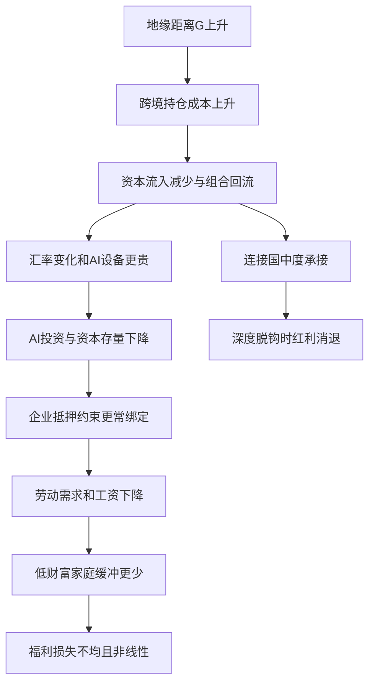

# 地缘经济分裂与 AI 时代的全球资本再配置

英文原题：Global Reallocation of Capital in the Era of Geo-Economic Fragmentation and Artificial Intelligence

arXiv：2609.18976v1；方向：经济；发布日期：2026-07-16

一句话问题：当芯片、数据中心和模型投资需要跨境流动时，地缘距离怎样变成投资成本，并让落后经济体和低财富家庭承受更大损失？

## 为什么“少投一点海外资产”会变成工资和福利问题

一家本来想去回报更高国家建设数据中心的基金，遇到投资审查、技术限制和更高风险补偿后，可能把钱留在本国。目的国少的不只是一次融资：AI 资本更贵、企业投资和招聘下降，汇率变化又抬高进口设备成本。

论文把这条链写入开放经济 HANK 模型。读完后你应能沿“地缘距离→跨境摩擦→资本与汇率→企业约束→家庭福利”解释结果，并知道表中的福利损失是模型条件下的计算，不是对某国未来的直接预测。

## 整体关系图



## 先懂资本摩擦、HANK 与 CEV

HANK 是“异质家庭新凯恩斯模型”：家庭的收入、财富和缓冲能力不同，企业还会遇到融资约束。这样，同一个宏观冲击不会被平均家庭完全代表。AI-specific capital 指 GPU、数据中心、云基础设施和模型权重等专门投入。

论文用消费等价变化 CEV 表示福利：若 CEV 为 -1%，可读成要给基准终身消费约 1% 才能让家庭愿意接受该情景。它是模型效用的换算单位，不等于当年 GDP 或账户余额下降 1%。

## 模型吃进什么，吐出什么

输入包括两国的财富分布、传统资本和 AI 资本、工资与价格、利率和汇率、企业抵押约束，以及地缘距离 G。跨境持仓成本写成随 G 增大的二次成本；三个摩擦参数用四个经验矩做模拟矩估计。

输出包括资本流量、AI 投资、产出与通胀的冲击路径，以及按国家和财富五分位拆开的 CEV。三国扩展再加入“连接国”，让它在两个阵营之间转接资本。

## 第一条链：摩擦先改变资金去哪里

G 增大时，持有外国资产的边际成本上升。家庭重新配置组合，目的国资本流入减少；同样一次 AI 技术改善，在低摩擦情景的资本流入峰值约为稳态上方 0.85%，高摩擦情景只有约 0.51%，衰减约 40%。

因为 AI 设备可贸易，汇率贬值会进一步抬高本币设备成本。资本存量又靠多年投资累积，所以一次流量缺口会留下更久的存量缺口。

## 第二条链：企业约束把投资冲击放大

企业最多能按抵押品的一定比例借钱。资本流入和现金流变弱后，约束开始绑定，企业不只少买设备，也会少雇人。论文称其为 financial accelerator，冲击在一至两个季度后进一步压低劳动需求。

AI 与劳动是互补还是替代非常关键。互补情景 η=0.5 时，产出峰值约下降 0.42%；替代情景 η=1.5 时约下降 1.18%，恢复超过十二个季度。论文并未断言现实一定属于哪一种。

## 三类中间状态不能混在一起

第一层是金融状态：地缘距离、跨境成本、资本流量和汇率。第二层是企业状态：AI 资本存量、抵押约束是否绑定、投资与劳动需求。第三层是家庭状态：工资、资产回报、预防性储蓄和消费。

连接国的好处也不是无限增长：中度分裂时可承接绕行资本，接近完全脱钩时连转接通道也会变贵。这个非单调机制不能简化成“中立国必然受益”。

## 模型给出的量级与分配结果

中度分裂 G=0.3 时，聚合 CEV 损失为终身消费的 0.42%—1.02%；从中度到极端情景，损失扩大约 4.8—5.3 倍。抵押约束绑定频率从约 8% 的季度升至约 50%，构成凸性来源之一。

Home 最低财富五分位损失 -1.25%，最高五分位 -0.50%，比率 2.5；作者分解称劳动收入渠道约占最低组损失的 56%。AI 落后国与先进国的福利损失比随情景为 4.0—8.8 倍。这些是估计参数驱动的模型结果。

## 不要把结构模型当作新闻预测器

福利量级依赖 AI—劳动替代弹性、AI 资本份额、抵押约束和线性的地缘摩擦函数。经验矩能约束部分参数，却不能单独验证整条因果链；过度识别检验 p=0.13 也只表示矩条件未被拒绝。

论文把复杂政策压缩为一个距离指数，无法覆盖制裁例外、技术国产化、资本管制规避和政治反馈。教学 demo 只是三国流量分配，不求解 HANK、汇率或家庭分布。

## 用一句话复述传导机制

地缘距离提高跨境持仓成本，资金回流使 AI 进口和投资更贵；企业融资约束放大投资与招聘下降；工资风险再让低财富家庭增加缓冲储蓄，因此同一宏观损失在国家和家庭之间高度不均。

评价政策时应分别问：能否改善资本配置、能否稳定本国货币与通胀、能否隔离地缘冲击。论文所谓 Fragmented-AI Trilemma 正是说三者不能在其模型里同时无代价实现。

## 最小实践：三国资本会怎样改道

需求：给先进国、追赶国和连接国不同的 AI 回报，并让跨境流量随地缘摩擦折价；比较低、中、高摩擦下的流量和简化福利代理。正常例显示追赶国损失更大，边界例说明这不是一般均衡福利。

实际运行输出：

```text
低摩擦：先进国 33.5，追赶国 33.3，连接国 33.3
中摩擦：先进国 38.3，追赶国 28.1，连接国 33.5
高摩擦：先进国 45.6，追赶国 22.1，连接国 32.3
追赶国份额变化：33.3 → 22.1
边界：份额是自造的局部折价算例，不含汇率、企业融资、家庭分布或论文CEV求解。
```

## 自测题

1. 同样的 AI 技术进步，为什么高摩擦情景的资本流入会更小且影响更久？
2. 最低财富组 CEV 损失更大，是否证明现实中的每个穷人都会损失 1.25%？
3. 连接国在什么情况下可能先受益、后失去红利？

## 原文与阅读范围

已读取经验事实、两国与三国模型、估计、冲击响应、福利表和稳健性；核对表 2—7及图 1—2。

作者主张是模型化的地缘摩擦通过 AI 资本和金融约束产生非线性且回归性的损失。运输线和三国算例是教学类比；没有预测特定国家或提供投资建议。

本次保存并解析的正文格式为 arxiv_html，提取到 6 个相关章节、22 条图表说明，正文约 123,478 个字符。

原文：https://arxiv.org/html/2609.18976v1
