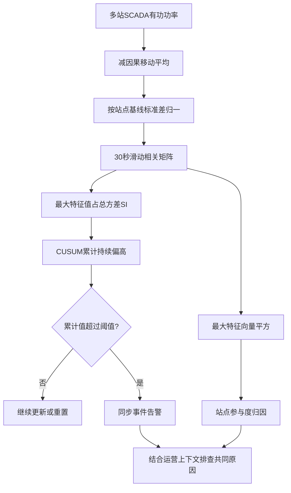

# 三座数据中心同时跳功率，电网怎样用现有遥测发现

英文原题：Detection of Synchronized AI Data Center Load Episodes Using SCADA Telemetry

arXiv：2609.18997v1；方向：科技与产业；发布日期：2026-07-17

一句话问题：每个变电站的功率都没越过单站报警线时，怎样从一秒一次的 SCADA 数据识别多个 AI 园区正在同步波动，并找出主要参与站点？

## 三个人都没喊得很响，但同时打同一个节拍

传统 EMS 像三只分开的音量表：每只都没超线，就不会报警。分布式训练却可能让不同园区在通信阶段一起抬升或回落，单站看似普通，合在一起却减少了电网原以为存在的负荷分散。

论文用现有有功功率遥测计算 Synchronization Index，再用 CUSUM 把持续的小幅升高变成时序告警，并从同一次特征分解得到站点参与度。读完后你应能解释去趋势、协方差、最大特征值、窗口与延迟的取舍。

## 整体关系图



## 相关矩阵像一张“谁和谁一起动”的表

先从每个站的原始功率减去近期移动平均，只留下较快波动；再按历史标准差归一化，避免大站天然压过小站。滑动窗口内的相关矩阵对角线约为 1，非对角线表示两个站是否同向变化。

最大特征值表示最强共同变化模式能解释多少波动。SI=最大特征值/全部特征值之和；N 个独立站的理想下界为 1/N，完全一起动时趋近 1。最大特征向量各分量平方之和为 1，可当站点参与份额。

## 检测器只需要已有的一秒级功率序列

每秒读取多个数据中心接入变电站的有功功率；用 30 秒因果移动平均去慢趋势，再在 30 秒滑窗内计算标准化协方差。论文案例为 RTDS 实时数字仿真的 IEEE 39 节点系统，三个 AI 数据中心接在不同母线。

正常启动期估计实际 SI 基线，因为共同冷却或基础设施会使它高于理论 1/N。运营者再设最小要检测的升幅、CUSUM allowance 和阈值 h，输出严重度、告警与站点参与度。

## SI 把多站共同波动压成一个连续分数

如果三个站彼此独立，方差分散在三个方向，最大特征值只占约三分之一；若它们受同一训练节拍驱动，相关矩阵出现近似秩一的共同成分，最大特征值吸收更多总方差，SI 上升。

在等方差、任意两站相关都为 ρ 的特殊情形，SI=[1+(N-1)ρ]/N。三站平均相关从 0 增到 0.6 时，SI 从 0.333 增至 0.733；公式帮助解释方向，真实矩阵不要求相关完全相等。

## CUSUM 不等一帧越线，而是累计持续偏高

每秒把 SI 超过基线加 allowance 后的余量累进，若变为负数就重置为零；累计量超过 h 才告警。这样能抓住单帧不强但持续的事件，同时避免普通上下抖动反复触发。

窗口是核心取舍：短窗反应快但特征值噪声大，长窗稳定却会稀释短事件。论文保留 30 秒窗；3—8 秒的八个短簇未被检出，说明“延迟有界”不等于所有持续时间都能发现。

## 一次告警包含严重度、证据积累和空间归因

SI 是当前窗口同步严重度；CUSUM S 是跨窗口积累的证据；参与向量 π 是每个站对主同步模式的贡献。三者不能互换：高 SI 可能太短而不报警，报警也需要参与向量告诉运营者查哪里。

论文的一个归因例中，母线 12 承担 0.732 的同步方差、母线 4 只有 0.116；不同事件最弱站点会变化。归因来自同一特征分解，不需额外分类器，但只表示统计共同模式，不自动证明某站是根本原因。

## 测试台结果既有区分力，也暴露短事件弱点

SI 阈值的 AUC 为 0.851，明显好于随机；设 h=1.0 时窗口级检测率 52.0%、误报率 20.8%，SI 首次越过漂移水平后平均约 1.8 秒响应。13 个事件簇只检出 5 个。

漏掉的八个簇持续 3—8 秒，峰值 SI 为 0.503—0.688；被检出簇峰值约 0.580—0.773。论文将遗漏归因于幅度与持续时间共同不足，这也是实际部署前必须重新校准窗口和阈值的证据。

## 模拟电网上的方法还不是现场报警产品

验证来自 RTDS 与三站设置，正常标签还参与了基线与阈值校准，没有真正现场 SCADA 的长期漂移、缺测、拓扑变化和未知共同负荷。误报 20.8% 与事件簇召回有限，远未达到直接自动处置标准。

相关不等于共同训练任务：天气、冷却、价格响应也能同步多个负荷。未来需现场留出校准、更多站点、边缘硬件和备用影响量化。教学 demo 使用人造波形和简化幂迭代。

## 从原始功率到可解释告警的五步

去掉慢趋势；按站点历史波动标准化；滑窗构造相关矩阵；用最大特征值占比计算 SI；用 CUSUM 累积超基线证据并告警；最后把最大特征向量平方归一化为站点参与度。

这个设计的关键不是复杂 AI 分类器，而是把同步的物理结构写成统计量。代价是它只看共同变化结构，仍需运营上下文判断共同原因和处置动作。

## 最小实践：独立波动与同步波动的 SI

需求：生成三条确定性的教学波形，分别构造近似独立和共享节拍两段；手写相关矩阵、幂迭代最大特征值和 CUSUM。正常例应看到同步段 SI 更高，边界说明不是论文 RTDS 数据。

实际运行输出：

```text
近似独立：SI=0.336，参与度=0.01,0.04,0.95
共享节拍：SI=0.984，参与度=0.33,0.33,0.33
秒1：SI=0.336，CUSUM=0.000，告警=否
秒2：SI=0.336，CUSUM=0.000，告警=否
秒3：SI=0.336，CUSUM=0.000，告警=否
秒4：SI=0.984，CUSUM=0.598，告警=是
秒5：SI=0.984，CUSUM=1.197，告警=是
秒6：SI=0.984，CUSUM=1.795，告警=是
秒7：SI=0.984，CUSUM=2.394，告警=是
边界：波形与阈值均为教学构造；不是RTDS或现场SCADA，也不能复现论文检测指标。
```

## 自测题

1. 为什么三个站都没越过单站功率阈值，SI 仍可能很高？
2. 把 30 秒窗缩成 5 秒，会同时带来什么好处和代价？
3. 参与度最高的站点，是否一定是造成同步事件的根因？

## 原文与阅读范围

已读取同步训练物理机制、去趋势与标准化、滑窗协方差、SI、CUSUM、参与度、RTDS 设置、窗口敏感性和检测结果；核对图 1—5及表 I—II。

论文证据来自 IEEE 39 节点 RTDS。教学波形未使用真实 SCADA，不复现其 AUC、检测率或事件归因。

本次保存并解析的正文格式为 arxiv_html，提取到 3 个相关章节、7 条图表说明，正文约 47,801 个字符。

原文：https://arxiv.org/html/2609.18997v1
