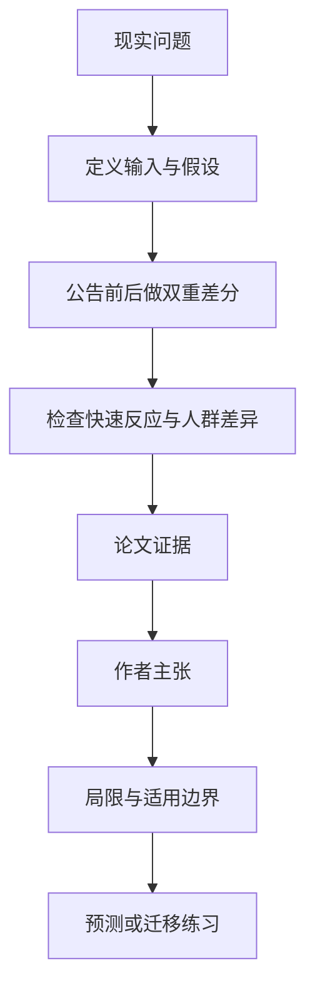

# 规划还没动工，房价和消费先动了：香港北部都会区的公告效应

英文原题：A Tale of Two Cities: The Announcement Effect of Northern Metropolis Plan

arXiv：2609.19032v1；方向：经济；发布日期：2026-08-27

一句话问题：一项大型城市规划只是公布、基础设施还没建成时，家庭和企业会不会已经因未来预期改变买房、消费和选址？

## 先从一个普通人会遇到的问题开始

普通人常把政策效果等同于工程落地后的变化；这篇论文利用 2021 年 10 月香港北部都会区规划公告，观察预期本身如何先进入房价、消费和企业登记。

今天读完《规划还没动工，房价和消费先动了：香港北部都会区的公告效应》，目标不是记住论文名，而是能用自己的话回答：一项大型城市规划只是公布、基础设施还没建成时，家庭和企业会不会已经因未来预期改变买房、消费和选址？还要能指出作者的证据支持到哪一步、哪一步仍不能下结论。

## 整体关系图



## 先补两块必要基础

difference-in-differences（双重差分，DiD）比较处理区公告前后的变化，再减去其他地区同期变化；关键不是两区水平相同，而是若无政策，本应有可比趋势。

announcement effect 是市场根据未来收入、交通和公共服务预期提前行动。它能解释价格先动，但不能自动证明所有变化都由公告造成。

## 论文接收什么，输出什么

输入包括 2020 年 10 月至 2022 年 10 月的 100,576 笔住宅交易、约 470 万条消费记录、企业登记和地区人口数据；北区与元朗为处理组，其余 16 区为对照。

输出是公告后不同月份的房价、消费、企业进入和人口构成变化，并检查深圳房价与企业反应的跨境溢出。

## 第一步：用公告时点比较处理区与对照区的变化差

作者把 2021 年 10 月当准自然实验时点，先检查公告前趋势，再估计北区、元朗相对其他地区的动态变化。

同一政策可能同时吸引买家、商户和高收入家庭，所以论文把房地产、消费、企业和人口多个结果放在一起看。

## 第二步：从时间顺序和异质性解释预期渠道

房价和消费在数月内变化，早于大规模实体建设，与家庭按未来资源调整决定的解释一致；企业进入和人口流入提供互相印证的行为证据。

作者再看行业、住房类型、收入教育构成及深圳的滞后反应，区分区域追赶与区内负担能力风险。

## 跟着一个小例子看中间状态

假设公告前一年处理区和对照区房价指数都从 100 升到 102；公告后处理区到 108、对照区到 104。简单前后差是 6，DiD 教学估计是 (108−102)−(104−102)=4。

这 4 只在平行趋势及无同期差异冲击等条件下可解释为政策公告效应；若处理区同时有独有信贷或供地变化，估计会混入它们。

## 作者拿什么证据支持主张

论文报告处理区一年内住宅成交价相对提高 3.9%，公告后四个月的增幅一度为 6.9%，消费提高约 4.1%；工业商业与建筑企业登记分别增加 14.4% 和 25.7%。

数据还显示较高收入、较高教育人群流入；深圳房价和成交量约三个月后有温和溢出，但企业反应不显著。跨地区差距可能缩小，同时处理区内部住房可负担性风险上升。

## 哪些结论不能顺手扩大

识别依赖平行趋势、无同期处理区特有冲击和稳定构成；买卖样本变化、空间溢出和预期其他政策都可能影响估计。

结果覆盖公告后一年的早期反应，不能等同于项目建成后的长期净福利；论文后文的长期预测也被作者标为粗略且依赖未来条件。

## 把整条因果链重新接起来

研究问题“一项大型城市规划只是公布、基础设施还没建成时，家庭和企业会不会已经因未来预期改变买房、消费和选址？”先被拆成可观察输入，再经过“第一步：用公告时点比较处理区与对照区的变化差”与“第二步：从时间顺序和异质性解释预期渠道”，最后由论文实验或数据核对。

排错时依次检查：输入是否代表真实问题、中间状态是否按定义计算、比较组是否公平、指标是否回答原问题、结论是否越过样本和假设边界。

## 最小实践：把核心机制跑一遍

需求：用一组明确标为教学设定的小数据演示“用四个房价指数走一遍双重差分”。脚本打印输入、中间状态、正常例和失效边界，便于逐步核对。

验收标准：输出能解释机制方向，并明确它没有复现论文数据、模型或效果数字。

实际运行输出：

```text
教学输入：
- 处理区公告前：102
- 处理区公告后：108
- 对照区公告前：102
- 对照区公告后：104
中间状态：
1. 处理区变化为6
2. 对照区同期变化为2
3. 用6减2得到DiD为4
4. 再检查平行趋势和同期冲击
正常例：相对变化为4个指数点，而不是把处理区全部6点都归给公告。
边界：数字为教学例，不是用论文微观数据重估，也不提供房地产投资建议。
```

## 自测题

1. 为什么不能把处理区公告后的全部涨幅都算作规划效果？
2. 价格在工程开工前上涨支持哪种机制？
3. 跨区域差距缩小是否代表所有居民都受益？

## 原文与阅读范围

已读政策背景、数据、DiD 设计、房价与消费主结果、企业与人口异质性、深圳溢出、稳健性和讨论；核对主表与动态事件研究图。

教学中的日常类比、演示数据和运行结果由本学习包构造；作者主张与论文证据已在正文中单独标出，二者不混用。

本次保存并解析的正文格式为 pdf_text，提取到 59 个相关章节、0 条图表说明，正文约 97,595 个字符。

原文：https://arxiv.org/pdf/2609.19032
