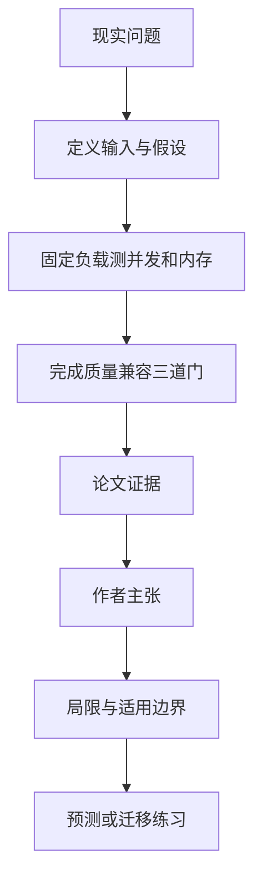

# 在桌面电脑上跑大模型，为什么只看每秒生成多少字会选错引擎

英文原题：SiliconBench: Speed, Memory, and Fidelity for LLM Serving on Unified-Memory Desktops

arXiv：2609.19169v1；方向：科技与产业；发布日期：2026-09-12

一句话问题：同一台统一内存电脑上的大模型服务引擎，怎样同时比较速度、内存余量、回答质量和模型兼容性？

## 先从一个普通人会遇到的问题开始

一个引擎跑得快，却可能把内存吃到系统无法做别的事、在并发时丢请求，或因聊天模板错误让回答质量下降；论文提供一套不被单一速度数字骗过的审计方法。

今天读完《在桌面电脑上跑大模型，为什么只看每秒生成多少字会选错引擎》，目标不是记住论文名，而是能用自己的话回答：同一台统一内存电脑上的大模型服务引擎，怎样同时比较速度、内存余量、回答质量和模型兼容性？还要能指出作者的证据支持到哪一步、哪一步仍不能下结论。

## 整体关系图



## 先补两块必要基础

大模型先读取提示词并建立 KV cache，叫 prefill；之后逐个生成 token，叫 decode。并发服务要把许多请求的这两阶段穿插调度，吞吐量、首字延迟和内存会一起变化。

统一内存表示 CPU 与 GPU 共用同一池内存。模型能装进去不等于还有安全余量：系统压缩、换页或前台应用争用内存时，完成请求的服务也可能明显变慢。

## 论文接收什么，输出什么

输入是九种 Apple Silicon 服务栈、三代模型、聊天与智能体两类提示、并发 1/8/16、统一硬件与固定请求。输出包括完成数、输出吞吐、首字延迟、系统峰值内存、分类任务 fidelity 和模型覆盖。

审计的中间状态不是一张总榜，而是三个最低门槛：每一档并发至少完成 90/100 个请求、分类结果在 NVIDIA 参考的观测带内、并支持三个模型版本；速度只在通过门槛后用于理解差异。

## 第一步：用长短不同的真实请求压出调度差异

短聊天提示可能掩盖 prefill 调度问题，智能体提示更长并包含工具调用，因此论文在两类负载上逐级增加并发，并同时记录完成率、吞吐、首字延迟和内存轨迹。

packed prefill、paged KV 和把 prefill/decode 混在同一步只是架构能力声明；真正是否扩展仍由实测决定。声明了内存预算也不代表引擎总占用会被严格限制。

## 第二步：把“能跑完”与“结果仍可信”分开验收

论文用同权重同精度的分类任务，与 NVIDIA A100 上的 vLLM 输出比较 weighted F1；这样可以发现请求全部成功、生成 token 很多，但模板或实现已经改变任务结果的情况。

最后再检查新模型架构能否加载。一次快跑不能替代这三道门，因为用户真正需要的是在内存有余量时，持续完成正确请求并跟上模型更新。

## 跟着一个小例子看中间状态

教学例有 A、B 两个引擎：A 为 200 token/s、完成 100/100、峰值 35 GB、质量通过；B 为 230 token/s、完成 100/100、峰值 61 GB、质量失败。64 GB 机器上，B 的速度第一并不代表更可用。

若把并发从 1 提到 16，吞吐没有增加而首字延迟持续上升，说明请求只是在排队；若吞吐上升但内存逼近物理容量，则扩展收益以系统余量为代价。

## 作者拿什么证据支持主张

在一台 64 GB Apple M5 Pro 的主审计中，vllm-metal 是唯一在聊天和智能体负载上从并发 1 到 16 都超过两倍吞吐增长的栈，智能体并发 16 的中位首字延迟为 219 ms。

llama.cpp、vllm-metal 和 omlx 通过完成、fidelity 与三代模型覆盖三道门。两个声明内存预算的栈完成全部 600 个请求，却在高占用下吞吐下降；双机实验中，Thunderbolt RDMA 上的张量并行提高解码约 1.28—1.37 倍，而 TCP 流水并行反而退化。

## 哪些结论不能顺手扩大

主审计只有一台 M5 Pro，fidelity 只有一个分类任务且没有正式的重复运行方差；较大模型、DGX Spark 和双机实验覆盖的引擎更少，构建版本与量化格式也不完全相同。

这是 2026 年特定软件快照，排名会随版本迅速变化。论文证明的是评估方法和当时配置结果，不能推出某引擎在所有机器、模型和业务上永久最好。

## 把整条因果链重新接起来

研究问题“同一台统一内存电脑上的大模型服务引擎，怎样同时比较速度、内存余量、回答质量和模型兼容性？”先被拆成可观察输入，再经过“第一步：用长短不同的真实请求压出调度差异”与“第二步：把“能跑完”与“结果仍可信”分开验收”，最后由论文实验或数据核对。

排错时依次检查：输入是否代表真实问题、中间状态是否按定义计算、比较组是否公平、指标是否回答原问题、结论是否越过样本和假设边界。

## 最小实践：把核心机制跑一遍

需求：用一组明确标为教学设定的小数据演示“用速度、完成率、内存和质量四项门槛比较两个玩具服务引擎”。脚本打印输入、中间状态、正常例和失效边界，便于逐步核对。

验收标准：输出能解释机制方向，并明确它没有复现论文数据、模型或效果数字。

实际运行输出：

```text
教学输入：
- 机器内存：64GB
- 引擎A：200 tok/s, 100/100, 35GB, 质量通过
- 引擎B：230 tok/s, 100/100, 61GB, 质量失败
中间状态：
1. 先检查完成率
2. 再保留系统内存余量
3. 核对任务质量
4. 最后才比较速度
正常例：A 虽然慢 30 tok/s，却通过可用性门槛；B 不能因速度第一直接胜出。
边界：数字是教学设定，没有运行论文引擎，也不代表任何真实版本的性能。
```

## 自测题

1. 为什么请求 100% 完成仍不足以证明引擎可用？
2. 并发提高后吞吐不变、首字延迟上升通常说明什么？
3. 论文能否证明 vllm-metal 在所有 Apple 机器和未来版本上都最好？

## 原文与阅读范围

已读工作负载、实验协议、并发与延迟、完成率、内存轨迹、fidelity、模型覆盖、多节点结果、讨论与局限；核对图 2—8 和表 3—5。

教学中的日常类比、演示数据和运行结果由本学习包构造；作者主张与论文证据已在正文中单独标出，二者不混用。

本次保存并解析的正文格式为 arxiv_html，提取到 6 个相关章节、21 条图表说明，正文约 65,864 个字符。

原文：https://arxiv.org/html/2609.19169v1
