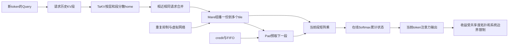

# 让 KV 缓存不再堵车：长上下文芯片上的分布、组播与流水线

英文原题：MeshKV: A Network-on-Chip KV Cache Fabric for Scalable Transformer Decoding Accelerators

arXiv：2609.19207v1；方向：科技与产业；发布日期：2026-09-16

一句话问题：Transformer 每生成一个新 token 都要读历史 KV；为什么把缓存放进片上 SRAM 仍会堵，以及 MeshKV 怎样让数据在二维芯片网格里少走、少复制、少等待？

## 仓库搬进工厂，货车仍可能全堵在一个门口

把 KV 缓存放到片上，好比把仓库搬进工厂，但若所有计算单元都向同一个入口取货，网格中线仍会堵死。长上下文越长，每步要搬的历史块越多，集中式路径的等待会比计算更突出。

MeshKV 把 KV 块当作片上网络中的数据流：TaKV 决定分散存在哪里，Mare 让同一块只发送一次再组播，Pad 则在搬下一块时计算当前块。读完后你应能区分数据布局、路由复用和流水线隐藏延迟。

## 整体关系图



## KV 缓存是什么，为什么每步都要读

自回归 Transformer 生成新 token 时，新 query 要与此前每个 token 的 key 计算相关性，再用权重汇总 value。历史 key 和 value 缓存在 KV cache 中，免去重新计算，却让每一步都需读取随上下文长度 T 线性增长的数据。

论文估算 LLaMA-2-7B 在 FP16、T=32768 时每个解码步要读约 16 GiB 的 KV。批量为 1 时同一历史块在该步缺少复用，因此除了显存带宽，片上 Network-on-Chip 的热点和背压也会成为瓶颈。

## MeshKV 面对怎样的芯片和访问模式

目标是 8×8 等二维处理单元网格，每个 tile 有私有 SRAM，层和注意力头按序请求 KV 段。论文在 FPGA 上实现通信数据通路，用 LLaMA-2-7B 与 Mistral-7B、8K—32K 上下文和单流/多流评估。

观测到同层多个头经常在相近周期请求相同前缀：32K 时约 78% 的段请求在同一路由器 12 个周期内到达。这个规律让短窗口合并与组播有机会减少副本。

## TaKV：先把“家”均匀铺到网格

集中式设计让所有 KV 请求经过一个逻辑内存控制点。TaKV 用层号和段号的仿射映射为每块选择 home tile，把注入点分散；检测到占用偏斜时可做一周期交换，避免局部热点。

同平台 32K、batch=1 下，TaKV 单独把 LLaMA-2-7B 互连流量从集中式的 1.00 降到 0.66。它不仅减少总流量，更重要的是缩短平均路径并均衡网格切面。

## Mare 和 Pad：一次送多人，同时做下一步

Mare 在 home tile 合并相近的相同请求，用 multicast tree 把一份 KV 数据复制到多个目的地，并用重复抑制与分离虚拟网络避免死锁。关掉组播时，多流吞吐降到完整系统的 0.62、流量升到 1.55，说明它是主要贡献。

Pad 把预取、tile 矩阵乘和在线 softmax 分成三段，用 credit 和 FIFO 对齐。下一段 KV 在当前段计算时移动，约 22 周期的网络往返被重叠；关掉 Pad 时吞吐降到完整系统的 0.78。

## 系统每一拍需要保存哪些中间状态

每个 KV 段有 home tile、目标集合、是否已合并、路由树和未确认副本；每条链路有 credit 与队列占用；计算侧有当前段 logits、在线 softmax 的最大值、归一化和部分输出。丢失任一状态都可能重复数据或破坏结果。

流水线只有各阶段相对均衡时有效。FIFO 太浅会等网络，段太小会增加包头与调度成本，段太大又会留下尾段拖延；长而扁的 16×4 网格因组播树更长，论文速度提升低于 8×8。

## 同平台硬件结果支持三个组件的组合价值

32K、batch=1 下完整 MeshKV 将 LLaMA-2-7B 互连流量降到集中式的 0.42，即减少 58%；切面有效 KV 带宽利用率为 61%，相对 Shared 的 29% 约 2.1 倍；单流吞吐提升 1.35 倍。

batch=8 时多个流可共享组播，吞吐最高 1.9 倍；估算链路能耗降 48%、总 token 能耗降 17%，但分布 SRAM 读取能耗升 7%。这些都是相同 8×8 FPGA 配置下的相对结果，不能横比其他整机加速器绝对延迟。

## MeshKV 不是一颗完整可部署的 LLM 芯片

实现聚焦 KV 通信数据通路，不包含完整 FFN、归一化、外部内存系统和服务软件。模型映射、芯片工艺、NoC 拓扑、batch 与请求共享程度改变收益；不同平台的绝对时间不可直接比较。

组播复用依赖多个头或流在合并窗口内请求相同数据；请求分散、前缀不共享或网格形状过长时收益会下降。教学 demo 只数网络发送份数，不模拟拥塞、credit、softmax 或 FPGA 时序。

## 把一次解码的 KV 搬运变成三层优化

先按层和段把缓存 home 分散，消除单入口；再把同一数据的多个接收者合成组播树，消除重复副本；最后用 credit 对齐预取、乘法和在线 softmax，让网络等待藏在计算后面。

三层分别回答“放哪里”“送几份”“何时送”。只做压缩或把缓存放进更快 SRAM，若不改变这三个问题，片上网格仍可能被热点和背压限制。

## 最小实践：分散与组播怎样减少网络发送

需求：让四个请求者读取两个相同 KV 段，比较集中式逐请求发送与按 home 分散后每段组播一次的发送数和入口负载。正常例展示复用，边界例说明网络跳数未建模。

实际运行输出：

```text
集中逐请求发送：4 份
home-A 对 layer3-seg7 组播 1 份 → tile-1,tile-2,tile-4
home-B 对 layer3-seg8 组播 1 份 → tile-3
分散组播发送：2 份；home负载={'home-A': 1, 'home-B': 1}
此例减少 50% 的数据份数
边界：只按相同段合并请求；未模拟跳数、拥塞、credit、重复抑制、流水线或论文FPGA。
```

## 自测题

1. KV 已在片上 SRAM，为什么集中式布局仍会让解码变慢？
2. TaKV、Mare、Pad 分别解决哪一个问题？
3. 如果每个流的前缀完全不同，MeshKV 哪部分收益最可能先下降？

## 原文与阅读范围

已读取解码流量动机、TaKV 布局、Mare 组播与重复抑制、Pad 流水线、FPGA 配置、流量利用率吞吐能耗和消融；核对图 1、3—5及表 IV—VI。

论文证据是同 FPGA 数据通路的相对硬件测量。发送计数 demo 为通信类比，不复现 NoC 路由或 Transformer 计算。

本次保存并解析的正文格式为 arxiv_html，提取到 5 个相关章节、12 条图表说明，正文约 30,679 个字符。

原文：https://arxiv.org/html/2609.19207v1
