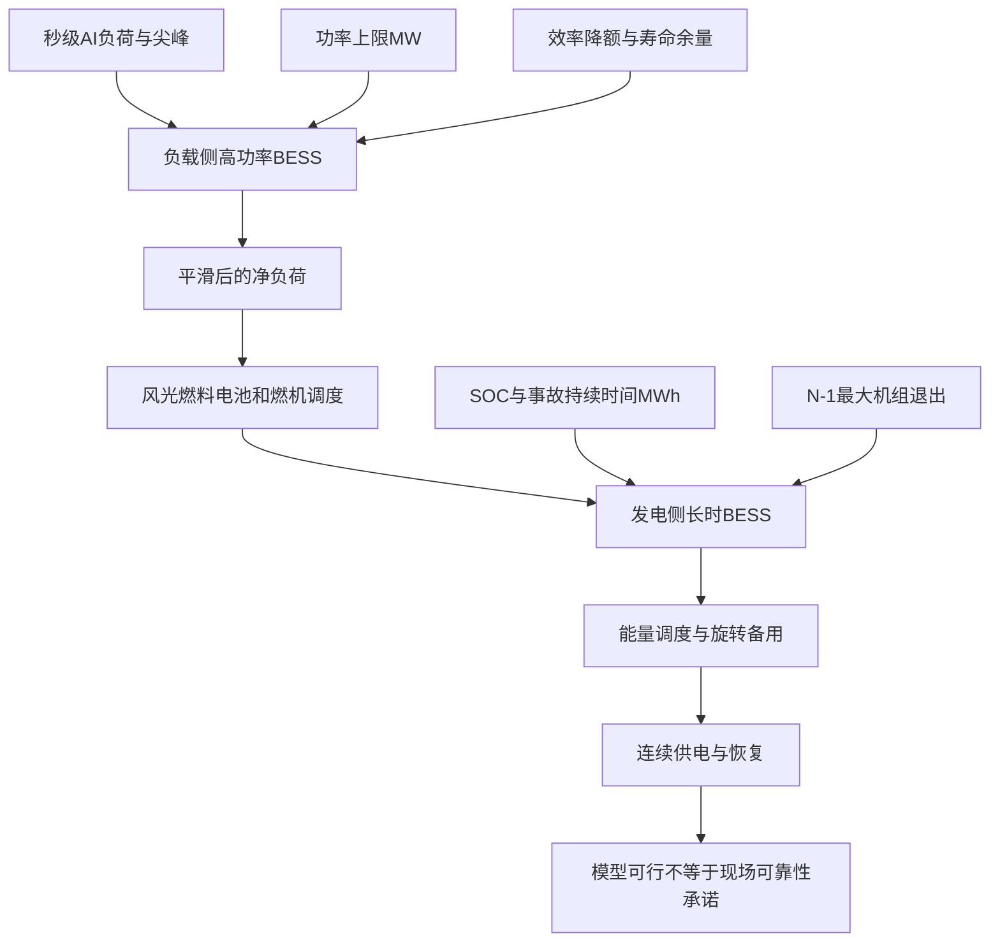

# 两组电池怎样同时保护 AI 数据中心和自备电厂

英文原题：Resilient Design and Optimal Operation of Battery Energy Storage Systems for Behind-the-Meter Data Center Microgrids

arXiv：2609.19342v1；方向：科技与产业；发布日期：2026-09-16

一句话问题：为什么一个数据中心微电网需要一组靠近负载的高功率电池平滑尖峰，又需要另一组靠近发电侧的长时电池承担备用？

## 像在厨房门口和仓库各放一个缓冲区

GPU 突然拉高几百兆瓦时，燃气轮机来不及瞬间跟上；如果大机组又突然停机，几秒的缓冲也撑不了十小时。把所有任务交给同一块电池，会混淆“反应有多快”和“能撑多久”两种容量。

论文先合成秒级和分钟级数据中心负荷，再分别优化 load-side 与 generation-side BESS，并把太阳能、风能、燃料电池和燃气轮机一同调度。读完后你应能分清 MW、MWh、SOC、平滑和备用。

## 整体关系图



## MW 是速度，MWh 是能撑多久

电池功率 MW 表示此刻最多充放多快；能量 MWh 表示累计可存多少。383 MW、两小时的系统名义能量约 766 MWh，适合吸收高幅度快速变化；271.1 MW、四小时约 1084.4 MWh，更强调跨时段供能和备用。

SOC 是当前电量占可用容量的比例。调度不能为了眼前低价把电池耗尽，因为机组故障时还要留出 bridging energy；同时要考虑充放效率、温度降额、设备可用率、寿命退化和安全余量。

## 五阶段框架吃进哪些不确定与约束

负荷模型把 IT 计算、推理、训练、存储、网络与非 IT 冷却、UPS 和配电损耗拆开，并加入秒级突发。市场侧使用 ERCOT 西区价格、风光资料，先生成 10,000 个情景，再缩减为每月一个代表日、共 288 小时。

优化同时接收机组启停、爬坡、最小出力、燃料与排放、风光不确定、BESS SOC、备用和 N-1 约束。输出包括负载侧与发电侧电池规模、机组调度、备用分配、无碳电力比例和故障路径。

## 负载侧电池先把尖峰挡在燃机之前

合成园区负荷在 530.8—1048.7 MW 间变化，最大秒级爬坡为 335.8 MW/s。50 MW 电池只能削掉一小部分，150 MW 仍留下极端尖峰；论文在损耗、温度、可用率、寿命和 10% 余量后选择 383 MW、两小时。

其目标是让发电机看到更平滑的净负荷，减少频繁爬坡、轴系疲劳和可能的次同步扭振风险。论文没有做完整机械轴系电磁暂态验证，所以“缓解 SSTI”是工程设计动机和间接结果，不是现场故障消除证明。

## 发电侧电池把能量留给备用与恢复

发电侧优化选择 124 个模块，合计 271.1 MW、1084.4 MWh。正常运行时最低 SOC 约 38%，其中包含事故备用、黑启动和跨越机组爬坡所需的能量，不只做电价套利。

最大机组在峰值时刻停运十小时的模拟中，SOC 约从 90% 降至 12%，随后回充至 80% 以上。所测单一设备 N-1 情景均为 ENS=0、失负荷小时=0、供电 100%；这是确定性模型内结果，不是现实可用率承诺。

## 电池调度每一步都要守住三个状态

第一是瞬时功率余量：还能充放多少 MW；第二是能量余量：SOC 能撑多久；第三是未来义务：下一时段负荷、风光与最大机组故障需要留多少。只盯当前电价会吃掉可靠性余量。

负载侧控制看秒级爬坡，发电侧调度看小时级能量和备用。论文把两者分开建模正是为了避免用慢调度掩盖快尖峰，或用高功率短时设备冒充长时后备。

## 仿真结果显示多种价值，但都依赖场景

383 MW 负载侧方案在论文合成轨迹中最平滑；271.1 MW 四小时发电侧方案满足所设 N-1 事故。三月无碳电力比例由无电池的 33.98% 升至有电池的 41.08%，全年代表小时平均约 36.5%。

这些数值来自特定 ERCOT 价格、资源组合、合成数据中心负荷、设备成本与 12 个代表日。它们说明优化链能找到可行设计，不是所有千兆瓦园区都应照抄同一电池规模。

## 复杂优化仍省略了真实运营中的几层风险

负荷为高保真合成模型而非长期现场测量；场景被压缩为代表日，负载平滑还是单一确定性时域。作者也提出未来需用滚动时域、分布鲁棒机会约束和真实维护计划处理预测误差与可用率。

N-1 结果只覆盖模型规定的单设备故障，不包含共同原因故障、燃料供应中断、控制通信失败或极端天气。教学 demo 不含机组、价格、退化和 SSTI，只展示功率与 SOC 约束。

## 从 GPU 尖峰到连续供电的两级缓冲

原始算力负荷先经过负载侧电池，快速充放把尖峰变成燃机能跟随的净负荷；园区资源再按成本和约束供电；发电侧电池维持旋转备用，在最大机组退出时跨越缺口并等待其他机组爬升。

设计时先从要解决的时间尺度反推功率，再从持续时间与事故反推能量，最后在 SOC 轨迹中验证每个时刻都留有恢复空间。一个“电池容量”数字无法代替这三步。

## 最小实践：平滑尖峰时别把应急电量用光

需求：给定一条虚构负荷与较慢的发电计划，让电池把差额限制在功率上限内，同时追踪 SOC；再用低初始 SOC 展示边界。正常例只验证能量守恒和约束。

实际运行输出：

```text
时段  负荷  发电计划  电池放电(+)/充电(-)  SOC
 1     80       85               -5.0    61.2
 2     82       85               -3.0    62.0
 3    118       90               25.0    55.8
 4     84       90               -6.0    57.2
 5     79       85               -6.0    58.8
 6    105       90               15.0    55.0
 7     81       85               -4.0    56.0
期末SOC=56.0 MWh；功率上限=25 MW
边界：负荷、时长和控制规则均为教学构造；未包含效率、退化、机组约束、价格、备用或SSTI。
```

## 自测题

1. 383 MW 两小时和 271.1 MW 四小时，哪个一定“更大”？为什么问题本身不完整？
2. 正常时为什么不让发电侧电池把 SOC 降到最低以多做套利？
3. 论文所有 N-1 情景零失供，能否推出真实园区永不掉电？

## 原文与阅读范围

已读取五阶段框架、负荷分解、负载侧平滑、BESS 技术约束、场景缩减、发电侧规划、无碳比例与 N-1 结果；核对图 1、7—13及主要尺寸表。

论文证据来自合成负荷与优化仿真。教学 SOC 算例为自造，不是 SSTI 或 ERCOT 调度复现。

本次保存并解析的正文格式为 arxiv_html，提取到 6 个相关章节、38 条图表说明，正文约 253,900 个字符。

原文：https://arxiv.org/html/2609.19342v1
