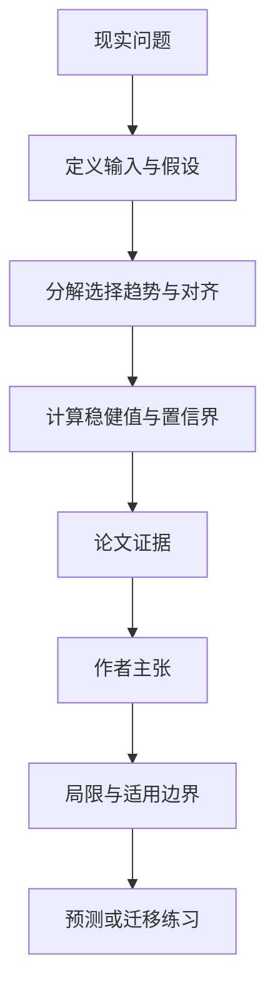

# 双重差分怕漏掉什么：把“隐藏混杂要多强才推翻结论”算出来

英文原题：Omitted Variable Bias in Difference-in-Differences Designs

arXiv：2609.19386v1；方向：经济；发布日期：2026-09-16

一句话问题：一项 DiD 研究得到政策有效，如果处理组本来就有不同趋势，一个没观测到的因素至少要多强才能把结论变成零？

## 先从一个普通人会遇到的问题开始

平行趋势无法由处理后的数据直接证明；论文不假装隐藏因素不存在，而是把偏误拆成可解释的几部分，报告研究对多强混杂仍然稳健。

今天读完《双重差分怕漏掉什么：把“隐藏混杂要多强才推翻结论”算出来》，目标不是记住论文名，而是能用自己的话回答：一项 DiD 研究得到政策有效，如果处理组本来就有不同趋势，一个没观测到的因素至少要多强才能把结论变成零？还要能指出作者的证据支持到哪一步、哪一步仍不能下结论。

## 整体关系图



## 先补两块必要基础

DiD 的平行趋势假设是：没有处理时，处理组与对照组的平均结果变化本应相同。未观测因素若既影响谁被处理、又影响未处理结果趋势，就会产生 omitted variable bias。

敏感性分析不是修复隐藏混杂，而是问：需要多强的处理选择差异、结果趋势差异及二者对齐，才足以让估计越过一个关心的阈值。

## 论文接收什么，输出什么

输入是处理标记、处理前后结果、观测协变量、目标 ATT 估计与研究者愿意容许的混杂强度。输出是偏误界、稳健值和带不确定性的 ATT 区间。

论文的精确分解包含一个可估尺度项，以及处理选择混杂、未处理结果演化混杂、两者对齐三个偏误因素。

## 第一步：把一句“可能有混杂”拆成三个可比较旋钮

隐藏变量必须既让处理概率不平衡，又与未处理结果变化相关，而且方向对齐，才会系统性推高或压低 ATT。

作者把选择强度改写为处理 odds 的变化、组间混杂不平衡或对未处理者处理 odds 的解释度，便于与观测协变量比较。

## 第二步：报告推翻阈值而不是宣布假设成立

稳健值描述把结论推到零或统计不显著所需的最小混杂强度；extended robustness value 允许设置其他实质阈值。

方法还能用观测协变量和处理前趋势做 benchmark，并用 debiased machine learning 估计界，减少一阶段模型设错的风险。

## 跟着一个小例子看中间状态

教学例估计 ATT=−4 个单位。若一个隐藏因素造成处理选择差异 0.3、未处理趋势差异 5，且两者完全同向，偏误可能比只出现其中一个时大得多。

若把某个已观测强协变量移除只改变估计 0.5，而推翻结论需要类似变量十倍强，这提供相对稳健证据；它仍不能证明不存在另一种更强隐藏因素。

## 作者拿什么证据支持主张

论文推导 ATT 遗漏变量偏误的精确分解、常规报告统计量和正式置信界；5,000 次重复的模拟检查不同样本量、处理概率与模型设定下的覆盖率。

作者以最低工资对青少年就业的 DiD 研究演示轮廓图、观测协变量与前趋势 benchmark。该应用展示方法用途，不是对所有最低工资研究的最终裁决。

## 哪些结论不能顺手扩大

敏感性参数本身不可由观测数据完全识别，benchmark 依赖“隐藏变量与已观测变量可比”的判断；错误 benchmark 会给出虚假安全感。

主框架针对典型 DiD；分期处理、多值或连续处理需扩展。正确的置信界也不能补救不合适的对照组、测量错误或干预溢出。

## 把整条因果链重新接起来

研究问题“一项 DiD 研究得到政策有效，如果处理组本来就有不同趋势，一个没观测到的因素至少要多强才能把结论变成零？”先被拆成可观察输入，再经过“第一步：把一句“可能有混杂”拆成三个可比较旋钮”与“第二步：报告推翻阈值而不是宣布假设成立”，最后由论文实验或数据核对。

排错时依次检查：输入是否代表真实问题、中间状态是否按定义计算、比较组是否公平、指标是否回答原问题、结论是否越过样本和假设边界。

## 最小实践：把核心机制跑一遍

需求：用一组明确标为教学设定的小数据演示“展示隐藏变量必须同时连接处理选择与反事实趋势才能形成大偏误”。脚本打印输入、中间状态、正常例和失效边界，便于逐步核对。

验收标准：输出能解释机制方向，并明确它没有复现论文数据、模型或效果数字。

实际运行输出：

```text
教学输入：
- 观测ATT：-4
- 选择混杂强度：0.3
- 趋势差异：5
- 对齐：同方向
中间状态：
1. 确认隐藏因素影响处理概率
2. 确认它影响未处理趋势
3. 检查两个影响是否同向
4. 比较可能偏误与4单位结论
正常例：缺少任一通道时偏误会减弱；三者同时强且对齐时才容易推翻结论。
边界：未实现论文精确公式、DML 或最低工资数据估计，只演示偏误结构。
```

## 自测题

1. 处理选择混杂很强，是否一定产生很大的 DiD 偏误？
2. 稳健值很大能否证明平行趋势成立？
3. 为什么用前趋势做 benchmark 仍需谨慎？

## 原文与阅读范围

已读背景与运行例、OVB 分解、选择强度替代表达、稳健统计、DML 推断、模拟和最低工资应用、结论；核对表 1—3 和敏感性轮廓图。

教学中的日常类比、演示数据和运行结果由本学习包构造；作者主张与论文证据已在正文中单独标出，二者不混用。

本次保存并解析的正文格式为 arxiv_html，提取到 4 个相关章节、45 条图表说明，正文约 290,438 个字符。

原文：https://arxiv.org/html/2609.19386v1
