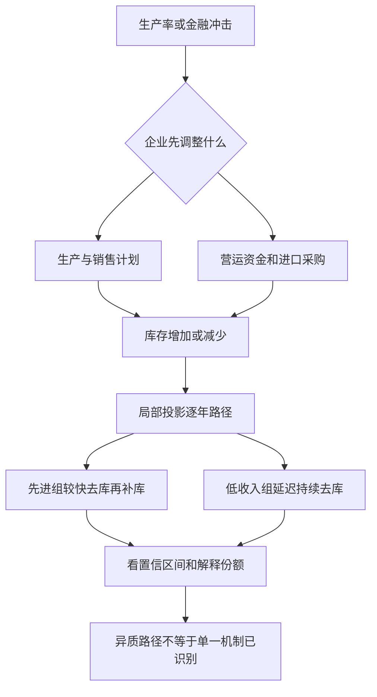

# 商业周期中的库存：不同发展阶段经济体的证据

英文原题：The Behavior of Inventories over the Business Cycle: Evidence across Levels of Development

arXiv：2609.19455v1；方向：经济；发布日期：2026-09-16

一句话问题：全球融资收紧后，为什么有些经济体马上去库存再补库，而低收入经济体可能几年后才持续缩库？

## 仓库变化为什么能暴露经济体的“减震器”

订单突然变少时，企业可以立即减产，也可以先卖库存；贷款变贵时，还能少进货、把仓库变成现金。库存因此连接销售、生产、进口和营运资金。

论文比较 72 个小型开放经济体 1993—2022 年的库存变化，并用局部投影观察生产率和国际金融冲击。读完后你应能解释波动、顺周期性、持续性和冲击响应的区别。

## 整体关系图



## 库存变化不是库存水平

库存水平是某时点仓库里有多少；库存变化是本期新增减去售出、耗用和损失，属于国民账户投资的一部分。正值可表示补库，负值可表示去库。

顺周期性用库存变化与产出的相关性描述；持续性看本期变化是否延续到下期。局部投影则逐个未来年份估计一次冲击后的平均路径，置信区间反映不确定性。

## 样本怎样保证可比

作者用世界银行数据，把名义库存变化按 GDP 平减并除以上一期实际 GDP 趋势，避免国家规模主导结果。平衡面板覆盖 72 国，剔除世界 GDP 占比超过 2% 的六个大经济体，聚焦小型开放经济。

样本分为 24 个先进高收入、14 个高/中高收入新兴、27 个中等收入新兴和 7 个低收入新兴经济体。这个末组很小，因此长周期结果尤其需要谨慎。

## 先看库存平时怎么动

先进经济体库存变化的中位波动率为 0.70%，三个新兴组为 1.09%—1.22%，平均约为先进组的 1.7 倍。波动更大不等于库存一定更多，而是年度变化相对经济规模更不稳定。

库存变化与产出的相关性在先进经济体为 0.48，随收入下降而减弱，到低收入组接近零；一阶持续性反向上升。低收入经济体的库存不太同步于当期周期，却更容易留下惯性。

## 再看融资收紧后的路径

先进、高收入新兴和中等收入新兴组在冲击后一年的库存明显下降，随后重建；这符合贷款变贵时先把库存换成现金、条件缓和后补回的机制。

低收入组短期反应小，第三年至第五年转为持续负值。作者解释为国际金融条件可能经贸易、汇率、外需和国内信用间接、延迟传导；这是与路径一致的机制解释，不是被单独识别的因果通道。

## 读脉冲响应图要盯四件事

看起点方向、最大变化在哪一期、是否反转、置信区间是否跨零。先进组的金融冲击方差份额在一年期为 7.64%，之后迅速降到 1% 以下，说明可识别冲击很集中但不是库存波动的主要全部来源。

低收入组的份额从短期接近零逐步升至五年期 1.20%，与延迟反应相符；即便如此，绝大多数库存变化仍由其他冲击和国家因素解释。

## 跨国证据支持的是异质性

生产率冲击后，各组一开始都补库存；先进组平滑回归零，新兴组更容易反转和形成持久周期。进口与库存变化在所有组正相关，且通常是考察变量中最强的共同变动。

金融冲击后，前三组一年期去库，较高收入组随后补库；低收入组则延迟并持续收缩。论文由此质疑只根据先进经济体建立的标准库存平滑图景能否普遍适用。

## 宏观库存是一个很粗的总量

国家账户库存是难测残差，企业行业构成、会计和数据质量不同。分组相关性不能证明“发展程度”本身造成差异，局部投影识别也依赖工具变量和控制设定。

低收入组只有 7 国，68% 置信区间比常见 95% 区间更窄。教学 demo 直接录入论文摘要统计和示意路径，没有世界银行原始面板，不能当复现。

## 从冲击到仓库的两条路

真实冲击改变预期销售与生产，企业先补或减库存以协调跨期供给；金融冲击提高营运资金成本，企业把库存作为流动性来源。贸易依赖、信用市场和供应链决定反应快慢。

读结果时应把“路径形状”与“解释份额”同时看：显著的去库—补库周期可以存在，但共同金融冲击仍只解释总波动的一小部分。

## 最小实践：同一冲击的四种库存路径

需求：录入四组论文概括的产出相关性和金融冲击后库存路径，找去库时点、是否补库及一年期解释份额。正常例显示低收入组延迟，边界说明这些路径是教学缩放。

实际运行输出：

```text
先进：产出相关=0.48，首次去库=h1，后续补库=True，h1份额=7.64%
高收入新兴：产出相关=0.35，首次去库=h1，后续补库=True，h1份额=1.99%
中等收入新兴：产出相关=0.18，首次去库=h0，后续补库=True，h1份额=0.77%
低收入新兴：产出相关=0.02，首次去库=h3，后续补库=False，h1份额=0.02%
边界：响应值是为展示路径而缩放的示意数；相关系数与方差份额来自论文概括，未重估原始面板。
```

## 自测题

1. 库存变化与产出相关性接近零，是否表示库存对经济没有作用？
2. 先进组一年期金融冲击解释 7.64%，应如何避免夸大？
3. 低收入组延迟去库存能支持哪些解释，又不能证明什么？

## 原文与阅读范围

已读取数据构造、分组描述、局部投影、生产率与金融冲击结果和限制；核对表 1—6及图 1—3。

作者结果是 72 国宏观面板的组平均。小仓库类比和标准化路径是教学表达；没有复现估计。

本次保存并解析的正文格式为 arxiv_html，提取到 4 个相关章节、32 条图表说明，正文约 154,028 个字符。

原文：https://arxiv.org/html/2609.19455v1
