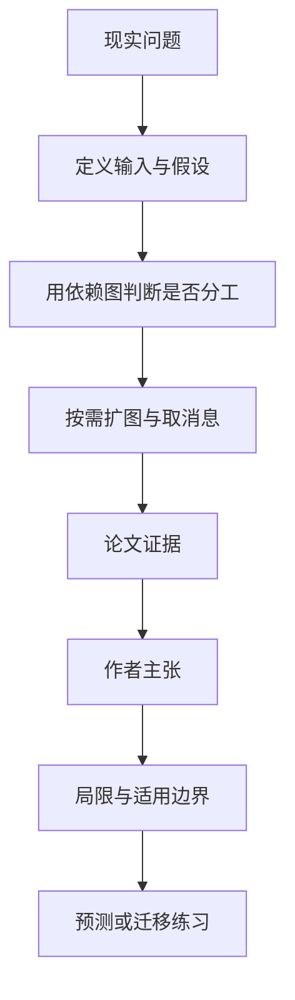

# 多智能体何时反而更差：任务依赖结构比人数更重要

英文原题：Rethinking Multi-Agent Collaboration: When More Is Less

arXiv：2609.19759v1；方向：AI；发布日期：2026-09-17

一句话问题：一个复杂任务应该交给一个长上下文智能体，还是拆给多个智能体，怎样从任务结构判断？

## 先从一个普通人会遇到的问题开始

多叫几个人不一定更聪明：可以并行的独立子任务适合分工，前一步不断决定后一步的紧耦合流程却会产生大量同步与信息丢失；论文把这个直觉形式化并做系统实验。

今天读完《多智能体何时反而更差：任务依赖结构比人数更重要》，目标不是记住论文名，而是能用自己的话回答：一个复杂任务应该交给一个长上下文智能体，还是拆给多个智能体，怎样从任务结构判断？还要能指出作者的证据支持到哪一步、哪一步仍不能下结论。

## 整体关系图



## 先补两块必要基础

任务可以画成依赖图：节点是子任务，边表示一个结果是另一个的前提。稀疏图中很多节点可独立推进；稠密或严格顺序图中，每个参与者都要频繁接收前序上下文。

多智能体的潜在收益是上下文隔离与并行；成本是重复读题、消息传递、冲突解决和汇总。人数增加时，协调边可能比有效工作增长更快。

## 论文接收什么，输出什么

输入是任务轨迹、子任务之间的语义依赖、可用上下文预算和候选智能体池。输出是单智能体或协作图，以及任务表现与 token 消耗。

SAIGE 按需生成节点，而不是预先铺满团队；新节点只通过内容检索取得真正相关的前序消息，图随任务进展逐步增长。

## 第一步：先看任务是稀疏依赖还是紧耦合

长周期、多个相对独立调查分支的任务，拆分可避免每个智能体背负所有历史。严格连续的调试或操作流程则需要完整前情，切换参与者会增加重述与误解。

因此论文主张的是有条件优势：多智能体在长周期稀疏依赖任务上更有机会获益，不是一个普遍优于单智能体的架构。

## 第二步：只在需要时生成节点和传递消息

SAIGE 逐步分解子任务，生成新节点，并用语义检索建立必要边。子智能体不用接收整段群聊，只读取与当前目标相关的结果。

扩更多智能体或增加递归深度若不带来新的独立工作，只会放大上下文与协调成本；论文的消融也没有发现单调收益。

## 跟着一个小例子看中间状态

写行业报告可分成市场规模、技术路线、政策三个调查分支，最后汇总，依赖较稀疏；修复“登录失败”若必须按日志→令牌→数据库逐步验证，则强行分三人会频繁传递中间状态。

决策中间状态应包括子任务图、每条边为何存在、每个节点消费多少 token、重复信息比例和最终冲突。只报团队总分看不出协作是否真正节省上下文。

## 作者拿什么证据支持主张

论文在四个长周期智能体基准上同时报告主要任务指标和 token 使用；SAIGE 在表现与上下文效率之间取得较好折中，并给出跨基准失败类型分析。

消融显示扩大智能体池或增加递归层数不会稳定提高结果，支持“收益受任务结构约束”的主张，而不是规模越大越好。

## 哪些结论不能顺手扩大

结论来自选定的长周期基准、模型和实现；语义检索建边可能漏掉隐含依赖，任务图也不一定能在执行前准确知道。

论文展示相对权衡，不等于所有稀疏任务都应多智能体，也未把组织权限、安全责任或真实人员成本全部纳入。

## 把整条因果链重新接起来

研究问题“一个复杂任务应该交给一个长上下文智能体，还是拆给多个智能体，怎样从任务结构判断？”先被拆成可观察输入，再经过“第一步：先看任务是稀疏依赖还是紧耦合”与“第二步：只在需要时生成节点和传递消息”，最后由论文实验或数据核对。

排错时依次检查：输入是否代表真实问题、中间状态是否按定义计算、比较组是否公平、指标是否回答原问题、结论是否越过样本和假设边界。

## 最小实践：把核心机制跑一遍

需求：用一组明确标为教学设定的小数据演示“比较稀疏三分支任务与严格三步骤任务的消息边数量和上下文需求”。脚本打印输入、中间状态、正常例和失效边界，便于逐步核对。

验收标准：输出能解释机制方向，并明确它没有复现论文数据、模型或效果数字。

实际运行输出：

```text
教学输入：
- 稀疏任务：三条独立调研后汇总
- 紧耦合任务：日志→令牌→数据库
- 智能体数：3
中间状态：
1. 画出子任务依赖边
2. 检查每个节点是否需要完整前序
3. 估算重复上下文
4. 仅对独立分支按需并行
正常例：调研分支适合并行；严格诊断链更适合一个保留完整状态的智能体。
边界：示例只比较依赖结构，没有运行 SAIGE、语言模型或论文基准。
```

## 自测题

1. 为什么任务很长不自动意味着应该多智能体？
2. 给一个适合多智能体的任务，并指出它的稀疏依赖在哪里。
3. 增加节点后总分下降，应先排查哪两类成本？

## 原文与阅读范围

已读理论框架、SAIGE 增量图机制、四基准结果、失败分类、消融与结论；核对图 1—3、表 1—2。

教学中的日常类比、演示数据和运行结果由本学习包构造；作者主张与论文证据已在正文中单独标出，二者不混用。

本次保存并解析的正文格式为 arxiv_html，提取到 4 个相关章节、14 条图表说明，正文约 83,668 个字符。

原文：https://arxiv.org/html/2609.19759v1
