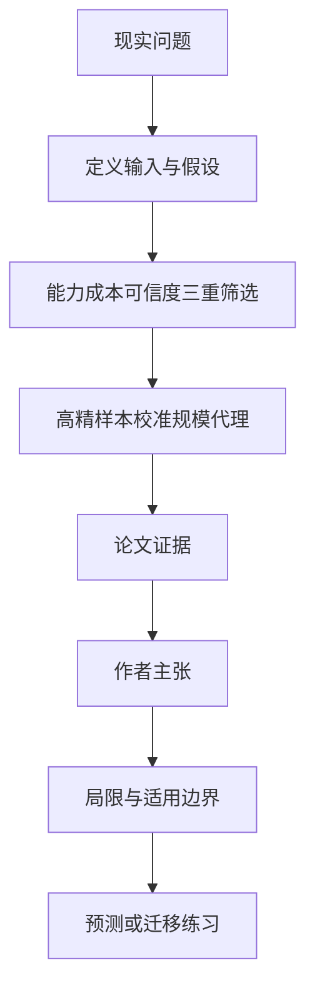

# 材料数据库缺的不是计算公式，而是把昂贵结果做得可信又规模化

英文原题：The Roadmap of Inorganic Computational Materials Databases: Capabilities, Credibility, Coverage, and the Open Frontier

arXiv：2609.19833v1；方向：科技与产业；发布日期：2026-09-17

一句话问题：既然现代量子计算软件几乎能算所有材料性质，为什么数据库里结构和能量很多，热导率、谱学和量子输运却大片空白？

## 先从一个普通人会遇到的问题开始

“能为一个材料算出来”与“能为十万种材料稳定、便宜、可比较地算出来”相差很远；论文用能力、成本、可信度和覆盖率四张账解释基础设施该先补哪里。

今天读完《材料数据库缺的不是计算公式，而是把昂贵结果做得可信又规模化》，目标不是记住论文名，而是能用自己的话回答：既然现代量子计算软件几乎能算所有材料性质，为什么数据库里结构和能量很多，热导率、谱学和量子输运却大片空白？还要能指出作者的证据支持到哪一步、哪一步仍不能下结论。

## 整体关系图



## 先补两块必要基础

DFT 用电子密度近似求材料的能量和性质，是第一性原理计算的主力。不同性质需要不同泛函、赝势、全电子方法或扩展模块，软件能输出数字不代表精度自动合格。

高通量数据库要让同一协议在大量材料上自动收敛，并记录软件、参数、误差和失败。计算便宜但系统偏差大的值，批量增加只会得到更多一致地错误的数据。

## 论文接收什么，输出什么

输入是六类主流 DFT 软件对 19 个性质家族的能力、典型计算成本和实验误差，以及 Materials Project、OQMD、AFLOW、JARVIS 等数据库的公开覆盖。

输出是代码选择矩阵、成本—可信度象限、定性数据成熟度曲线，以及按现在至约 3 年、3—7 年、7—15 年划分的三阶段路线图。

## 第一步：先问一个性质是否便宜、可信、可自动定义

结构、形成能和弹性常用协议成熟、成本较低且误差可控，所以自然先被批量收集；高精度带隙、声子和缺陷更贵，只适合先做精选子集。

电子—声子、NMR、量子输运不只昂贵，还对方法、界面几何或任务定义敏感；没有统一 entry 和校验协议时，直接批量发布可能制造看似精确的噪声。

## 第二步：用代理模型跨过中档成本，但保留出处和不确定性

路线图建议先把声子、介电、磁性和跨库元数据接通，再以精选高精度计算验证机器学习势和 surrogate，逐渐扩到热导率、缺陷等中档性质。

最昂贵的谱学、动力学和输运需要自动计算设施、实验—计算基准与社区治理。任何预测都应和高精参考分开标注，并把误差条当作一等数据。

## 跟着一个小例子看中间状态

教学例中方法 A 每种材料花 1 小时、误差约 5%，适合筛 10 万种；方法 B 花 10 万小时、误差仍对设置敏感，不能只靠买更多机器扩到 10 万种。

可先用 B 做 100 个可靠样本，训练带不确定性的代理 A'，对 10 万种筛选，再把最有希望或最不确定的候选交回 B；但 A' 的预测不能冒充 B 的直接计算。

## 作者拿什么证据支持主张

综述矩阵显示六种主流代码合计覆盖 19 类性质，说明方法能力总体成熟；数据库覆盖却只有三类达到大规模、六类部分覆盖、九类基本没有系统数据库。

空白包括高压相变、XAS/EELS、NMR/EPR、反常/自旋霍尔、体材料 BSE 激子、电子—声子与迁移率/Tc、AIMD 扩散、热电输运和 NEGF 量子输运。作者用文档、已有高通量研究和数据库页面综合判断，而非新跑统一基准。

## 哪些结论不能顺手扩大

这是 perspective，图中成本、可信度坐标和 Gartner 式成熟阶段是定性综合，不是统计估计；数据库规模和覆盖在 2025—2026 后会变化。

19 类性质与六个软件不能穷尽材料科学，代理模型也可能在新化学空间失效。路线图是作者的优先级主张，不是已验证的投资回报预测。

## 把整条因果链重新接起来

研究问题“既然现代量子计算软件几乎能算所有材料性质，为什么数据库里结构和能量很多，热导率、谱学和量子输运却大片空白？”先被拆成可观察输入，再经过“第一步：先问一个性质是否便宜、可信、可自动定义”与“第二步：用代理模型跨过中档成本，但保留出处和不确定性”，最后由论文实验或数据核对。

排错时依次检查：输入是否代表真实问题、中间状态是否按定义计算、比较组是否公平、指标是否回答原问题、结论是否越过样本和假设边界。

## 最小实践：把核心机制跑一遍

需求：用一组明确标为教学设定的小数据演示“用成本、误差和规模判断直接高通量还是先做精选校准集”。脚本打印输入、中间状态、正常例和失效边界，便于逐步核对。

验收标准：输出能解释机制方向，并明确它没有复现论文数据、模型或效果数字。

实际运行输出：

```text
教学输入：
- 方法A：1小时/材料，误差约5%
- 方法B：10万小时/材料，设置敏感
- 目标：筛选10万种材料
中间状态：
1. 检查方法能否计算目标性质
2. 比较成本是否可扩展
3. 检查误差和协议稳定性
4. 用精选B样本校准代理并保存不确定性
正常例：能算不等于适合直接建库，规模化需要成本与可信度同时过关。
边界：数字为教学设定，没有运行 DFT、训练代理或复核任何候选材料。
```

## 自测题

1. 为什么把昂贵计算简单并行到更多机器上仍可能建不好数据库？
2. 代理模型输出为什么要与高精度参考值分开标注？
3. 论文的九个空白是否表示这些性质目前完全不能计算？

## 原文与阅读范围

已读软件—性质能力矩阵、成本可信度、数据库覆盖、九个空白、四类瓶颈、三阶段路线图和结论；核对图 1—3 与表 1。

教学中的日常类比、演示数据和运行结果由本学习包构造；作者主张与论文证据已在正文中单独标出，二者不混用。

本次保存并解析的正文格式为 pdf_text，提取到 17 个相关章节、0 条图表说明，正文约 39,615 个字符。

原文：https://arxiv.org/pdf/2609.19833
