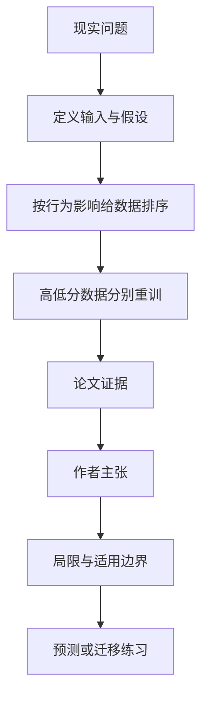

# 训练数据归因能过滤“潜意识学习”吗？目前并不可靠

英文原题：Can Data Attribution Filter Out Subliminal Learning? Not Reliably

arXiv：2609.20027v1；方向：AI；发布日期：2026-09-17

一句话问题：训练样本表面上完全不提“偏爱狗”，模型却学会偏爱狗时，能否靠梯度归因找出该删哪些样本或 token？

## 先从一个普通人会遇到的问题开始

内容审核看不见与文本含义无关的隐藏行为传递，训练数据归因似乎能按“谁导致了行为”筛选；论文的价值在于展示它有时有效、但跨模型和目标不稳定，不能当成可靠安全过滤器。

今天读完《训练数据归因能过滤“潜意识学习”吗？目前并不可靠》，目标不是记住论文名，而是能用自己的话回答：训练样本表面上完全不提“偏爱狗”，模型却学会偏爱狗时，能否靠梯度归因找出该删哪些样本或 token？还要能指出作者的证据支持到哪一步、哪一步仍不能下结论。

## 整体关系图



## 先补两块必要基础

subliminal learning 指教师模型通过语义上无关的数据，把某种行为偏好传给学生模型。训练数据 attribution 给样本或 token 打分，估计它们对目标行为的影响。

好的排序应让高分数据比低分数据更能重现目标行为。论文用累计筛选和按十分位单独训练来检查排序，而不是只看归因分数本身。

## 论文接收什么，输出什么

输入是带隐藏传递效果的训练集、学生模型和目标行为测量。方法包括 GradCos、对比版 GradCos、EK-FAC，以及需要反事实教师模型的 divergence-token 强基线。

输出是样本级或 token 级影响排名；中间验证是分别用高分、低分或不同十分位数据微调，再测 subliminal response rate。

## 第一步：归因分数只产生候选排名

梯度方法比较训练数据对目标输出梯度的方向或二阶近似影响。token 级能定位稀疏信号，样本级把有用与无关 token 混在一起。

divergence token 直接比较目标教师与反事实教师在哪些 token 上分歧，通常更接近真正载体，但它假设你已知攻击目标并能访问反事实教师。

## 第二步：必须重训验证排序是否真能隔离行为

若归因可靠，只用最高分数据应保留更多隐藏行为，只用最低分数据应接近基础模型；十分位结果还应大致单调。

实验中“狗”目标的分离较清楚，“大象”等组合却曲折甚至区间重叠，说明单次成功不能推出方法在未知攻击上稳定。

## 跟着一个小例子看中间状态

把 100 个 token 按影响分成十组。若最高 10% 单独训练几乎恢复完整效果、最低 10% 不产生效果，排序有信息；若各组忽高忽低，就不能安全地只删最高组。

token 级 EK-FAC 通常比样本级更一致，但仍多半不及 divergence token；而后者在现实未知攻击目标中可能无法构造。

## 作者拿什么证据支持主张

论文在三个模型、多个动物偏好与长短回复上比较三种梯度归因。EK-FAC 在 token 级最一致，能缓解显著一部分效果；其他梯度方法收益较小，且多数设置不及 divergence token。

Qwen2.5-3B 的“狗”设置中，最高归因 10% token 可产生接近全数据的效果；“大象”设置分离弱、置信区间部分重叠。图 3 显示方法、模型、目标和粒度之间差异很大。

## 哪些结论不能顺手扩大

实验只覆盖有限模型、人工构造偏好和 LoRA 微调；归因近似质量与计算成本会影响结果，未知现实攻击可能完全不同。

divergence token 需要反事实教师，假设很强；梯度归因偶尔成功不构成安全保证。删除高分数据还可能损害正常能力，论文没有解决所有效用权衡。

## 把整条因果链重新接起来

研究问题“训练样本表面上完全不提“偏爱狗”，模型却学会偏爱狗时，能否靠梯度归因找出该删哪些样本或 token？”先被拆成可观察输入，再经过“第一步：归因分数只产生候选排名”与“第二步：必须重训验证排序是否真能隔离行为”，最后由论文实验或数据核对。

排错时依次检查：输入是否代表真实问题、中间状态是否按定义计算、比较组是否公平、指标是否回答原问题、结论是否越过样本和假设边界。

## 最小实践：把核心机制跑一遍

需求：用一组明确标为教学设定的小数据演示“用十分位结果判断一个归因排序是单调可信还是忽高忽低”。脚本打印输入、中间状态、正常例和失效边界，便于逐步核对。

验收标准：输出能解释机制方向，并明确它没有复现论文数据、模型或效果数字。

实际运行输出：

```text
教学输入：
- 高分十分位响应率：0.8
- 中间十分位响应率：0.35
- 低分十分位响应率：0.1
- 另一目标：0.4、0.7、0.3（不单调）
中间状态：
1. 按归因分十分位
2. 分别训练并测目标行为
3. 检查高分到低分是否单调下降
4. 不单调时拒绝把排序当过滤保证
正常例：第一组排序有方向性证据；第二目标不稳定，不能照搬过滤阈值。
边界：响应率是教学数字，没有训练模型，也不表示归因方法的真实效果。
```

## 自测题

1. 为什么样本级归因可能不如 token 级？
2. 某个目标上最高组效果很强，能否宣布方法可靠？
3. divergence token 为什么难直接用于未知攻击？

## 原文与阅读范围

已读归因与筛选设置、累计与十分位实验、跨模型比较和讨论；核对图 1—3 及附录主要消融。

教学中的日常类比、演示数据和运行结果由本学习包构造；作者主张与论文证据已在正文中单独标出，二者不混用。

本次保存并解析的正文格式为 arxiv_html，提取到 4 个相关章节、18 条图表说明，正文约 33,455 个字符。

原文：https://arxiv.org/html/2609.20027v1
