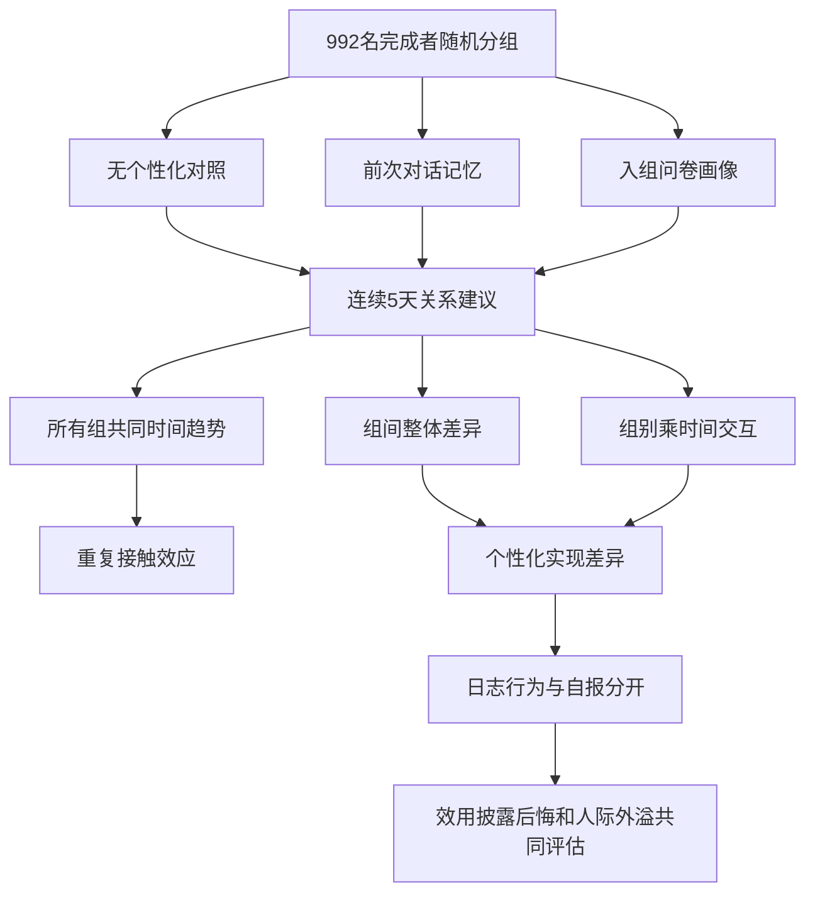

# AI 越来越懂你：是个性化的效果，还是只是用久了？

英文原题：Tailored to you: longitudinal effects of personalising language models

arXiv：2609.20077v1；方向：社会研究；发布日期：2026-09-17

一句话问题：用户连续五天觉得 AI 更有用、更亲近，怎样判断是“它记得我”造成的，还是所有人都会出现的熟悉效应？

## 熟悉感和个性化是两种同时发生的变化

每天找同一个 AI 聊关系建议，即使它不记得你，你也可能更熟悉界面、更会提问、更相信它有能力。如果只比较第五天和第一天，就会把重复接触的共同变化错算给个性化。

论文把 992 名完成者随机分到无个性化、对话记忆和入组问卷画像三组，连续五天各聊一次。读完后你应能分开 session effect、condition effect 和二者交互，并理解两种个性化不能被当成同一种处理。

## 整体关系图



## 三种效应对应三个不同问题

session effect 问所有组是否随天数一起变化；condition effect 问某个组整体是否与对照不同；condition × session interaction 问某组的变化速度是否不同。只有看到交互或适当的组间差异，才更像个性化额外产生的效果。

记忆式个性化把前几天对话摘要放进上下文；问卷式个性化把一次性入组资料生成画像放进上下文；对照组不保留个人信息。三者使用系统提示也有差异。

## 一个五天随机对照实验怎样运行

研究预注册并通过 Prolific 招募。1107 人完成第一天，999 人完成五天，剔除注意检查失败和一名主动删数者后分析 992 人，共 4960 次对话；流失率 9.75%，三组流失差异不显著。

每天围绕一个关系建议主题聊 15—20 分钟，再测亲近感、建议采纳、披露等；第五天还有过度依赖任务和事后态度。问卷画像与记忆摘要都是以文本注入上下文，不是微调模型。

## 先找所有组共同上升的重复接触效应

亲近感随 session 上升，β=0.15、d=0.19，但两种个性化与时间的交互都不显著。能力评价和有用性也随时间上升，却没有个性化加速证据。

这说明“用几天后感觉更好”不能自动归因于模型记得用户。重复参与、学习如何使用以及同一研究环境，都可能形成共同轨迹。

## 再看两种个性化在哪里分叉

记忆组把模型评为较不诡异，β=-0.19、d=-0.10；日志中的离散自我披露次数在个性化组可能更高，记忆组最一致，但自报的深度和亲密度没有组间差异。行为记录和主观感受并不总一致。

问卷组事后分享后悔略高，并在第一天较不愿采纳建议，后来增速更快。两种实现常只有一种出现差异，因此不能用“个性化”一个词覆盖所有数据来源和交互方式。

## 产品监测要保存组别、时间和数据来源

至少记录：用户在哪一组、第几次交互、个性化材料来自何处、模型实际引用了什么、自报感受、日志行为和事后态度。只看最终满意度，会同时丢掉共同时间趋势和实施差异。

还要给用户查看、编辑和删除画像或记忆的能力。作者用 reflective endorsement 表达一个问题：用户今天仍愿意认可过去披露的数据被这样使用吗？

## 最重要的结果包含大量“没有差异”

两种个性化都被用户明显感知为更个性化，说明操纵有效；但亲近感、错误建议接受、自报披露深度、一般自我效能和友好评价等许多指标并未相对对照显著改变。null result 也是校准风险判断的重要证据。

五天后所有组普遍更认可向聊天机器人寻求建议、关怀和友谊，并更接受分享亲密信息。部分人类求助舒适度下降，但机制解释仍是作者推测，不能由同时变化直接推出因果链。

## 五天关系建议实验不等于长期日常使用

参与者被指定主题、被提醒每天完成并获得报酬；系统提示限制了情感升级。真实用户会自由选题、间断使用，并可能让模型读取邮件、浏览记录或推断属性，结论未覆盖这些情景。

统计检验很多，效应多数较小，部分只是边缘显著；第一天记忆组还没有历史记忆，却已经用了不同个性化指令，可能造成起始差异。教学 demo 使用人造均值，不复现原始个体模型。

## 判断个性化影响的完整实验链

随机分组后保留每日重复测量；先估计所有组共同的时间趋势；再比较条件起点和变化速度；把自报与日志行为分开；最后按记忆、问卷或其他实现解释，不能只给一个“个性化有效”结论。

产品决策也应同时问效用、披露行为、后悔、诡异感和对人类关系的外溢。某一项变好不代表总风险下降。

## 最小实践：共同时间趋势不等于个性化效果

需求：用三组虚构的五日亲近感均值，计算各组首尾变化与相对对照的额外变化；再展示问卷组后悔可与记忆组诡异感走不同方向。边界说明数字不是论文数据。

实际运行输出：

```text
对照：3.0 → 3.6，五日变化 +0.6
记忆：3.1 → 3.7，五日变化 +0.6
问卷：3.2 → 3.8，五日变化 +0.6
记忆相对对照的额外变化：+0.0
问卷相对对照的额外变化：-0.0
不同结果不能合并：对照后悔=2.0，记忆组诡异感=1.7，问卷组后悔=2.4
边界：所有均值均为教学构造，只演示时间效应与组别交互的区别，不是论文结果复算。
```

## 自测题

1. 三组亲近感都上升且上升速度相似，为什么不能说记忆功能让人更亲近？
2. 日志显示披露次数更多，自报却说亲密度没变，两者谁错了？
3. 问卷个性化与记忆个性化为何不能合并成一个处理组？

## 原文与阅读范围

已读取预注册问题、三组实施、招募与流失、每日与事后指标、混合模型结果、null effects、讨论和外推限制；核对图 1—2。

论文证据是五日随机对照条件下的平均效应。demo 数字为教学构造，不是原始数据再分析，也不证明长期心理后果。

本次保存并解析的正文格式为 arxiv_html，提取到 5 个相关章节、4 条图表说明，正文约 106,973 个字符。

原文：https://arxiv.org/html/2609.20077v1
