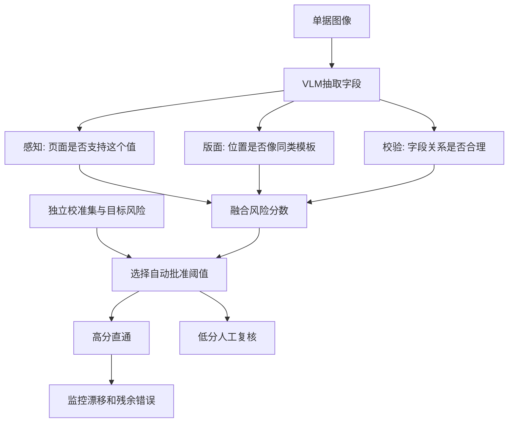

# 感知、版面与校验：为金融单据直通处理校准可信度

英文原题：Perception, Layout, and Validation: Calibrated Confidence for Reliable Straight-Through Processing of Financial Documents

arXiv：2609.20110v1；方向：AI；发布日期：2026-09-17

一句话问题：系统从发票读出金额后，怎样决定哪些字段可以不经人工复核，又把已放行错误率控制在目标内？

## 模型说“我很确定”，为什么财务仍不能直接入账

一张模糊发票上，“1,880”可能被读成“1,680”。视觉语言模型不仅会给答案，还可能很自信。直通处理（straight-through processing, STP）要把部分字段直接送入后续系统，关心的不是平均识别率，而是“被自动批准的那一组里还错多少”。

论文把信心拆成感知、版面和校验三条可解释通道，再用风险校准选择自动批准阈值。读完你应能说明为什么排序能力与风险保证不是一回事，以及覆盖率提高为何必须和残余错误率一起报告。

## 整体关系图



## 先理解字段正确、排序和放行风险

字段正确是抽取值与金标准规范化后是否一致。AUROC 衡量分数把正确字段排在错误字段前面的能力，但不会直接告诉你某个阈值下已批准组的错误比例。STP coverage 是多少字段被自动批准；selective risk 是这些字段中的经验错误率。

若只批准最高分字段，风险通常下降但人工量上升。部署者先给目标，例如已批准组错误率低于 10%，再在独立校准数据上选阈值。阈值不能用最终测试标签偷偷调，否则保证失去意义。

## 三条信心通道分别看什么

感知通道重新在页面 OCR token 中寻找抽取值，看文字是否真的落在图像上、匹配是否清晰。版面通道比较字段所在页面布局与历史同类单据：供应商模板、字段区域和邻近关系是否像已见过的正确样本。

校验通道使用可解释业务规则，例如金额求和、日期格式、标识符校验位、字段间一致性。不同字段不是每条规则都适用，所以缺失规则证据不能粗暴当成失败。三条特征由轻量融合模型组合成一个风险排序分数。

## 先让错误与正确字段拉开距离

语言模型口头给出的 confidence 容易受表达习惯影响，不一定跟字段正确性同步。分解分数把“页面上找没找到”“位置像不像”“业务关系通不通”变成可观测中间状态，错误更容易落到低分。

论文在真实发票、合成发票和广告购买表三个公开数据集、两个 VLM 家族上测试。原生口头信心 AUROC 为 0.54—0.74，分解分数为 0.90—0.99。这个结果说明排序显著改善，但仍不能跳过最后的风险阈值。

## 再用 conformal risk control 选放行线

conformal risk control 可直译为保形风险控制：在交换性等假设下，利用校准样本为某个阈值的选择风险给出有限样本控制。直觉是从高分往下扩大自动组，直到统计上再也不能确信风险在目标内。

论文目标错误率小于 10% 时，VLM 原生信心只能自动放行约 0.1%—7.0% 字段；分解方法能放行 49%—72%，同时使已批准组经验错误率不超过目标。不是所有数据集都恰好 72%，也不是承诺未来分布变化后永远不超标。

## 跟一个金额字段做三次检查

输入“总额=1,880”。感知状态记录页面是否存在该字符序列以及 OCR 匹配质量；版面状态记录它是否出现在常见总额区域；校验状态比较小计、税额和总额是否相加。融合分数高并不等于三项都满分，但能告诉审阅者风险来自哪里。

输出不是简单的“模型信心 92%”，而是字段值、各通道证据、融合分数和自动/人工路由。若规则通过但 OCR 找不到原值，应优先送人工，而不是让一项强证据掩盖另一项缺口。

## 论文实验真正比较了什么

作者比较两类视觉语言模型在三个数据集上的口头信心、分解特征及其融合，并通过消融确认感知、版面、校验均有贡献。表 4 还区分字段总数、原始正确率和能否在页面找到，避免把本来无法 grounded 的字段混为一种错误。

工业价值来自风险—覆盖曲线：同一风险目标下，能自动处理更多字段，才减少人工。AUROC 很高却只能安全批准很少数据，仍可能没用；覆盖很高但风险失控更不能用。

## 校准不是永久保险

风险控制依赖校准数据与未来数据足够可比。新供应商模板、扫描设备、语言或字段规则变化会产生 distribution shift；这时应监控通道分布、重新校准，并保留拒绝和人工复核，不是沿用旧阈值。

论文数据集和模型覆盖有限，规则工程也需要领域知识。教学 demo 用六个手写分数选阈值，样本太小，既没有论文的保形上界也没有真实 OCR，因此只展示“先排序、再按风险目标选线”的逻辑。

## 从图片到自动批准的完整链路

VLM 先抽字段；感知通道回到页面找值；版面通道比较模板位置；校验通道检查业务关系；融合模型给风险分数；独立校准集选阈值；线上高于阈值的字段直通，其余人工复核；持续监控漂移和已批准错误。

排错时先问错误值是否可在页面找到，再问位置与规则，最后才看融合与阈值。若上线风险突然上升，不能只微调 VLM 提示词，还要检查模板漂移、规则失效与校准期是否过旧。

## 最小实践：在错误率目标下选阈值

需求：给一组教学字段的感知、版面、校验分数和正确标签，取三项平均作融合分数；从候选阈值中选择满足经验错误率不超过 10% 且覆盖最多的一条，再路由两个新字段。边界是小样本经验规则，不是保形保证。

实际运行输出：

```text
教学校准：阈值 0.81，放行 4/6，经验错误率 0%
字段A 三通道=(0.9, 0.87, 0.93)，融合=0.90 → 自动批准
字段B 三通道=(0.78, 0.83, 0.76)，融合=0.79 → 人工复核
边界：六条手写样本只能演示阈值逻辑，不构成论文的保形风险上界或上线保证。
```

## 自测题

1. AUROC 从 0.7 升到 0.95，能否直接推出错误率低于 10% 时可自动放行一半字段？
2. 新供应商突然更换发票模板，哪条通道可能先报警，旧阈值为何需重验？
3. 若总额规则通过，但页面找不到抽取值，你会怎样路由并说明原因？

## 原文与阅读范围

已读取方法、通道定义、融合与风险控制、数据集和实验；核对主要架构图、特征表、数据统计以及风险—覆盖和消融结果。

论文数字来自三个公开数据集和两个 VLM 家族；教学三分数平均与六条记录是刻意简化，未复现 OCR、LightGBM 或 conformal 上界。

本次保存并解析的正文格式为 arxiv_html，提取到 4 个相关章节、18 条图表说明，正文约 52,391 个字符。

原文：https://arxiv.org/html/2609.20110v1
