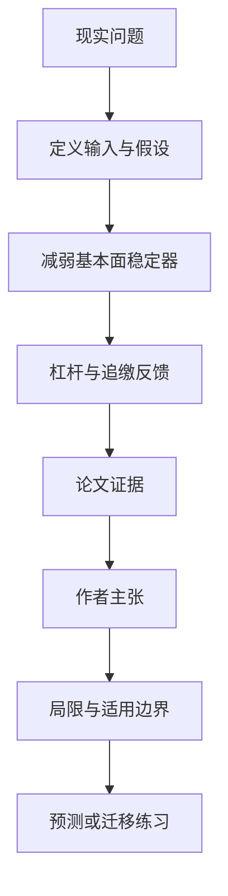

# 杠杆怎样点燃流动性危机：弱基本面锚定下的订单簿模拟

英文原题：Herding and Liquidity in Order-Book Markets. III. Leverage and the Onset of Endogenous Liquidity Crises under Weak Anchoring

arXiv：2609.20192v1；方向：金融；发布日期：2026-07-24

一句话问题：没有外部坏消息时，高杠杆市场为什么也可能自己出现流动性枯竭和厚尾价格波动？

## 先从一个普通人会遇到的问题开始

价格偏离基本面后，保证金追缴会迫使卖出，订单簿变薄又放大价格变化；论文用可调的“基本面锚”隔离这个反馈，找到危机只在弱锚、高杠杆和适度羊群的窄区域出现。

今天读完《杠杆怎样点燃流动性危机：弱基本面锚定下的订单簿模拟》，目标不是记住论文名，而是能用自己的话回答：没有外部坏消息时，高杠杆市场为什么也可能自己出现流动性枯竭和厚尾价格波动？还要能指出作者的证据支持到哪一步、哪一步仍不能下结论。

## 整体关系图



## 先补两块必要基础

订单簿由买卖限价单组成。基本面锚定指流动性报价倾向回到参考价值附近；锚越弱，价格越像失去弹簧。杠杆意味着资产跌一点，净值相对损失被放大。

maintenance margin 是维持头寸所需最低权益。论文把杠杆 λ 和维持保证金压成 margin buffer B=(1/λ-m)/(1-m)：缓冲越接近零，越容易被追缴。

## 论文接收什么，输出什么

输入是基本面锚强度、杠杆、羊群程度、维持保证金以及噪声交易者、做市商与持仓者的代理规则。输出是收益尾部、波动自相关、单边订单簿耗竭和危机点燃概率。

作者没有注入外部冲击，而是扫描参数空间，比较有无杠杆、不同锚与相同羊群，寻找内生危机的开启区域。

## 第一步：弱锚让价格偏离不再被流动性拉回

强锚下，买卖报价围绕基本价值补充，即便有杠杆也较安静。锚接近移除时，羊群订单更容易把一侧订单簿吃空。

论文的连续锚参数让“基本面稳定”不只是开/关假设，可定位危机从哪里开始。

## 第二步：保证金反馈把偏离变成强制交易

价格下跌压缩高杠杆持仓的缓冲，触发保证金卖出；卖出进一步耗竭买盘、推动价格下降，形成内生反馈。

危机开启是平滑、亚临界 crossover，并非清晰临界点；在固定缓冲下杠杆越高危机越深，主要行为可由 margin buffer 排序。

## 跟着一个小例子看中间状态

一位投资者用 10 倍杠杆持有，权益缓冲很薄。价格稍跌→保证金不足→被迫卖出→买盘减少→价格再跌；若基本面做市不断补单，这条链会被压住。

只有高杠杆并不够：论文的厚尾主要出现在锚很弱的角落，并需要一定羊群强度；因此不能把所有波动都归咎于杠杆。

## 作者拿什么证据支持主张

模拟显示厚尾仅在弱锚、高杠杆区域出现；锚强度约低于 0.15、羊群约高于 0.2 的窄区域出现明显危机增量。

在固定弱锚与羊群下，13 个杠杆—保证金组合的耗竭与点燃概率大致按 margin buffer 落在单调曲线上；绝对收益自相关只持续约 2—3 个滞后。

## 哪些结论不能顺手扩大

这是单一连续双向拍卖的代理模拟，人口、资本、清算、信息和市场制度均简化；“因果隔离”只相对模型内部参数成立。

短记忆波动聚集不等于真实市场长期波动，开启区域对其他参数的稳健性仍待研究；不能据此生成杠杆交易建议。

## 把整条因果链重新接起来

研究问题“没有外部坏消息时，高杠杆市场为什么也可能自己出现流动性枯竭和厚尾价格波动？”先被拆成可观察输入，再经过“第一步：弱锚让价格偏离不再被流动性拉回”与“第二步：保证金反馈把偏离变成强制交易”，最后由论文实验或数据核对。

排错时依次检查：输入是否代表真实问题、中间状态是否按定义计算、比较组是否公平、指标是否回答原问题、结论是否越过样本和假设边界。

## 最小实践：把核心机制跑一遍

需求：用一组明确标为教学设定的小数据演示“计算两组杠杆与维持保证金的 margin buffer 并判断哪组更脆弱”。脚本打印输入、中间状态、正常例和失效边界，便于逐步核对。

验收标准：输出能解释机制方向，并明确它没有复现论文数据、模型或效果数字。

实际运行输出：

```text
教学输入：
- 方案A：λ=8,m=0.10
- 方案B：λ=4,m=0.10
- 公式：B=(1/λ-m)/(1-m)
中间状态：
1. A 缓冲约 0.0278
2. B 缓冲约 0.1667
3. 缓冲越小越接近追缴
4. 弱锚时 A 更易反馈放大
正常例：同一维持保证金下，更高杠杆压缩 margin buffer。
边界：只演示论文控制量，不是实际券商保证金模型或市场风险预测。
```

## 自测题

1. 为什么强基本面锚定时高杠杆未必触发危机？
2. margin buffer 接近零意味着什么？
3. 论文的危机开启是临界相变吗？

## 原文与阅读范围

已读代理结构、锚强度扫描、杠杆/羊群机制、危机指标与结论；核对图 2—6 的厚尾、点燃与 margin-buffer collapse。

教学中的日常类比、演示数据和运行结果由本学习包构造；作者主张与论文证据已在正文中单独标出，二者不混用。

本次保存并解析的正文格式为 arxiv_html，提取到 7 个相关章节、9 条图表说明，正文约 65,233 个字符。

原文：https://arxiv.org/html/2609.20192v1
