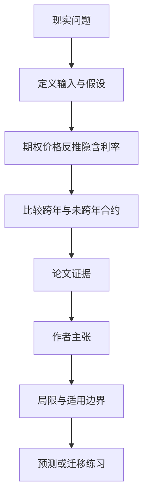

# 年末过路费：期权隐含利率里也藏着资产负债表摩擦

英文原题：The Year-End Toll: Frictions Embedded in Option-Implied Rates

arXiv：2609.20224v1；方向：金融；发布日期：2026-08-21

一句话问题：用期权价格算出的“无风险利率”为什么会在到期日跨过 12 月 31 日时突然多出一小截？

## 先从一个普通人会遇到的问题开始

看起来能锁定固定收益的期权组合仍要占用现金、保证金和机构资产负债表；论文用到期日刚好跨年这一不连续边界，识别一笔约 2—3 个基点的固定“过路费”。

今天读完《年末过路费：期权隐含利率里也藏着资产负债表摩擦》，目标不是记住论文名，而是能用自己的话回答：用期权价格算出的“无风险利率”为什么会在到期日跨过 12 月 31 日时突然多出一小截？还要能指出作者的证据支持到哪一步、哪一步仍不能下结论。

## 整体关系图



## 先补两块必要基础

put-call parity（看涨—看跌平价）把同到期、同行权价的看涨和看跌期权组合成近似固定终值，因此可以反推折现因子。反推得很精确，不代表它只含纯粹无风险利率。

1 个基点是 0.01 个百分点。固定价格楔子若摊到很短期限，年化后会被 1/期限放大；所以 2.5 个基点的固定费用在三个月期限上约等于年化 10 个基点。

## 论文接收什么，输出什么

输入是 2012—2025 年 SPX、RUT 及周度期权的一分钟最优报价，配合同期美国国债或 OIS 折现曲线。输出是期权隐含折现率相对基准的 funding basis。

关键比较是在同一天、相近剩余期限的合约中，看到期日第一次跨过未来 12 月 31 日是否出现跳跃，并用其他季度末、不同合约和基准做安慰剂及稳健性检查。

## 第一步：从看涨—看跌价差反推折现因子

同一行权价的看涨减看跌，对行权价的斜率给出折现因子。作者在每个市场—分钟—到期日单元中拟合，再取日内质量筛选估计的中位数。

拟合很好只说明合成远期定价关系稳定；维持组合仍需资金、抵押品、保证金和内部限额，因此隐含率可能带实施楔子。

## 第二步：用跨年边界分离一笔固定成本

年底是中介机构报表和资本约束更紧的自然边界。若两只期限接近的期权只有一只跨过年末，价差跳跃更像一笔跨界固定成本，而非平滑期限溢价。

论文进一步检验固定价格楔子与连续年化流量溢价的函数形式，并在国债 CIP 和独立国际期权面板中寻找同方向证据。

## 跟着一个小例子看中间状态

设两只期权今天都交易，一只 12 月 30 日到期，另一只 1 月 2 日到期。若后者隐含折现价格突然多承受 2.5 个基点，而邻近非年末日期没有类似跳跃，说明跨年本身有额外成本。

同样 2.5 个基点摊在 3 个月约为年化 10 个基点，摊在 12 个月仍约 2.5 个基点；这就是论文用 1/τ 识别固定楔子的直觉。

## 作者拿什么证据支持主张

严格同日局部比较得到平均约 2—3 个基点的未年化跨年跳跃，完整面板估计量级相近；功能形式更支持固定价格楔子。

结果对国债与 OIS 基准、标准月度与常规周度合约、日历安慰剂和数据质量筛选保持，并在政府债券 CIP 与独立构造的国际期权面板中出现相近的年末边界与时期变化。

## 哪些结论不能顺手扩大

结果与中介资产负债表跨年影子价格一致，但不能识别某一条具体监管规则的因果效应，也不说明全部 option funding basis 都是期权端成本。

安全资产便利收益和更平滑的融资、抵押品摩擦仍可能存在；研究的是指数期权和特定时期，不能直接变成个人交易策略。

## 把整条因果链重新接起来

研究问题“用期权价格算出的“无风险利率”为什么会在到期日跨过 12 月 31 日时突然多出一小截？”先被拆成可观察输入，再经过“第一步：从看涨—看跌价差反推折现因子”与“第二步：用跨年边界分离一笔固定成本”，最后由论文实验或数据核对。

排错时依次检查：输入是否代表真实问题、中间状态是否按定义计算、比较组是否公平、指标是否回答原问题、结论是否越过样本和假设边界。

## 最小实践：把核心机制跑一遍

需求：用一组明确标为教学设定的小数据演示“把固定 2.5 个基点楔子换算成不同期限的年化影响”。脚本打印输入、中间状态、正常例和失效边界，便于逐步核对。

验收标准：输出能解释机制方向，并明确它没有复现论文数据、模型或效果数字。

实际运行输出：

```text
教学输入：
- 固定跨年楔子：2.5 bp
- 三个月期限：0.25
- 一年期限：1.0
中间状态：
1. 把固定价格楔子除以剩余年数
2. 三个月得到约 10 bp 年化
3. 一年得到约 2.5 bp 年化
4. 比较固定楔子与平滑利率
正常例：相同固定费用在短期限的年化数字更大，因此期限图形呈 1/τ。
边界：只是单位换算，没有用真实期权报价估计 put-call parity 或因果效应。
```

## 自测题

1. 为什么合成远期拟合很准，仍不能证明隐含利率“无摩擦”？
2. 固定 3 bp 楔子对半年期的粗略年化影响是多少？
3. 跨年跳跃能否直接证明由某项监管造成？

## 原文与阅读范围

已读数据与经验设计、局部不连续、功能形式、跨市场验证和结论；核对表 4.1—4.3、5.1—5.4、7.2—7.8、8.1—8.2 与图 5.1。

教学中的日常类比、演示数据和运行结果由本学习包构造；作者主张与论文证据已在正文中单独标出，二者不混用。

本次保存并解析的正文格式为 arxiv_html，提取到 4 个相关章节、30 条图表说明，正文约 180,164 个字符。

原文：https://arxiv.org/html/2609.20224v1
