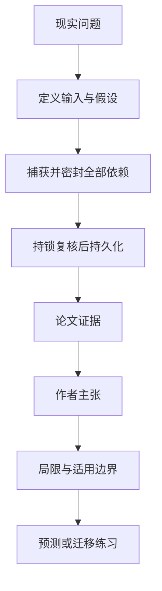

# AI 智能体提交操作时：如何保证证据、政策与权限仍然有效

英文原题：When AI Agents Commit: Cognitive Serializability Across Data, Evidence, Policy, and Authority

arXiv：2609.20261v1；方向：AI；发布日期：2026-07-28

一句话问题：智能体思考了几秒后准备下单，怎样确认它读过的库存、供应商证书、政策和授权在真正提交时仍同时有效？

## 先从一个普通人会遇到的问题开始

普通数据库事务只能保证数据库里的读写顺序，却不知道智能体在外部看过的证据或权限是否已经变化；这篇论文把这个“想的时候对、做的时候已过期”的风险变成可检查的提交契约。

今天读完《AI 智能体提交操作时：如何保证证据、政策与权限仍然有效》，目标不是记住论文名，而是能用自己的话回答：智能体思考了几秒后准备下单，怎样确认它读过的库存、供应商证书、政策和授权在真正提交时仍同时有效？还要能指出作者的证据支持到哪一步、哪一步仍不能下结论。

## 整体关系图



## 先补两块必要基础

数据库的 serializability（可串行化）意思是并发事务的结果等价于某种逐个执行顺序。它保护数据库内部状态，却不会自动锁住网页证据、政策版本或外部授权。

论文把智能体看到的每项输入变成带类型、版本和来源的 dependency token（依赖令牌）。内容哈希只证明字节没变；“这份文件现在仍适用”还要单独的适用性证明。

## 论文接收什么，输出什么

输入是智能体推导操作时接触的数据库状态、外部证据、政策、信念和授权，以及它准备执行的具体变更。输出不是“答案”，而是准许或拒绝一次可持久化操作，并留下与操作绑定的回执。

关键中间状态包括密封依赖包、完整读写范围、当前政策、外部有效性栅栏和数据库 guard。严格模式要求原推导依据仍原样有效；兼容模式只重新证明当前依据仍允许同一个具体效果。

## 第一步：把智能体实际看过的依据全部密封

可信代理拦截数据库读取、外部 API、政策检查和授权，把它们规范化并写入密封 envelope。智能体不能绕过代理直接取数，否则论文的保证不成立。

注册表还要提前声明操作可能读写的完整范围。漏掉一个会影响效果的依赖，系统不一定自动报错，而是直接落到定理保护范围之外。

## 第二步：先拿保护，再按当前状态复核并提交

提交门先按固定顺序取得本地 guard 和必要的外部保留，再在这些保护仍有效时检查依赖、政策、权限和具体变更。保护要持续到数据库提交或声明的耐久事件。

严格 TCT-S 要找到一个逻辑时刻，使推导时见过的所有值与提交效果同时有效；较弱的 TCT-C 允许依据变化，但必须由已注册的联合谓词重新证明这个效果仍兼容。

## 跟着一个小例子看中间状态

教学例中，智能体看到库存 12 件、供应商证书有效、单笔上限 10 万元、经理批准，然后拟下单 8 件。思考期间证书被撤销。普通数据库仍可能成功扣库存；TCT 的证据栅栏应在提交前发现证书状态变化。

若政策只是把审批人姓名换了，但仍允许同一笔 8 件订单，严格模式会因依据改变而拒绝；兼容模式只有在注册的复核规则证明效果仍合规时才可放行。

## 作者拿什么证据支持主张

作者在 PostgreSQL 16 原型上构造 28 类受控扰动历史，每种配置运行 100 次；实现对注入异常给出了协议规定的准入结果。供应链基准包含 10 万库存项、1 万供应商和 5 万活跃订单。

原型在 32 个并发线程时峰值达到 1,842 笔事务/秒，平均提交阶段额外开销为 3.22 毫秒。它说明该契约在给定硬件和模拟负载上可实现，不等于生产系统已获得普遍安全保证。

## 哪些结论不能顺手扩大

安全依赖可信代理、注册表、数据库和外部发行方都按假设工作；被攻破的中介、未登记的副作用、模型参数中的隐含知识和旁路调用不在保护范围。

哈希不能证明内容真实，回执也不保证远程副作用与本地事务原子完成。生产性能、跨组织发行方协调和不完整依赖发现仍是开放问题。

## 把整条因果链重新接起来

研究问题“智能体思考了几秒后准备下单，怎样确认它读过的库存、供应商证书、政策和授权在真正提交时仍同时有效？”先被拆成可观察输入，再经过“第一步：把智能体实际看过的依据全部密封”与“第二步：先拿保护，再按当前状态复核并提交”，最后由论文实验或数据核对。

排错时依次检查：输入是否代表真实问题、中间状态是否按定义计算、比较组是否公平、指标是否回答原问题、结论是否越过样本和假设边界。

## 最小实践：把核心机制跑一遍

需求：用一组明确标为教学设定的小数据演示“比较普通数据库提交与依赖复核提交在证书中途撤销时的决定”。脚本打印输入、中间状态、正常例和失效边界，便于逐步核对。

验收标准：输出能解释机制方向，并明确它没有复现论文数据、模型或效果数字。

实际运行输出：

```text
教学输入：
- 库存：12
- 拟购买：8
- 推导时证书：有效
- 提交时证书：已撤销
中间状态：
1. 记录库存、证书、政策和授权版本
2. 密封下单 8 件的提案
3. 提交前同时复核依赖
4. 证书版本变化，因此严格模式拒绝
正常例：若所有依赖保持有效，订单和回执一起提交；本例因证书撤销而拒绝。
边界：这里只演示依赖变化；没有实现论文的锁、签名、注册表或 PostgreSQL 性能实验。
```

## 自测题

1. 为什么 PostgreSQL SERIALIZABLE 仍不能自动发现供应商证书被撤销？
2. 内容哈希没变，为什么文件仍可能不再适用？
3. TCT-C 放行一笔操作是否等于原来的推理过程仍然正确？

## 原文与阅读范围

已读引言、系统模型与密封、充分条件和边界、PostgreSQL 原型评估、范围与限制；核对图 1、算法 1、表 1—4 和图 2—3。

教学中的日常类比、演示数据和运行结果由本学习包构造；作者主张与论文证据已在正文中单独标出，二者不混用。

本次保存并解析的正文格式为 arxiv_html，提取到 6 个相关章节、14 条图表说明，正文约 157,237 个字符。

原文：https://arxiv.org/html/2609.20261v1
