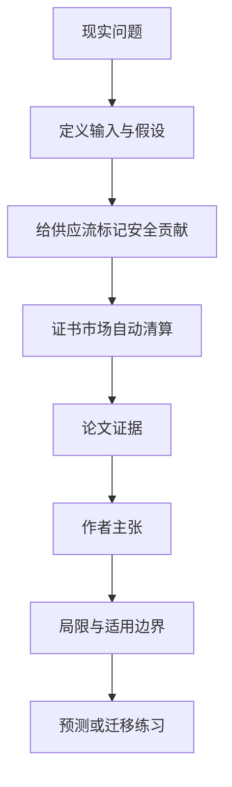

# 可交易进口证书：把供应安全目标变成一个会自动调价的市场

英文原题：Tradeable Import Certificates for Strategic Supply Security

arXiv：2609.20282v1；方向：经济；发布日期：2026-09-17

一句话问题：政府既想保留国际贸易，又想保证关键商品有足够国内或可靠来源供给，能否不必事先猜准每项关税和补贴？

## 先从一个普通人会遇到的问题开始

芯片、药品或稀土的安全目标通常写成“至少多少来自国内或可靠伙伴”；论文提出给不同流向记证书、进口时交证书，让证书价格自动反映目标有多难达到。

今天读完《可交易进口证书：把供应安全目标变成一个会自动调价的市场》，目标不是记住论文名，而是能用自己的话回答：政府既想保留国际贸易，又想保证关键商品有足够国内或可靠来源供给，能否不必事先猜准每项关税和补贴？还要能指出作者的证据支持到哪一步、哪一步仍不能下结论。

## 整体关系图



## 先补两块必要基础

可交易证书可以理解为限量入场券：对安全目标有贡献的生产或出口会生成证书，不可靠进口要交证书。证书供需决定价格，因此它同时像进口税和出口奖励。

constrained efficient（约束下有效）不是没有代价，而是在必须满足各国供应安全目标的前提下，让普通生产、运输和消费损失尽可能小。

## 论文接收什么，输出什么

输入是各国对不同产品、产地和去向设定的线性安全贡献系数，以及需求、生产成本、运输成本和可靠性。输出是各贸易流量、国内产量与一国统一的证书价格。

中间状态是每单位流量创造或消耗多少证书、证书市场能否清算、目标是否达到，以及证书价格代表的边际安全成本。

## 第一步：把每条供应流对安全的贡献换成证书系数

可靠的国内生产或可信伙伴供给可以生成证书，脆弱来源的进口需要交证书；系数允许不同产品和来源对目标贡献不同。

这不是简单禁止进口。只要进口商买得到证书仍可进口，代价由达到安全目标所需的稀缺程度决定。

## 第二步：让证书价格替谈判者持续重算政策强度

当可靠供给变少，证书更稀缺、价格上升，市场自动鼓励安全来源并抑制证书消耗大的流量；环境改善时价格会下降。

论文证明在模型假设下，匹配的各国证书系统能实现满足目标的福利最大配置，并比固定关税—补贴协议更能抵抗某些隐蔽偏离。

## 跟着一个小例子看中间状态

教学例中，国内一单位供给生成 1 张证书，可靠伙伴进口生成 0.5 张，脆弱来源进口消耗 1 张。若大家大量选择脆弱来源，证书需求上升，价格会把安全成本反映进采购决定。

若政府设置证书价格上限，极端短缺时仍可多进口，但安全数量目标可能失守；这体现价格安全阀和硬目标之间的取舍。

## 作者拿什么证据支持主张

论文给出一般均衡模型和定理，证明在完全竞争、线性战略目标及匹配证书规则下，竞争均衡实现约束福利最大化；图 1 用两国例子比较合作配置与纳什配置。

作者还构造经济胁迫模型，把目标连接到短缺显著性、来源可靠性、双边依赖和“不向胁迫让步”的规范。证据是理论推导，不是某国实施后的实证评估。

## 哪些结论不能顺手扩大

结果依赖可量化且可执行的线性目标、竞争市场和证书合规；现实中的市场势力、腐败、错报、动态投资和多层供应链会改变结果。

论文承认制度按现行 WTO 规则可能遇到数量限制和出口补贴问题；价格上限可改善法律或福利风险，却会削弱硬目标保护。

## 把整条因果链重新接起来

研究问题“政府既想保留国际贸易，又想保证关键商品有足够国内或可靠来源供给，能否不必事先猜准每项关税和补贴？”先被拆成可观察输入，再经过“第一步：把每条供应流对安全的贡献换成证书系数”与“第二步：让证书价格替谈判者持续重算政策强度”，最后由论文实验或数据核对。

排错时依次检查：输入是否代表真实问题、中间状态是否按定义计算、比较组是否公平、指标是否回答原问题、结论是否越过样本和假设边界。

## 最小实践：把核心机制跑一遍

需求：用一组明确标为教学设定的小数据演示“演示一国证书市场如何把安全贡献不同的供给流连接起来”。脚本打印输入、中间状态、正常例和失效边界，便于逐步核对。

验收标准：输出能解释机制方向，并明确它没有复现论文数据、模型或效果数字。

实际运行输出：

```text
教学输入：
- 国内产量生成：每单位1张
- 可靠进口生成：每单位0.5张
- 脆弱进口消耗：每单位1张
中间状态：
1. 计算各流量的证书净贡献
2. 汇总证书供给和需求
3. 短缺时证书价格上升
4. 采购转向安全贡献更高的来源
正常例：统一证书价格把分散的供应选择连接到同一数量目标。
边界：没有求解论文的一般均衡，也未评估现实 WTO 合法性或任何国家政策。
```

## 自测题

1. 证书价格上涨说明了什么？
2. 为什么固定关税可能需要比证书系统更多信息？
3. 加入价格上限会牺牲哪项保证？

## 原文与阅读范围

已读引言、一般框架、效率与稳健性命题、经济胁迫基础、法律和政策讨论；核对图 1 及关于价格安全阀的讨论。

教学中的日常类比、演示数据和运行结果由本学习包构造；作者主张与论文证据已在正文中单独标出，二者不混用。

本次保存并解析的正文格式为 arxiv_html，提取到 3 个相关章节、1 条图表说明，正文约 111,338 个字符。

原文：https://arxiv.org/html/2609.20282v1
