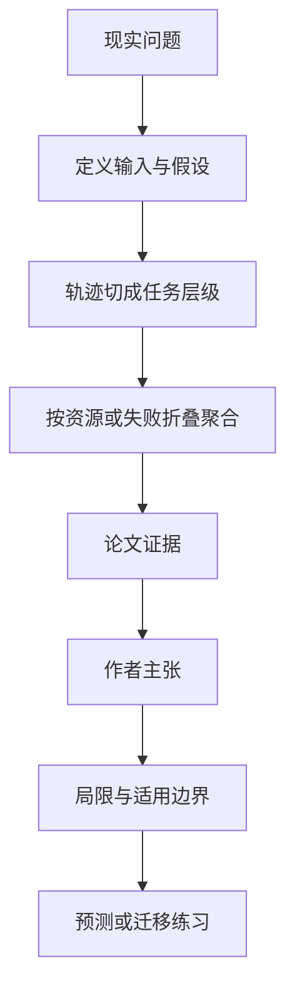

# AgentPProf：把长周期智能体的工作画成“火焰图”

英文原题：AgentPProf: Semantic Profiler for Long Horizon AI Agents

arXiv：2609.20301v1；方向：AI；发布日期：2026-09-14

一句话问题：一个运行几天、调用很多工具的智能体，怎样找出究竟哪类任务最耗 token、最常失败，而不是逐条翻日志？

## 先从一个普通人会遇到的问题开始

传统 trace 适合看一次执行，长期优化却要跨许多运行聚合；论文借用软件 profiler 的思想，把不稳定的自然语言步骤归并成语义操作栈，让成本和失败能按责任层级累积。

今天读完《AgentPProf：把长周期智能体的工作画成“火焰图”》，目标不是记住论文名，而是能用自己的话回答：一个运行几天、调用很多工具的智能体，怎样找出究竟哪类任务最耗 token、最常失败，而不是逐条翻日志？还要能指出作者的证据支持到哪一步、哪一步仍不能下结论。

## 整体关系图



## 先补两块必要基础

debugging 关注“这一次为什么错”；profiling 关注“很多次运行中，时间、成本或错误长期集中在哪里”。火焰图中横向宽度代表累计资源，而不是时间先后。

代码 profiler 有稳定函数名，智能体轨迹却写成“检查登录”“再看凭据”等自由文本。必须先把事件统一成 operation，再分成任务与子任务层级。

## 论文接收什么，输出什么

输入是跨运行的模型消息、工具调用、用户交互和资源记录。输出是统一操作、递归切分出的语义操作栈，以及可被 pprof 读取的折叠栈。

查询时可把同一层级按操作次数、token、时延或失败差异加权，得到普通或差分火焰图；同一切分不必为每个指标重跑。

## 第一步：递归找任务边界并建立语义栈

论文观察到一个任务通常占据连续轨迹，并可再分子任务。分割器先找大边界，再对片段递归切分，形成类似函数调用栈的意图层级。

统一 operation 把不同框架的消息和工具调用投影到共同表示，稳定责任实体不再是某一条自然语言，而是“诊断认证→检查凭据”这类语义路径。

## 第二步：跨运行聚合并做差分定位

所有运行的相同语义路径被折叠，宽度可表示 token 或操作数。比较好运行与坏运行时，差分火焰图突出失败中额外出现的恢复、重试等路径。

这并不自动证明某路径导致失败，只是把调查优先级从海量日志缩小到高占用或高差异区域。

## 跟着一个小例子看中间状态

三次登录排障都包含“读日志→查账户→测网络”，失败运行还反复“刷新令牌→重试”。聚合后，刷新令牌分支占失败额外 token 的大部分，成为优先检查点。

若分割器把两个任务误并，火焰图会把资源归错责任；因此需要用人工标注评切分，再用问题定位任务检验 profile 是否真有帮助。

## 作者拿什么证据支持主张

在 CodeTraceBench 的 405 条轨迹上，语义切分与人工阶段标注达到 0.764 的 B³ F1。该指标同时考察聚类式分段的精确与召回。

在三个问题定位基准（完整查询数 614、400、220）上，加入 profile 的方法 MAP 最高提升 56%；论文还展示按次数、token 和好坏差异生成的标准 pprof 火焰图。

## 哪些结论不能顺手扩大

profile 给出相关热点而非因果证明；自然语言意图边界可能模糊，新的框架和跨项目命名会影响聚合稳定性。

多项目评估、与现有 tracing 生态的集成、在线触发与利用 profile 做运行时控制仍属未来工作。

## 把整条因果链重新接起来

研究问题“一个运行几天、调用很多工具的智能体，怎样找出究竟哪类任务最耗 token、最常失败，而不是逐条翻日志？”先被拆成可观察输入，再经过“第一步：递归找任务边界并建立语义栈”与“第二步：跨运行聚合并做差分定位”，最后由论文实验或数据核对。

排错时依次检查：输入是否代表真实问题、中间状态是否按定义计算、比较组是否公平、指标是否回答原问题、结论是否越过样本和假设边界。

## 最小实践：把核心机制跑一遍

需求：用一组明确标为教学设定的小数据演示“把三条运行中的相同语义路径按 token 汇总，并突出失败额外重试”。脚本打印输入、中间状态、正常例和失效边界，便于逐步核对。

验收标准：输出能解释机制方向，并明确它没有复现论文数据、模型或效果数字。

实际运行输出：

```text
教学输入：
- 正常运行：诊断认证→查凭据 300 token
- 失败运行：诊断认证→查凭据→刷新令牌→重试 900 token
- 权重：token
中间状态：
1. 统一不同日志事件
2. 递归切出诊断与子步骤
3. 按语义路径累加 token
4. 比较坏运行减好运行
正常例：差分热点指向刷新令牌与重试分支，供开发者优先调查。
边界：热点不是失败因果；示例未运行论文分割模型或真实 pprof。
```

## 自测题

1. 为什么逐次 trace 不能替代长期 profile？
2. 火焰图最宽的分支能否直接判定为 bug 根因？
3. 如果相同任务每次措辞不同，聚合前需要解决什么？

## 原文与阅读范围

已读语义操作栈、递归分割、pprof 投影、CodeTraceBench 与定位实验、结论；核对图 1—4、表 1。

教学中的日常类比、演示数据和运行结果由本学习包构造；作者主张与论文证据已在正文中单独标出，二者不混用。

本次保存并解析的正文格式为 arxiv_html，提取到 4 个相关章节、5 条图表说明，正文约 51,430 个字符。

原文：https://arxiv.org/html/2609.20301v1
