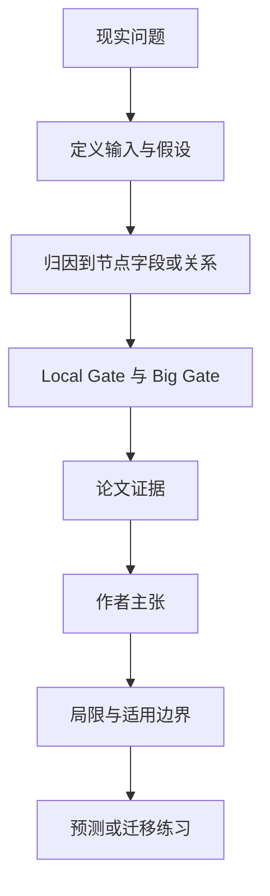

# SkillAA：失败后只修技能图中最可能出错的一小块

英文原题：SkillAA: Attribution-Guided Skill-Graph Updating with Targeted Validation and Rollback

arXiv：2609.20455v1；方向：AI；发布日期：2026-09-17

一句话问题：智能体答错后，怎样判断该改“何时用技能”、执行步骤还是技能关系，并避免一次修改把原来正确的案例弄坏？

## 先从一个普通人会遇到的问题开始

直接根据一次失败重写整份技能，像修一处漏水却把整屋管道换掉；论文给技能节点和关系稳定地址，用成功/失败对比定位最小编辑面，再经过局部与全局两道门决定是否提交。

今天读完《SkillAA：失败后只修技能图中最可能出错的一小块》，目标不是记住论文名，而是能用自己的话回答：智能体答错后，怎样判断该改“何时用技能”、执行步骤还是技能关系，并避免一次修改把原来正确的案例弄坏？还要能指出作者的证据支持到哪一步、哪一步仍不能下结论。

## 整体关系图



## 先补两块必要基础

外部 skill 是不改模型参数的任务程序。技能图节点可分 applicability（何时用/不用）、execution（怎样做）等字段，边描述技能组合依赖。

abductive attribution（溯因归因）不是读取隐藏思维链，而是依据预测、可审计的执行摘要、稳定节点 ID 和正确性，选择最可能解释失败的可编辑位置。

## 论文接收什么，输出什么

输入是冻结的学生/教师模型、初始技能图、彼此独立的更新集和测试集，以及每次执行的 prediction、trace、usage 与验证结果。只有技能图可变。

输出是更新后的图。候选编辑先通过 Local Gate 在可能受影响案例上测试，再由 Big Gate 把同一轮候选合并后在整个更新集验证；失败就原子回滚。

## 第一步：用稳定地址把失败路由到最小编辑面

教师比较错误轨迹与相似成功案例，判断是触发条件、执行步骤、排除边界、关系缺失，还是一次性执行失误/证据不足。后两类可决定不改图。

usage 中的稳定 ID 让“Q3 使用 E2 调到 Q7”可追踪；候选只能编辑归因授权的位置，其他字段保持不变。

## 第二步：局部门找回归，全局门决定提交

Local Gate 复测直接受影响的技能和案例，快速淘汰局部退化。通过者一起进入 Big Gate，在完整更新池上检查净收益。

测试集只用于最终评估，不能参与编辑选择；否则技能图会把测试答案学进去，看似进步却没有泛化证据。

## 跟着一个小例子看中间状态

某问答技能总把关系方向读反。归因定位到节点 Q3 的“方向判断”字段，只改一条步骤；局部复测相关问题，全局再检查其他题是否下降。

若错误其实来自本次检索没有证据，系统应标成 insufficient evidence 而不永久改技能。把偶发环境失败写成通用规则会污染后续任务。

## 作者拿什么证据支持主张

以 gpt-5.6-sol 为例，SkillAA 在 SearchQA、LiveMath、DocVQA 分别达到 81.5%、66.7%、91.2%，在主设置的每个模型—基准组合中观察均值最高。

三次独立优化/评估使用种子 42、43、44，报告均值与半极差。消融支持结构化节点、显式关系、归因编辑和 Local Gate；Big Gate 的留出收益随模型而变。

## 哪些结论不能顺手扩大

结果限于三类主基准、一个 ALFWorld 扩展、较小技能图和少量重复；教师归因仍可能错，模型与提示版本也影响结果。

最高观察均值不等于与所有替代方法在相同监督与计算预算下严格可比；将反复验证的技能内化进模型参数仍是未来工作。

## 把整条因果链重新接起来

研究问题“智能体答错后，怎样判断该改“何时用技能”、执行步骤还是技能关系，并避免一次修改把原来正确的案例弄坏？”先被拆成可观察输入，再经过“第一步：用稳定地址把失败路由到最小编辑面”与“第二步：局部门找回归，全局门决定提交”，最后由论文实验或数据核对。

排错时依次检查：输入是否代表真实问题、中间状态是否按定义计算、比较组是否公平、指标是否回答原问题、结论是否越过样本和假设边界。

## 最小实践：把核心机制跑一遍

需求：用一组明确标为教学设定的小数据演示“演示一次错误如何只修改一个技能字段，并在局部回归失败时回滚”。脚本打印输入、中间状态、正常例和失效边界，便于逐步核对。

验收标准：输出能解释机制方向，并明确它没有复现论文数据、模型或效果数字。

实际运行输出：

```text
教学输入：
- 失败：关系方向读反
- 候选地址：Q3.execution.step2
- 局部旧正确数：4
- 候选后正确数：3
中间状态：
1. 对比成功与失败轨迹
2. 归因到 Q3 的方向步骤
3. 只生成该字段候选编辑
4. 局部正确数下降，因此回滚
正常例：候选没有越过 Local Gate，不进入全局提交。
边界：这是规则化演示，没有调用教师模型或复现三个基准分数。
```

## 自测题

1. 为什么“证据不足”时不应自动改技能？
2. Local Gate 已通过，为什么还需要 Big Gate？
3. 测试集能否用来选择候选编辑？

## 原文与阅读范围

已读统一技能图、溯因路由、Local/Big Gate、主实验与消融、结论；核对图 1—3、算法 1—2、表 1—5。

教学中的日常类比、演示数据和运行结果由本学习包构造；作者主张与论文证据已在正文中单独标出，二者不混用。

本次保存并解析的正文格式为 arxiv_html，提取到 4 个相关章节、16 条图表说明，正文约 109,607 个字符。

原文：https://arxiv.org/html/2609.20455v1
