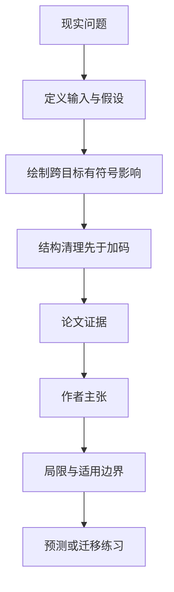

# 组织为什么越努力越没效果：内部目标互相抵消的结构性低效

英文原题：Unpriced Internal Externalities and Structural Inefficiency in Organizations

arXiv：2609.20462v1；方向：经济；发布日期：2026-09-17

一句话问题：一个流程同时提高合规却拖慢交付时，继续加人加预算为什么可能几乎不增加组织总效果？

## 先从一个普通人会遇到的问题开始

管理问题常被诊断为努力不足；论文提出先把机制对多个目标的正负影响放在同一张表上，若它们大量抵消，瓶颈是结构冲突而不是投入。

今天读完《组织为什么越努力越没效果：内部目标互相抵消的结构性低效》，目标不是记住论文名，而是能用自己的话回答：一个流程同时提高合规却拖慢交付时，继续加人加预算为什么可能几乎不增加组织总效果？还要能指出作者的证据支持到哪一步、哪一步仍不能下结论。

## 整体关系图



## 先补两块必要基础

论文把流程、制度或技术称为 primitive（基础机制），它可能同时影响速度、质量、合规和员工体验。跨目标影响没有内部定价时就形成 internal externality。

结构幅度 M 表示一项机制总共推动了多少，冲突 C 表示其中多大比例被相反方向抵消；作者写成教学上易懂的关系：实现结果 = 努力 E × 幅度 M × (1−C)。

## 论文接收什么，输出什么

输入是每个内部机制对各目标的有符号影响及施加努力，输出是净效果、总影响幅度、冲突比率和建议的治理动作。

中间状态要保留正向与负向影响，不能一开始只看净值；净值小既可能是机制没作用，也可能是作用很大却互相抵消。

## 第一步：把每个机制对多个目标的正负作用展开

例如审批制度让合规 +8、质量 +3、速度 −7、员工体验 −2。总幅度很大，净值却只有 +2，说明它很有影响但高度冲突。

这与激励错配不同：即使所有人都认真执行，机制本身也会同时推动相反目标。

## 第二步：先降冲突，再谈追加努力和最优分配

若 C 很高，增加 E 会按同一结构放大正负两边，边际净收益仍弱；应先改审批边界、拆分场景或去掉冲突环节。

冲突下降后，预算和注意力优化才更有意义。论文据此区分扩大、约束、重构或降级不同内部机制。

## 跟着一个小例子看中间状态

教学例把某审批对四个目标的影响记为 +8、+3、−7、−2，总绝对幅度 20、净效果 2。大量活动存在，但 18 个方向单位互相抵消。

若只把执行强度翻倍，正负影响一起翻倍；若重构后把速度损失从 −7 降至 −2，净效果会明显提高，即便努力不变。

## 作者拿什么证据支持主张

论文给出静态形式模型、指标定义、命题与可检验预测，并用组织机制的概念案例解释治理顺序。

作者没有报告企业样本、自然实验或随机试验；“结构清理优先”目前是从模型推出的待验证假说，不是已证实的普遍管理规律。

## 哪些结论不能顺手扩大

不同目标往往单位不同且权重有价值判断，正负影响也可能非线性、随时间变化或由利益相关者战略操纵。

框架抽象掉学习、反馈、权力和实施成本；冲突指标可辅助诊断，不能替代因果测量或管理者对目标优先级的判断。

## 把整条因果链重新接起来

研究问题“一个流程同时提高合规却拖慢交付时，继续加人加预算为什么可能几乎不增加组织总效果？”先被拆成可观察输入，再经过“第一步：把每个机制对多个目标的正负作用展开”与“第二步：先降冲突，再谈追加努力和最优分配”，最后由论文实验或数据核对。

排错时依次检查：输入是否代表真实问题、中间状态是否按定义计算、比较组是否公平、指标是否回答原问题、结论是否越过样本和假设边界。

## 最小实践：把核心机制跑一遍

需求：用一组明确标为教学设定的小数据演示“比较追加努力和减少目标冲突对净效果的不同影响”。脚本打印输入、中间状态、正常例和失效边界，便于逐步核对。

验收标准：输出能解释机制方向，并明确它没有复现论文数据、模型或效果数字。

实际运行输出：

```text
教学输入：
- 合规：8
- 质量：3
- 速度：-7
- 体验：-2
中间状态：
1. 计算总绝对幅度20
2. 计算净效果2
3. 努力翻倍会同步放大正负影响
4. 把速度损失降为-2后再看净效果
正常例：先改冲突结构可能比按原结构加倍执行更有效。
边界：各目标被粗略放在同一尺度，只演示论文逻辑，不能作为真实组织评分。
```

## 自测题

1. 净效果接近零为什么不一定代表机制不重要？
2. 高冲突时直接增加预算会发生什么？
3. 真实使用冲突指标前最难确定的是什么？

## 原文与阅读范围

已读概念定义、结构幅度与冲突指标、结果关系、治理分类、可检验预测、局限与结论；确认论文为理论框架而非实证研究。

教学中的日常类比、演示数据和运行结果由本学习包构造；作者主张与论文证据已在正文中单独标出，二者不混用。

本次保存并解析的正文格式为 pdf_text，提取到 29 个相关章节、0 条图表说明，正文约 55,253 个字符。

原文：https://arxiv.org/pdf/2609.20462
