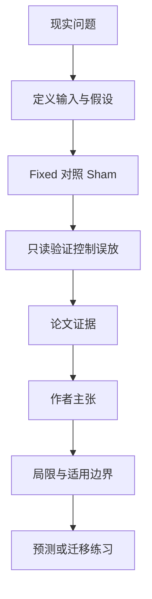

# 智能体 Harness 为什么有价值：计划信息与放行控制要分开算

英文原题：How Do Agent Harnesses Create Value? Planning Information and Release Control in Stateful LLM Agents

arXiv：2609.20474v1；方向：AI；发布日期：2026-09-17

一句话问题：给智能体一份好计划和在最后加一个审查员，分别改善什么，什么时候哪一个更值钱？

## 先从一个普通人会遇到的问题开始

很多团队把“计划、工具编排、完成检查”打包成一个 harness 后只报总成功率；这篇论文把计划带来的成功增量、验证器避免的误放行和额外成本分开，普通读者也能看清权衡。

今天读完《智能体 Harness 为什么有价值：计划信息与放行控制要分开算》，目标不是记住论文名，而是能用自己的话回答：给智能体一份好计划和在最后加一个审查员，分别改善什么，什么时候哪一个更值钱？还要能指出作者的证据支持到哪一步、哪一步仍不能下结论。

## 整体关系图



## 先补两块必要基础

oracle success 是由环境真值判断任务是否真的完成；false pass 是任务其实失败却被系统当成完成。两者不是同一个指标：少误放可能以错杀一些正确任务为代价。

Fixed 组收到预写的任务专属计划，Sham 组收到字数和外壳相同、但内容被打乱的政策文字。这样比较尽量把“有用指导”与“只是多给了文字”区分开。

## 论文接收什么，输出什么

输入是零售或航空任务、执行模型、harness 配置和重复运行。输出包括 oracle 验证成功、是否被终端验证器拒绝、误放行以及记录的推理成本。

论文把价值写成情景函数：成功增加有收益，避免误放行也有收益，但两者权重取决于错误责任成本；再减去计划或验证所需推理费用。

## 第一步：用等长度假计划隔离“信息含量”

若只把有计划组和无计划组相比，优势可能来自更长上下文或额外注意。Fixed—Sham 对比保持字数与包装接近，只改变计划是否真的对应任务。

计划主要作用在执行之前和过程中，帮助模型安排子目标与依赖；论文发现收益集中在复杂任务，而不是每类任务都同样明显。

## 第二步：终端验证器只决定是否放行

验证器读取最近对话和结果，不能修改环境，只能拒绝一个看似完成的轨迹。它不让失败任务变成功，却能避免把错误结果交付出去。

因此选择 harness 组件不能只看准确率：低责任场景可能更重视计划提高成功率，高责任场景可能更重视验证器拦下误放行。

## 跟着一个小例子看中间状态

假设 100 个任务，计划让真成功从 70 增到 77；验证器在剩余 23 个失败中拦下 14 个，同时错拦 4 个成功。计划改变“做成多少”，验证器改变“哪些结果允许交付”。

若每个误放行损失很小，错拦造成的可用性损失可能不划算；若误放行会产生高额退款或合规责任，即使验证器错拦一部分正确任务也可能更有价值。

## 作者拿什么证据支持主张

在 265 个匹配单元、23 个零售任务的汇总比较中，Fixed 相对 Sham 的 oracle 成功率提高 7.17 个百分点，90% 按任务聚类 bootstrap 区间为 1.15—13.36 个百分点。

只读终端验证器拦下 61% 的无效零售轨迹，同时扣留 17% 的正确轨迹，每次额外成本低于 1 美分。独立验证器以完整组合约十二分之一的增量成本获得了几乎全部误放行收益。

## 哪些结论不能顺手扩大

主要样本经过任务和配置可用性筛选，航空试验只有 6 个任务；公开基准可能出现在模型训练数据中，且部分托管模型版本与请求设置记录不完整。

90% 区间不是常见的 95% 区间；结果说明特定基准上的相对效应，不能直接保证新任务、新模型或真实商业损失函数中的最佳组合。

## 把整条因果链重新接起来

研究问题“给智能体一份好计划和在最后加一个审查员，分别改善什么，什么时候哪一个更值钱？”先被拆成可观察输入，再经过“第一步：用等长度假计划隔离“信息含量””与“第二步：终端验证器只决定是否放行”，最后由论文实验或数据核对。

排错时依次检查：输入是否代表真实问题、中间状态是否按定义计算、比较组是否公平、指标是否回答原问题、结论是否越过样本和假设边界。

## 最小实践：把核心机制跑一遍

需求：用一组明确标为教学设定的小数据演示“把计划的成功增量和验证器的误放行控制放进同一张价值账”。脚本打印输入、中间状态、正常例和失效边界，便于逐步核对。

验收标准：输出能解释机制方向，并明确它没有复现论文数据、模型或效果数字。

实际运行输出：

```text
教学输入：
- 基础真成功：70
- 计划后真成功：77
- 失败轨迹：23
- 验证器拦下失败：14
- 错拦正确：4
中间状态：
1. 先算计划多完成 7 个任务
2. 再算验证器少放出 14 个错误
3. 同时记录错拦 4 个正确结果
4. 按业务的错误责任决定权重
正常例：计划改善完成能力；验证器控制交付风险，它们不能用一个成功率混为一谈。
边界：数字是教学缩放，不是论文原始样本重算，也没有估算你的真实业务损失。
```

## 自测题

1. 为什么验证器拦下失败不能算成任务被成功完成？
2. Sham 组为什么比单纯“无计划”更能隔离计划内容的作用？
3. 在误放行损失极高时，应优先看哪个指标？

## 原文与阅读范围

已读评估框架、实验设计、主结果、成本/责任情景、讨论与结论；核对图 1—2、表 1—3 及验证器取舍。

教学中的日常类比、演示数据和运行结果由本学习包构造；作者主张与论文证据已在正文中单独标出，二者不混用。

本次保存并解析的正文格式为 arxiv_html，提取到 5 个相关章节、53 条图表说明，正文约 142,728 个字符。

原文：https://arxiv.org/html/2609.20474v1
